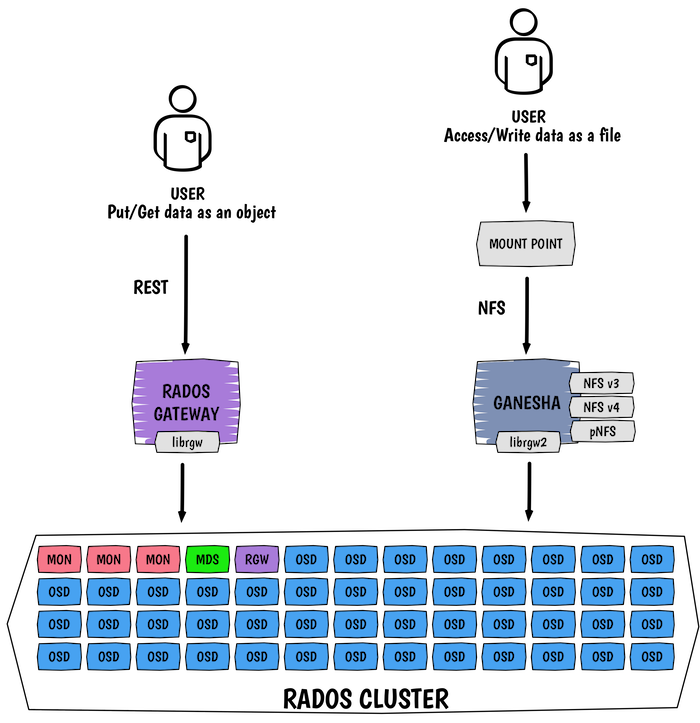

I guess you got lucky, or maybe I felt so bad not posting anything for more than a month but here it is the **last** blog post of the year :).

With the latest release of Ceph, Jewel, a new Rados Gateway feature came out. This feature hasn’t really been advertised yet so I thought I will do a blog post. This is an initial implementation that will be improved in the first releases of Ceph obviously.

As this requires a couple of components, it is quite difficult at the moment to get it easily working. So even if we support it in ceph-ansible, this is not that stable yet. For example on Ubuntu, we need it to ship Ceph v10.2.5 on Xenial so that `nfs-ganesha` 2.4 can build a working Rados Gateway FSAL.

## I. What is NFS Gateway for RGW?

Rados Gateway NFS brings the ability to store data as object through the REST interface of Rados Gateway and retrieve them as file on a network filesystem, presently NFS. The other way around is also possible, store data as files on an NFS share and retrieve them as objects on Rados Gateway. Nice right?

This serves multiple purposes but the one I like the most is probably the cohabitation of _legacy_ applications that need a filesystem interface to access data with cloud native applications. It allows us to run cloud applications along side with traditional applications.

Enough general explanation, let’s go deeper on how this actually works.

## II. Architecture

Under the hood, multiple components interact with each other. The REST object interface is obviously handled by Rados Gateway where the filesystem interface is officially orchestrated by Ganesha which is a user-mode file server for NFS (v3, 4.0, 4.1, 4.1 pNFS, 4.2) and for 9P from the Plan9 operating system.

## III. Ceph and Ganesha

Ceph has a long relationship with Ganesha, it is not the first time we implement a new FSAL (Filesystem abstraction layer) in Ganesha for Ceph.

We actually have two FSALs at the moment:

- `FSAL_RGW` which uses `librgw2`, is the one we use for Rados Gateway NFS.
- `FSAL_CEPH` which use `libcephfs1`, is the one we use when we re-export the CephFS filesystem.

## IV. Setup

Always the same answer from me… ceph-ansible AND containerized Ceph. They both support Rados Gateway NFS. However as explained in the introduction, depending on your operation system you will want to wait a little bit.

Basically you need **at least**:

- Ganesha 2.4
- Ceph v10.2.5

With both, you should be able to go through the process quite smoothly. From a pure ceph-ansible perspective, you just need to add a host in your inventory file to act as a Ganesha gateway. Needless to say you need a client to mount the NFS share and a Rados Gateway up and running.

  

> Now, really, you will see me next year ;)

Source: Sebastian Han ([Ceph Rados Gateway and NFS](https://sebastien-han.fr/blog/2016/12/23/Ceph-Rados-Gateway-and-NFS/))
