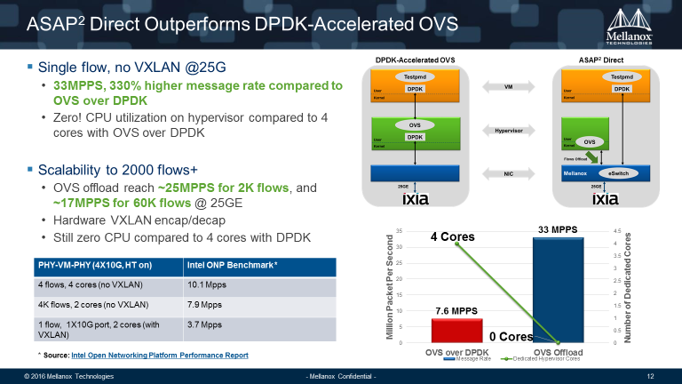

You want your cloud network to be software-defined, but without compromising performance or efficiency. How about 25G, 50G or 100Gbps speed without glitches? How about earth-shattering DPDK or virtualized network function (VNF) performance? How about unleashing your NVMe SSD speed potentials with software defined storage? The hyperscale giants are doing all of this and more with Mellanox solutions. We can enable you to do the same based on our experience working with some of the largest cloud service providers and hyperscale Internet companies. Our end-to-end interconnect portfolio including NICs, switches, cables, and associated network automation and management software, can seamlessly integrate with OpenStack and deliver total infrastructure efficiency, operational simplicity, and deployment flexibility. This is what we mean by getting your cloud networking done right:

- **Total Infrastructure Efficiency**

Unleash the full potential of the entire data center infrastructure and deliver the highest application performance and workload density, ultimately guarantee business service SLA while capping cost.

- **Operational Simplicity**

Ready integration with mainstream virtualization and cloud platforms, state-of-the-art API-driven network automation, and eliminating the need to engineer around the network to simplify network design and operations, and lower OPEX.

- **Deployment Flexibility**

Based on best practices in hyperscale data center infrastructure design, the Mellanox solution employs network disaggregation and open networking principles to free customers from vendor lock-in, reducing risks and enhancing business agility.

There are two exciting demos we are going to show you in our booth #A31 at OpenStack Summit Barcelona:

- **ASAP2 – Accelerated Switching and Packet Processing**

This is a unique feature supported by Mellanox ConnectX®-4 Lx series of Ethernet adapters to deliver more than four times the packet throughput when compared to OVS (Open vSwitch) over DPDK, with zero CPU overhead for hardware-based forwarding plane and SDN control plane.

- **Ceph over RDMA/RoCE**

In this demo, we run a 4-node Ceph cluster with fast storage – NVMe flash drives in each Ceph server, running over 50GbE networks. It all connects using state-of-the-art Open Networking switches running Cumulus Linux over Mellanox Spectrum™ hardware, with PFC/ECN features enabled for RDMA/RoCE. We compare the 4KB read IOPS performance in three different network protocol settings:

1. Simple Messenger TCP
2. Async Messenger TCP
3. XIO Messenger using RDMA/RoCE

In our test environment, RDMA/RoCE shows nearly 2X IOPS performance:

Now comes the really fun part, we are hosting a happy hour party during the OpenStack Summit with our Open Networking partner Cumulus Networks on Oct 25th. Space is limited, so if you want to secure your drinks, register today!

We look forward to seeing you in Barcelona!

Source: mellanox ([Get Your Cloud Networking Done Right: Find Out How from Mellanox at OpenStack Summit Barcelona](http://www.mellanox.com/blog/2016/10/get-your-cloud-networking-done-right-find-out-how-from-mellanox-at-openstack-summit-barcelona/))
