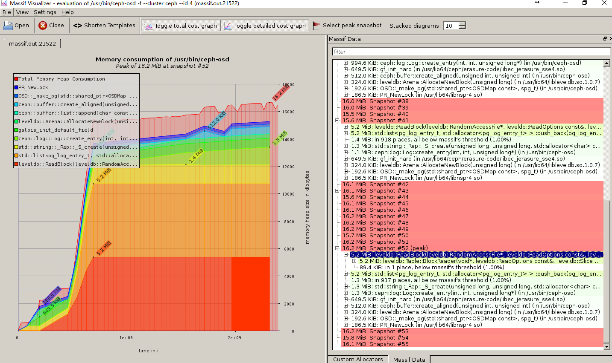

  
  

## 前言

这个工具我第一次看到是在填坑群里面看到，是由研发-北京-蓝星同学分享的，看到比较有趣，就写一篇相关的记录下用法

火焰图里面也可以定位内存方面的问题，那个是通过一段时间的统计，以一个汇总的方式来查看内存在哪个地方可能出了问题  
  
本篇是另外一个工具，这个工具的好处是有很清晰的图表操作，以及基于时间线的统计，下面来看下这个工具怎么使用的

本篇对具体的内存函数的调用占用不会做更具体的分析，这里是提供一个工具的使用方法供感兴趣的研发同学来使用

## 环境准备

目前大多数的ceph运行在centos7系列上面，笔者的环境也是在centos7上面，所以以这个举例，其他平台同样可以

需要用到的工具

- valgrind
- massif-visualizer

安装valgrind  

<table><tbody><tr><td class="code"><pre>yum install valgrind </pre></td></tr></tbody></table>

massif-visualizer是数据可视化的工具，由于并没有centos的发行版本，但是有fedora的版本，从网上看到资料说这个可以直接安装忽略掉需要的依赖即可，我自己跑了下，确实可行

下载massif-visualizer  

<table><tbody><tr><td class="code"><pre>wget ftp://ftp.pbone.net/mirror/download.fedora.redhat.com/pub/fedora/linux/releases/23/Everything/x86_64/os/Packages/m/massif-visualizer-0.4.0-6.fc23.x86_64.rpm </pre></td></tr></tbody></table>

安装massif-visualizer  

<table><tbody><tr><td class="code"><pre>rpm -ivh massif-visualizer-0.4.0-6.fc23.x86_64.rpm  --nodeps </pre></td></tr></tbody></table>

不要漏了后面的nodeps

## 抓取ceph osd运行时内存数据

停掉需要监控的osd（例如我的是osd.4）  

<table><tbody><tr><td class="code"><pre>[root@lab8106 ~]# systemctl stop ceph-osd@4 </pre></td></tr></tbody></table>

开始运行监控  

<table><tbody><tr><td class="code"><pre>[root@lab8106 ~]# valgrind --tool=massif /usr/bin/ceph-osd -f --cluster ceph --id 4 --setuser ceph --setgroup ceph ==21522== Massif, a heap profiler ==21522== Copyright (C) 2003-2015, and GNU GPL'd, by Nicholas Nethercote ==21522== Using Valgrind-3.11.0 and LibVEX; rerun with -h for copyright info ==21522== Command: /usr/bin/ceph-osd -f --cluster ceph --id 4 --setuser ceph --setgroup ceph ==21522==  ==21522==  starting osd.4 at :/0 osd_data /var/lib/ceph/osd/ceph-4 /var/lib/ceph/osd/ceph-4/journal 2017-08-10 16:36:42.395682 a14d680 -1 osd.4 522 log_to_monitors {default=true} </pre></td></tr></tbody></table>

监控已经开始了,在top下可以看到有这个进程运行，占用cpu还是比较高的，可能是要抓取很多数据的原因  

等待一段时间后，就可以把之前运行的命令ctrl+C掉

在当前目录下面就会生成一个【massif.out.进程号】的文件  

<table><tbody><tr><td class="code"><pre>[root@lab8106 ~]# ll massif.out.21522  -rw------- 1 root root 142682 Aug 10 16:39 massif.out.21522 </pre></td></tr></tbody></table>

## 查看截取的数据

### 命令行下的查看

<table><tbody><tr><td class="code"><pre>[root@lab8106 ~]# ms_print massif.out.21522 |less </pre></td></tr></tbody></table>

这个方式是文本方式的查看，也比较方便，自带的文本分析工具，效果如下：  
  

### 图形界面的查看

首先在windows上面运行好xmanager-Passive，这个走的x11转发的（也可以用另外一个工具MobaXterm）  
  
运行好了后，直接在xshell命令行运行  

<table><tbody><tr><td class="code"><pre>[root@lab8106 ~]# massif-visualizer massif.out.21522  massif-visualizer(22494)/kdeui (kdelibs): Attempt to use QAction "toggleDataTree" with KXMLGUIFactory!  massif-visualizer(22494)/kdeui (kdelibs): Attempt to use QAction "toggleAllocators" with KXMLGUIFactory!  description: "(none)"  command: "/usr/bin/ceph-osd -f --cluster ceph --id 4"  time unit: "i"  snapshots: 56  peak: snapshot # 52 after "2.3138e+09i"  peak cost: "16.2 MiB"  heap "749.0 KiB"  heap extra "0 B"  stacks </pre></td></tr></tbody></table>

然后在windows上面就会弹出下面的  
  
就可以交互式的查看快照点的内存占用了，然后根据这个就可以进行内存分析了，剩下的工作就留给研发去做了

## 相关链接

[linux – 如何测量应用程序或进程的实际内存使用情况？](https://codeday.me/bug/20170415/1699.html)

## 总结

只有分析落地到数据层面，这样的分析才是比较精准的

## 变更记录

| Why | Who | When |
| --- | --- | --- |
| 创建 | 武汉-运维-磨渣 | 2017-08-10 |

Source: zphj1987@gmail ([如何测量Ceph OSD内存占用](http://www.zphj1987.com/2017/08/10/how-to-get-Ceph-OSD-mem-used/))
