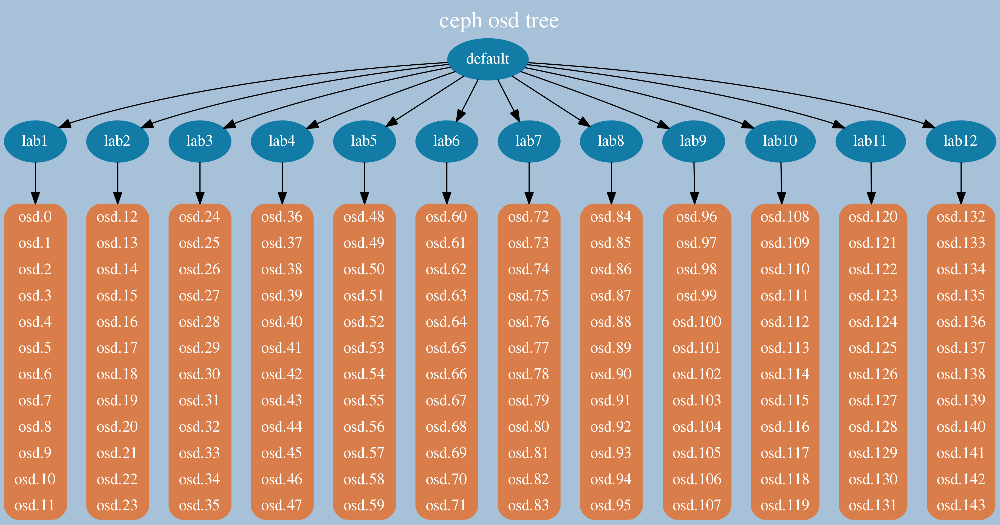

  
  

## 前言

很久没有处理很大的集群，在接触一个新集群的时候，如果集群足够大，需要比较长的时间才能去理解这个集群的结构，而直接去看ceph osd tree的结果，当然是可以的，这里是把osd tree的结构进行了一个结构化输出，也可以理解为画出一个简单的结构图，比较适合给其它人讲解你对crush做了哪些改变，这个如果指着文字来讲估计很多人会听的云里雾里，如果有比较方便的方式出图就比较好了

为此写了一个小工具自己用，正好也可以看看我们对结构做简单调整后的效果

## 创建一个模拟集群

环境就一台机器，不需要用到磁盘，这里是模拟结构  
创建一个大集群40台机器  

<table><tbody><tr><td class="code"><pre>seq 1 40 |xargs -i ceph  osd crush add-bucket lab{} host seq 1 40|xargs -i ceph osd crush move lab{}  root=default </pre></td></tr></tbody></table>

创建一个960个的集群  

<table><tbody><tr><td class="code"><pre>seq 1 960 |xargs -i ceph osd create </pre></td></tr></tbody></table>

放到指定的主机  

<table><tbody><tr><td class="code"><pre>#! /bin/sh for osd in `seq 0 959` do host=$(( (($osd / 24)) + 1 )) ceph osd  crush create-or-move  osd.$osd 3.6  host=lab$host &amp; done </pre></td></tr></tbody></table>

这里后台执行会快点,不然得等15分钟，执行完检查下有没有还在处理的进程即可  

<table><tbody><tr><td class="code"><pre>ps -ef|grep create-or-move </pre></td></tr></tbody></table>

## osd的一些结构

机器如果在远程可以上传临时文件  

<table><tbody><tr><td class="code"><pre>ceph osd tree -f json-pretty &gt; zp.json curl --upload-file ./zp.json https://transfer.sh/zp.json </pre></td></tr></tbody></table>

得到的地址下载即可

### 默认结构，主机分组

960个osd的效果如图，节点太多了，图片本身输出的时候是高清图片可以放大去看的，并且主机如果不是这么多，显示效果会好一点，这里我们看的清楚是主机分组的

### 调整下rack结构

<table><tbody><tr><td class="code"><pre>seq 1 8|xargs -i ceph  osd crush add-bucket rack{} rack seq 1 8|xargs -i ceph osd crush move rack{} root=default </pre></td></tr></tbody></table>

<table><tbody><tr><td class="code"><pre>#! /bin/sh for host in `seq 1 40` do rack=$((  (((($host - 1)) / 5)) + 1 )) ceph osd  crush move lab$host rack=rack$rack &amp; done </pre></td></tr></tbody></table>

### 调整完结构我们再看下

可以看到已经是多层的结构了，这个机器太多，我们来看下稍微少点机器的效果

### 12台机器每台12个osd的效果

主机分组

rack分组

后面的两个图的就比较清晰了

工具的一个作用是，在调整结构后，能够比较方便的去检查osd的结构，是不是均匀的，有没有调整错误，有没有某个host里面的osd个数跟其他不一样，这几种情况之前都遇到过

- 分rack的时候rack里面主机数目不一致，怎么调整pg都是不平衡
- 加osd的时候，某个主机的osd给漏掉了

如果你面对的是几十个osd的时候，你还会看看，当超过一百个的时候，一般来说就是走过场了，都会侥幸的认为，应该没事吧，好像是对的，当然通过各种方式都能实现

目前这个小工具是直接运行直接出图的,配色后面再处理下效果

## 总结

这个tree的图一直以为之前有写过，但是找不到代码了，重新实现了一次，也算一个梳理，这个图只是作为一个更大的体系里面很小的一部分的模块

本篇同样给出了模拟大集群的方式

Just for Fun

## 变更记录

| Why | Who | When |
| --- | --- | --- |
| 创建 | 武汉-运维-磨渣 | 2018-09-19 |

first image by Tricia Van Asten

Source: zphj1987@gmail ([ceph osd tree的可视化](http://www.zphj1987.com/2019/09/19/ceph-osd-tree-graphical/))
