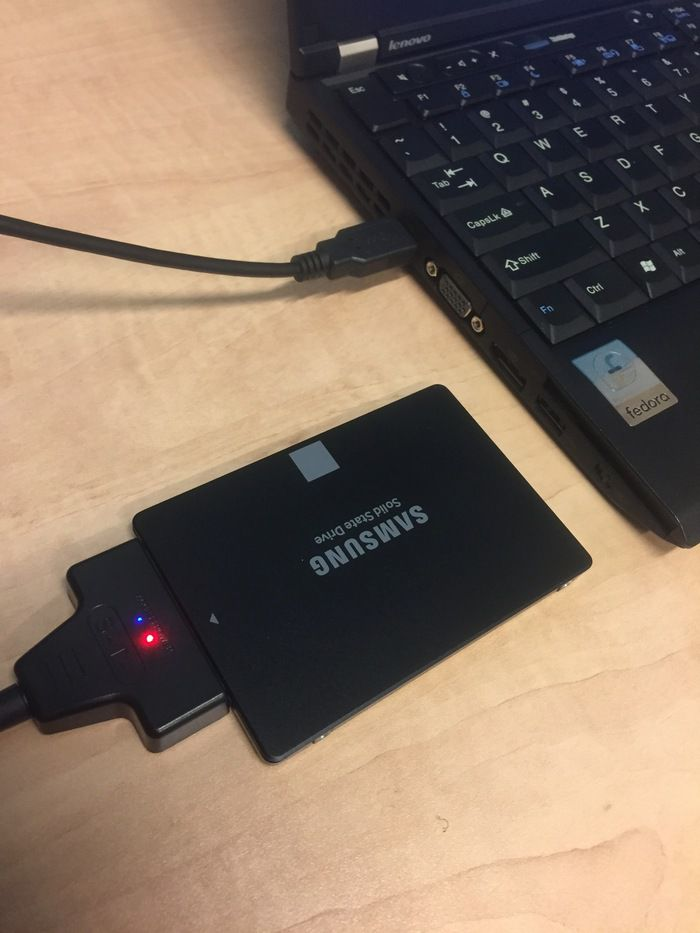
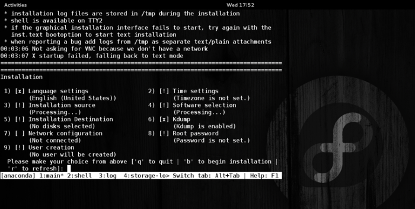
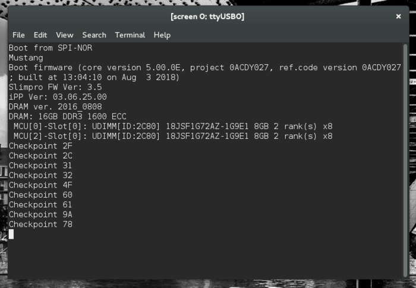

_with Josh Everett (Red Hat) and Massimo Morana (ARM)_

[](https://svbtleusercontent.com/vY5iZxiGJuP5X54vgqtLu90xspap.jpeg)

The Dragon Propulsion Laboratory [examined in depth](https://f2.svbtle.com/arm-64-bit-walkthrough-of-the-mustang) the excellent X-Gene ARM chips that were an early entrant on the ARM 64-bit scene and enabled so much of the software-side Linux OS development on ARMv8. More recently, we built a [custom cluster](https://f2.svbtle.com/the-mustang-rides-again) in cooperation with Wayne Enterprises that we affectionately refer to as our “Bat Cluster”. In this third blog, we are moving back to the software side of the equation, setting up Red Hat Enterprise Linux on the Bat Cluster itself.

# Enterprise Bits

Red Hat Enterprise Linux introduced full support for 64-bit ARM with [release 7.4](https://www.redhat.com/en/blog/red-hat-introduces-arm-server-support-red-hat-enterprise-linux) in November of 2017, and while there are many flavors of Linux on ARM, only something as robust and secure as RHEL would do for a sophisticated user like Wayne Enterprises!

The most commonplace strategy for board bring-up on ARM development boards is to use a [PXE server](https://en.wikipedia.org/wiki/Preboot_Execution_Environment) to deliver boot images to the board over the network, even for install purposes. While that is a very suitable process for development shops, setting up dedicated DHCP server is somewhat unwieldy for personal use. We chose to perform a local install instead without requiring network support. As the Mustang board is headless and does not have any video interface, this is somewhat different from the RHEL install process we are all used to.

We are reserving the SATA interfaces for bulk storage use, ideally with [Ceph](https://www.ceph.com) — but that’s another blog. That leaves the SD Card (properly the Serial Digital Interface) and USB ports as our best alternatives to boot the board all the way to Linux user space. Both SD and USB interfaces are fully supported by [U-Boot](https://www.denx.de/wiki/U-Boot), but we did not fathom a satisfactory way to boot from SD card within the depths of the latest UEFI firmware.

[](https://svbtleusercontent.com/pBSKeWMN4AM4WF2btY94y90xspap.png)

We also had a fascinating adventure discovering that USB 3.1 storage media can [actually underperform](http://www.admin-magazine.com/Archive/2018/48/Assess-USB-performance-while-exploring-storage-caching) older USB 2 storage with better garbage collection implementations. As operating system boot generates a burst of write activity on account of logs, this can actually lead to device timeouts. We discarded some cheaper, unbranded USB keys and replaced them with a trusty old standby, the same [SanDisk Cruzer Fit](https://www.amazon.com/SanDisk-Cruzer-Low-Profile-Drive-SDCZ33-032G-B35/dp/B00812F7O8/) USB keys that were once selected as the internal boot media of the first generation [Ubuntu Orange Box](https://www.zdnet.com/article/canonicals-cloud-in-a-box-the-ubuntu-orange-box/).

[](https://svbtleusercontent.com/4sfCQtCqvmVncRYV2hg5Vt0xspap.png)

# Back to The Bat Lab

We started by downloading the [Enterprise Linux ISO images](https://access.redhat.com/downloads/content/419/ver=/rhel---7/7.6/aarch64/product-software) for ARM 64 from Red Hat’s content distribution network (a developer subscription may be required for access).

[](https://svbtleusercontent.com/wsSLNUNvZwgaPswPNcmARa0xspap.png)

In this blog we use the second binary DVD image exclusively, labeled _Red Hat Enterprise Linux Alternate Architectures 7.6 Binary DVD_ (rhel-alt-server-7.6-aarch64-dvd.iso).

```
$ ls -lh rhel-alt-server-7.6-aarch64-dvd.iso
-rw-rw-r-- 1 jeverett jeverett 3.0G Feb 15 16:38 rhel-alt-server-7.6-aarch64-dvd.iso
$
```

We laid out the install setup as we did [back in 2015](https://f2.svbtle.com/arm-64-bit-walkthrough-of-the-mustang), except that we have finally upgraded our USB-to-SATA cable to USB 3. Our plan is to boot from a temporary SATA SSD device (a 120GB Samsung 750 EVO we had laying around), as it is very easy to boot these boards from the SATA interface, and install from here on to our permanent USB boot drives (the ever reliable SanDisk Cruze drives I mentioned earlier).

[](https://svbtleusercontent.com/nv1JSQT7kxD62h7LGsmAKw0xspap.jpeg)

# dd to the Rescue

We keep things easy and lay down a single partition, mostly because we want a clean GPT partition table on the drive to start with. `disks` comes in handy for this purpose as usual. We then image the whole drive with the bootable ISO we just downloaded:

```
sudo dd if=rhel-alt-server-7.6-aarch64-dvd.iso of=/dev/sda
sync
```

[](https://svbtleusercontent.com/enz14bPifphUab9EHha8Rc0xspap.png)

With our newly prepared disk, we are ready to install RHEL directly on the boot USB drives we are setting up for each Mustang board. We are designating our bootable drives as `USB FS0:`, which maps to the _top_ USB port on the board’s IO stack. The rest of the board bringup setup involves just configuring the Serial-to-USB cable by connecting to UART0, which is the _bottom_ serial port.

Connect to the serial port using screen:

```
sudo screen /dev/ttyUSB0 115200
```

[](https://svbtleusercontent.com/3JnkHBNxihEjSFLy2QUexp0xspap.png)

# Actually Installing RHEL

The first screen offers to boot from install media or, alternatively, to verify the install media _before_ booting. Our serial terminal is running on a Fedora system, in case you wonder about the background art.

[](https://svbtleusercontent.com/kLqY37ZP9Jf18P5QJcQrRX0xspap.png)

In deference to Murphy’s Law, we recommend you choose to verify the install medium on its first use and not tempt fate.

[](https://svbtleusercontent.com/qKjEm1KwvoZw5P2m7ojVwH0xspap.png)

Once the Installer drive boots, we minimally need to carry out these three steps to install a working RHEL 7.6 system:

[](https://svbtleusercontent.com/syjq3iegiGqxeNyyK17wpZ0xspap.png)

- select install destination (5, 1, 2, 3, c), which will implicitly define source
- set a root password (8, password, password, yes)
- set a timezone (2, 1, 11, 4)

We chose the US-EST timezone as we are doing this build at our Westford engineering HQ, and no, our password is not “password”. To save ourselves the need to set up further configuration later, we also configured the following:

- set network configuration (7, 3, 1, dhcp, 6, 8.8.8.8, 7)
- set the host name (7, 1, batcluster-1, c)
- configure Systemd’s timesyncd.service via the TZ menu (2, 2, 1, fedora.pool.ntp.org)

If the installer requires it after these steps you may have to confirm the software selection once more (4, 1). Hit `b` to proceed and start installing.

[](https://svbtleusercontent.com/4cnDdvi1E4SroESoiLGG4u0xspap.png)

# Enterprising ARM

[](https://svbtleusercontent.com/stkvxBeW2RSgpBoxK8Pqh60xspap.png)

Our install resulted in the bootable partition layout above. After rebooting, we keep tapping the escape key in our `screen` serial connection until we are prompted with the UEFI setup utility.

[](https://svbtleusercontent.com/vZwXJFLsVxqDfN7QhHxg7A0xspap.png)

[](https://svbtleusercontent.com/p7VUSSDLCwrW5BcanvzFJJ0xspap.png)

The boot configuration may happen to be right, there is nothing in the Fourth Law of Thermodynamics to prevent it. Yet again, it may not be, so we check. The boot order should list our SanDisk USB key as the first boot option in the boot menu.

[](https://svbtleusercontent.com/Zf9RnhyornGo8jPamyKxW0xspap.png)

We are ready to reboot again, but not before we set up wired network connections for each of our boards. We chose to configure the `eth1` network interface amongst the four this board has available. The corresponding port is found at the base of the dual ethernet socket located just right of the serial ports.

If all goes well, you will be prompted to log in. Log in as root with the password you selected at setup time.

[](https://svbtleusercontent.com/7hpCqWRexi9KPnk7BzW8uK0xspap.png)

# Subscription Manager

To support updates and package installs, we need to activate the RHEL subscription:

```
subscription-manager register
subscription-manager attach --auto
```

You will be prompted to authenticate with the customer portal as part of this process.

# Now in Triplicate

Now that we have a fully configured host, we proceed to replicate it for the other boards. We start using `dd` to copy the master image to a local disk, and then in turn imaging two more USB keys from the master image. On our laptop the first USB storage device is found at _sdb_, but this is likely to be different on your system:

```
sudo dd if=/dev/sdb of=master_node_image status=progress
sudo dd of=/dev/sdb if=master_node_image status=progress
```

We need to update the hostname to differentiate each device. We acccomplish this as follows after first boot. For example, we renamed the second board thusly:

```
hostnamectl set-hostname batcluster-2
```

[](https://svbtleusercontent.com/6QCeR4HQXLm8yVskroV8x40xspap.jpeg)

# Power Footprint

We took a few power draw measurements of the cluster as we completed the setup. In our testing, a single X-Gene 1 Mustang board of the 3PCx revision is showing a power envelope between 32 and 36 watts. This measurement was taken with idle CPU, and includes the board itself, the USB storage key and active serial and ethernet connections. The power supply efficiency was rated 80 Plus (Bronze). Peak load was at 46W in normal operation, and pegging the CPU at 100% with a fork bomb produced the maximum draw of 63W.

Measuring the entire cluster, we benchmarked the idle power draw at a steady 110 watts — that is for 24 cores! — and pegging all CPUs at 100% with an infinite shell loop for each core raised the power draw to a still cool 193 watts. Pretty amazing.

Comments? Discuss on Hacker News.

# Acknowledgements

The authors wish to thank Edward Gasiorowski of Ampere Computing for his invaluable assistance and his knowledge of multiple generations of the X-Gene hardware.

Source: Federico Lucifredi ([To the Bat Cluster! Setting Up Enterprise Linux](https://f2.svbtle.com/the-mustang-runs-with-RHEL))
