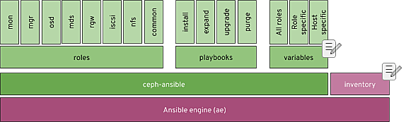

_Deploying a containerized Ceph Storage 4 cluster using ceph-ansible_

_with Guillaume Abrioux (Red Hat) and Paul Cuzner (Red Hat)_

# Introduction

The landscape of modern IT infrastructure is dominated by software defined networking, public cloud, hybrid cloud and software defined storage. The shift from legacy hardware centric architectures to embrace software defined infrastructure requires a more mature orchestration “engine” to manage changes across distributed systems. For many enterprises, Ansible has fulfilled this requirement and this in turn has led to the upstream Ceph community basing their next generation management toolchain on Ansible, in the form of Sébastien Han’s [ceph-ansible](https://github.com/ceph/ceph-ansible).

Ceph Storage was the first Red Hat product to incorporate Ansible technology after our [October 2015 acquisition](https://www.redhat.com/en/about/press-releases/red-hat-acquire-it-automation-and-devops-leader-ansible) of Ansible’s corporate sponsor. Red hat Ceph Storage has been shipping ceph-ansible as its default installer since 2016 (Ceph Storage 2.0), supporting Ceph Storage installation and management across a wide variety of use cases, architectures and deployment sizes. In the process, ceph-ansible has achieved an unparalleled flexibility in the depth of configuration options made available to power users.

# More than an installer

It’s easy to think of ceph-ansible as just an installation tool - but ceph-ansible is not a one-trick pony. Once you have installed Ceph Storage, ceph-ansible can also support the Operations team with tools that provide:

- Expansion — adding further daemons or resources to the cluster
- Configuration change management — `ceph.conf`, systemd unit files, sysctl
- Dynamic changes to running ceph daemons
- Log gathering
- Managed cluster rolling upgrades

# Under the hood

Ansible itself prescribes a structured approach to deployment and orchestration, breaking deployments down into more discrete and manageable roles, tasks, templates and files. A typical Ceph Storage cluster is constituted by a number of specialized daemons performing different roles, so Ansible’s inherent structure aligns well with Ceph’s role-based architecture.

The diagram below provides a high level overview of the components/functions that ceph-ansible provides:

[](https://svbtleusercontent.com/xgxx2XKCzTtjxWFztMYiMP0xspap.png)

Although the ceph-ansible environment consists of several thousand lines of code, the changes required to prepare for an installation only touch on two components; the variables and Inventory (denoted by the ‘edit’ icon).

# The inventory

Arguably the core file of any Ansible based solution is the Inventory. The Inventory defines the hosts that will be managed, groups them into specific roles and may also include host specific configuration settings. In its simplest form, this is what a ceph-ansible inventory could look like:

```
[mons]
mon0
mon1
mon2

[mgrs]
mon[0-2]

[osds]
osd[0-2]

[mdss]
mds0

[rgws]
rgw0

[grafana-server]
metrics
```

You can see machines are grouped into Ceph roles (MONs, MGRs, OSDs, etc), and can be specified explicitly or use host names that include numeric (or alphabetic) ranges. Ansible’s inventory specification is very flexible, supporting per-host variables and the inclusion of variables for the whole group or role.

However, the most important aspect of the inventory is that connectivity doesn’t work by magic - it relies on something more mundane… the distribution of SSH public keys. All the hosts in your inventory must be accessible from the ceph-ansible host using passwordless SSH. This means that your build process should ideally plan for the distribution of the ceph-ansible account’s public key to your target machines (`ssh-copy-id` is your friend for that).

# Installing ceph-ansible

A common architectural pattern for Ceph Storage is to designate a host, or virtual machine, as the ansible “controller” or administration host — providing a separate management plane. Recent versions (Ceph Storage 3 and Ceph Storage 4), introduced a metrics and monitoring role which could also be deployed to the same Ansible controller host.

Once the host has been subscribed, the Ceph Storage Tools repo must be enabled to provide access to the ceph-ansible RPM. The output below shows the typical repositories/channels that the Ansible controller host requires.

```
$ sudo dnf repolist
Updating Subscription Management repositories.
repo id                             repo name                     status
ansible-2.8-for-rhel-8-x86_64-rpms  Red Hat Ansible Engine 2.8 for RHEL 8 x86_64 (RPMs)           5
rhceph-4-tools-for-rhel-8-x86_64-rpms Red Hat Ceph Storage Tools 4 for RHEL 8 x86_64 (RPMs)      45
rhel-8-for-x86_64-appstream-rpms Red Hat Enterprise Linux 8 for x86_64 - AppStream (RPMs)     5,691
rhel-8-for-x86_64-baseos-rpms    Red Hat Enterprise Linux 8 for x86_64 - BaseOS (RPMs)        2,078
```

With the repositories enabled, ceph-ansible can be installed with `dnf`, which will install the ceph-ansible roles and playbooks under `/usr/share/ceph-ansible` ([ceph-ansible for Ceph Storage 4](https://github.com/ceph/ceph-ansible/releases/tag/v4.0.17) requires Ansible 2.8, with 2.9 support coming in the 4.1 release).

# Configuration

As illustrated in the first figure, configuring ceph-ansible requires changes to two main areas; the Inventory file and the variables (host or group). The Inventory describes the hosts that the playbook(s) will act upon, while the variables define how the roles will be configured on those hosts. However, since this is Ansible you can also embed variables within the inventory file itself to accommodate heterogeneous hardware deployments. Here’s an example that defines a different NIC device for each mon daemon within an Ceph Storage cluster.

```
[mons]
mon0 monitor_interface=eth0
mon1 monitor_interface=eth1
mon2 monitor_interface=eth3
```

Here are some further examples that illustrate the flexibility that the inventory and group variables provide.

[](https://svbtleusercontent.com/aekzrqEmzvDGKP6ja8CBDQ0xspap.png)

For further information about variables, and variable precedence take a look at the official [Ansible documentation](https://docs.ansible.com/ansible/latest/user_guide/playbooks_variables.html#variable-precedence-where-should-i-put-a-variable).

# Playbooks

Before you can begin a Ceph Storage deployment, you need to ensure that all the hosts declared in the inventory are accessible, and your variables are defined to reflect your desired Ceph Storage cluster configuration.

There are two main deployment playbooks: `site.yml` for an `rpm` based deployment, and `site-container.yml` for a container based deployment. Their names speak for themselves!

During playbook execution, Ansible provides start and completion state for each playbook task running on each host, which if you’re new to Ansible, can seem overwhelming. Although this can seem like a lot of output, it really provides the easiest way to monitor progress.

At the end of the playbook run, `ceph-ansible` will provide output showing the state of the Ceph cluster and Ansible itself will provide a breakdown of the playbook timings by role.

```
TASK [ceph-dashboard : print dashboard URL] ************************************
Sunday 15 March 2020  22:28:26 +0000 (0:00:02.419)   0:10:03.824 *******
ok: [rhcs4-1] => {
"msg": "The dashboard has been deployed! You can access your dashboard web UI at http://rhcs4-1.storage.lab:8443/ as an 'admin' user with 'admin' password."
}

<SNIP>

TASK [show ceph status for cluster ceph] ***************************************
Sunday 15 March 2020  22:28:27 +0000 (0:00:01.090)   0:10:05.344 *******
ok: [rhcs4-1 -> rhcs4-1] => {
"msg": [
     "  cluster:",
     " id: 3e102c29-e1d8-4d0b-88ad-c293ecb57674",
     " health: HEALTH_WARN",
     "        too few PGs per OSD (21 < min 30)",
     " ",
     "  services:",
     " mon: 3 daemons, quorum rhcs4-3,rhcs4-1,rhcs4-2 (age 8m)",
     " mgr: rhcs4-1(active, since 26s), standbys: rhcs4-3, rhcs4-2",
     " mds: cephfs:1 {0=rhcs4-2=up:active} 1 up:standby",
     " osd: 9 osds: 9 up (since 66m), 9 in (since 66m)",
     " rgw: 1 daemon active (rhcs4-3.rgw0)",
     " ",
     "  data:",
     " pools:   8 pools, 64 pgs",
     " objects: 211 objects, 4.2 KiB",
     " usage:   9.1 GiB used, 9.0 TiB / 9.0 TiB avail",
     " pgs: 64 active+clean",
     " ",
     "  io:",
     " client:   767 B/s rd, 170 B/s wr, 0 op/s rd, 0 op/s wr",
     " "
]
}

Sunday 15 March 2020  22:28:27 +0000 (0:00:00.048)   0:10:05.393 *******
===============================================================================
check for python ------------------------------------------------------- 52.39s
install python for debian based OS ------------------------------------- 21.79s
ceph-container-engine : install container package ---------------------- 14.03s
ceph-dashboard : set or update dashboard admin username and password --- 10.53s
ceph-infra : install chrony --------------------------------------------- 5.93s
ceph-mgr : create ceph mgr keyring(s) on a mon node --------------------- 5.63s
ceph-common : install redhat dependencies ------------------------------- 5.50s
ceph-common : install redhat ceph packages ------------------------------ 5.29s
ceph-osd : install lvm2 ------------------------------------------------- 5.28s
ceph-osd : install dependencies ----------------------------------------- 5.09s
gather and delegate facts ----------------------------------------------- 5.00s
ceph-mds : install ceph-mds package on redhat or suse ------------------- 4.89s
ceph-mgr : install ceph-mgr packages on RedHat or SUSE ------------------ 4.87s
ceph-grafana : install ceph-grafana-dashboards package on RedHat or SUSE --- 4.87s
ceph-rgw : customize pool size ------------------------------------------ 4.45s
ceph-rgw : set the rgw_create_pools pools application to rgw ------------ 4.04s
ceph-container-common : container registry authentication --------------- 3.54s
ceph-dashboard : create radosgw system user ----------------------------- 2.88s
ceph-osd : systemd start osd -------------------------------------------- 2.53s
ceph-dashboard : enable mgr dashboard module (restart) ----------------— 2.42s
```

# Beyond installation

Once installed, ceph-ansible provides a number of playbooks to support the day-to-day management of an Ceph Storage cluster. There are more than 20 playbooks provided that cater for cluster expansion, upgrades and even cluster removal. Here’s a small selection of playbooks that ceph-ansible offers:

[](https://svbtleusercontent.com/3hnjEHrJSdgbpeCPLNTL4R0xspap.png)

# Tips for storage ninjas

Red Hat Ceph Storage has been deployed with ceph-ansible across a number of use cases ranging from small three-node clusters to clusters containing thousands of OSDs and exceeding 50 PBs in size. Over time, how Ansible and ceph-ansible can be used has evolved so before you start your production installation, there are some additional tips that may help:

1. Whenever possible, opt to use a separate host as the Ansible controller.
2. Consider using container based deployments. This enables you to better utilize the underlying hardware of smaller clusters with daemon colocation.
3. Using a vm for the Ansible controller is fine, and allows you to exploit hypervisor features like HA.
4. In a single cluster environment, consider collocating you metrics and monitoring with the Ansible controller machine.
5. If your environment is going to contain multiple clusters, keep the monitoring/metrics role separate and consider using git to manage all your ansible configurations from a single ansible controller.
6. Consider storing the output from your playbook runs to provide an audit trail.
7. Playbook runtime is typically proportional to the cluster size — so for larger deployments ensure your console session won’t time out - screen, and tmux are commonly used for this purpose.

# The sky’s the limit

The Ceph Storage user base spans hundreds of sites running petabyte scale-clusters — a customer’s site is approaching 100 PB deployed, while a handful of others are crossing the 50 PB line as we write. Open Source scale-out storage is succeeding in the market because of its competitive economics, architectural scalability, and technical flexibility.

Ceph can be configured in extreme detail by a power user, just like Linux, and for this reason we like to refer to Ceph as “The Linux of storage” — It is not merely a statement about code licenses and community, it is a statement about our ambition to serve many use cases, and to design a system that can be configured in the hands of an expert, while simultaneously delivering the UX making it accessible to new users.

At Red Hat, we think it is our job to make this amazing technology available to everyone: to those at the beginning of the learning curve just as much as the distributed system experts. This blog is addressed to a DevOps-trained, Ansible-capable ops ninja, while in the [first blog in the series](https://f2.svbtle.com/installing-ceph-the-easy-peasy-way) we explored how our UI can install a small Ceph Storage cluster in minutes, essentially asking no questions from the operator and simply clicking through, while the [second blog](https://f2.svbtle.com/command-and-control) explored the capabilities of our newfangled management UI. As the size of the largest clusters continues to increase, the expert looks towards automation to manage massive scale with a fixed staff size, while new users coming in at smaller scales need a reasonable learning curve to start learning about the technology. We continue in our quest to supply better tools to both.

# Do try this at home

Red Hat Ceph Storage 4 is [available from Red Hat’s website](https://access.redhat.com/downloads/content/281/ver=4/rhel---8/4.0/x86_64/product-software). Try out your hand at distributed storage today!

_Cross-posted to the [Red Hat Blog](https://www.redhat.com/en/blog/deploying-containerized-red-hat-ceph-storage-4-cluster-using-ceph-ansible)._

Source: Federico Lucifredi ([The Power User's Path to Ceph](https://f2.svbtle.com/deploying-a-containerized-red-hat-ceph-storage-4-cluster-using-ceph-ansible))
