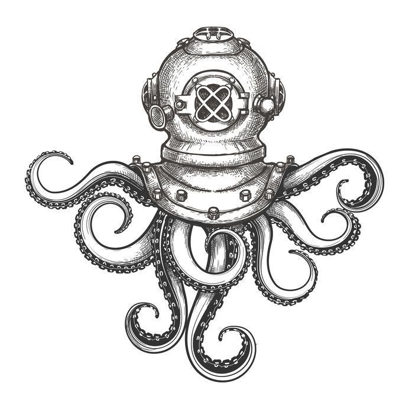
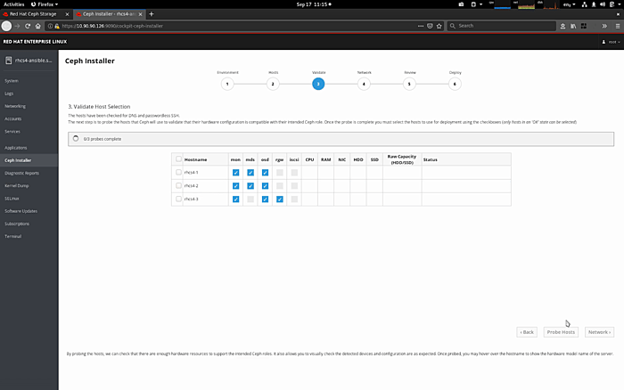

_The Nautilus technology cornerstone to a roaring 2020_

Red Hat Ceph Storage 4 brings the Nautilus codebase to our portfolio of marquee-name customers, and lays the foundation for our Ceph storage product portfolio for the rest of the year. 4.0 is integrated with OpenStack Platform 16 from the start, enabling customers to roll out the latest and greatest across the Red Hat Portfolio: OpenStack Platform 16 on RHEL 8.1 with RHCS 4.0 through a single, director-driven install process, equally supporting dis-aggregated and hyperconverged configurations. The combination of Bluestore and Beast as default components literally doubles our object store performance compared to 12 months ago, and that is just the start of our Object story for what promises to be a very busy year indeed.

Today, we are releasing version 4 of Red Hat Ceph Storage, a new rendition of our infrastructure storage offering establishing a new standard for software-defined storage usability and new milestones in security and scalability. Bold words, says you. Read on, says I.

# Security

Security-conscious customers will take note of the support for FIPS-140-2 validated crypto provided through the use of RHEL’s cryptographic libraries as they are certified by NIST. In combination with other enhancements, this has already enabled a Red Hat partner selling services in the Federal space to attain FedRAMP certification for their private cloud built with OpenStack Platform and Ceph Storage.

The introduction of the messenger v.2 protocol enables encryption of the Ceph protocol itself, enabling customers that want to encrypt a Ceph’s cluster’s private network to do so. While the threat of rogue insiders roaming in one’s datacenter cannot be mitigated by software means, this feature enables our customers to pursue policies where everything transmitted over the network is encrypted, irrespective of physical or VLAN segregation of traffic.

Support for multi-factor auth delete in RGW rounds up the security features of the release. Multi-factor authentication adds an increased layer of security toward preventing accidental or malicious bucket deletion. Enabling MFA when changing the versioning state of a bucket or permanently deleting an object version helps prevent security issues from compromised credentials, requiring a second factor to be provided to authenticate successfully.

# Management

RHCS 4 maintains compatibility with existing Ceph installations while enhancing Ceph’s overall manageability. Adding a [new management UI](https://f2.svbtle.com/command-and-control) providing operators with better oversight of their storage clusters, RHCS 4 does not require mastering the internal details of the RADOS distributed system, significantly lowering the learning curve to SDS adoption. Operators can now manage storage volumes, create users, monitor performance and even initiate cluster upgrades from the new dashboard interface. Power users can operate clusters from the command line just as before, but with additional delegation options available for their junior administrators, combining the best of both worlds.

We are also helping you put noisy neighbors in their place, with the long-awaited arrival of [“RBD Top”](https://f2.svbtle.com/ceph-block-performance-monitoring). Integrated within the new Dasboard is a new facility providing a bird’s-eye view of the overall block workloads’ IOPS, throughput, as well as average latency. It includes a ranked list of the top 10 images that are using the highest IOPS and throughput, and as well as those images experiencing the highest request latency — hence its moniker.

Last but not least, we are adding the [simplest install experience](https://f2.svbtle.com/installing-ceph-the-easy-peasy-way) for RHCS yet. During our most successful beta program to date, we introduced a new [GUI installation tool](https://github.com/pcuzner/cockpit-ceph-installer) built on top of the [Cockpit](https://cockpit-project.org/) web console.

The new UI installer is a further step forward in usability, delivering an opinionated install experience backed by the same [Ansible logic](https://github.com/ceph/ceph-ansible) that operators are already familiar with, requiring no Ceph experience whatsoever on the part of those deploying a Ceph cluster for the first time. While carefully selecting hardware from a validated reference architecture remains necessary to ensure a good balance of economics and performance, the new installer significantly lowers the bar to deploying a Ceph cluster for hands-on evaluation. The new install UI guides users with no prior Ceph knowledge to build clusters ready for use by providing sensible defaults and making the right choices without asking the operator for much more than a set of servers to turn into a working cluster.

# Scale

The new release brings increased robustness to the over-10-petabyte class of storage clusters increasingly common in our S3 Object Store, Data Analytics and AI user bases. We are one of only two vendors in the industry with more than a handful of customers with S3-compatible capacity exceeding 10PB, with leading edge customers exceeding 50PB now. We are proud of the work we are doing together with these advanced customers, and how they push us to continuously improve the product with requirements that foreshadow what the broader market will need in the years ahead.

Increasing automation of the cluster’s internal management, now including pg\_num alongside bucket sharding and data placement activities is a key element of storage scalability without requiring an ever-expanding operations staff. A new implementation of the RGW’s webserver and more robust MDS scaling in CephFS join a robust amount of tuning under the hood to deliver the scalability enhancements our users have come to expect from the team every year. The combination of the new Object store front-end with the Bluestore backend results in twice the object store performance we were delivering just a year ago! As we continue to push storage scale boundaries further up (and out), improved monitoring tools like the new “RBD Top” are needed to provide immediate insight on what clients are generating the most IO.

We are also delivering TCO improvements at the lower end of the capacity range, introducing a minimum configuration of three servers and a recommended configuration of at least four (down from five and seven, respectively) for customers that are looking at compact Object Store configurations to start their scale-out infrastructure.

# Thank You

The team set and broke all previous records: the most features in a release (61), the longest and most complex planning cycle (18 months), the largest cast, with at least 189 people involved directly and many many more I did not speak to directly missing in this imperfect headcount. This seventeenth and largest yet release of RHCS is all the more significant. Beyond the sheer scope of the release, it is also worth celebrating how we managed to ship RHCS while the all-absorbing, monumental effort to develop a new Ceph-based OpenShift Container Storage product was simultaneously underway. Many Red Haters in many different teams had a hand in making this possible: you know who you are. Thank You.

To the hundreds of customers running RHCS, who drive forward the product with their challenging requirements and fund its development through Red Hat subscriptions. Thank you.

And of course, Ceph would not exist without the many contributions the the upstream project by many different organizations and individual members of this amazing development Community. Thank you.

As always, those of you with an insatiable thirst for detail should read the [release notes](https://access.redhat.com/documentation/en-us/red_hat_ceph_storage/4.0/html-single/release_notes/index) next—and feel free to ping me on [Twitter](https://www.twitter.com/0xF2) if you have any questions!

# We’re Always Ready to Support You

Red Hat Ceph Storage 4.0 is the first Ceph release delivered with a 60-month support lifecycle right from the start, thanks to the 24-month extension optionally available through Red Hat’s ELS program. As always, if you need technical assistance, our Global Support team is but one click away using the Red Hat support portal.

Source: Federico Lucifredi ([Twenty Thousand Features under the Sea](https://f2.svbtle.com/twenty-thousand-features-under-the-sea))
