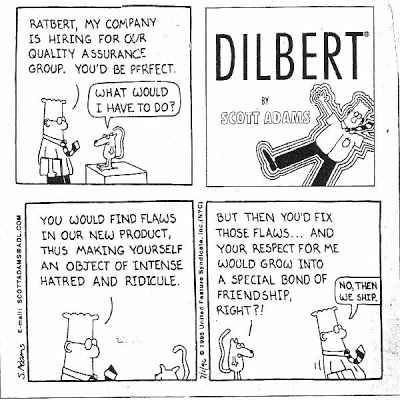
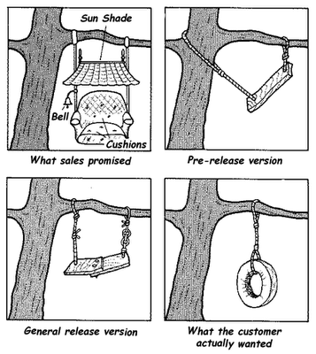

The Ceph community is made up of many individuals with a wide variety of backgrounds, from FOSS hacker to corporate architect. We feel very fortunate to have such a great, and active, community. Even more so lately, as we have been fielding a number of questions on how best to become a more active participant in the Ceph community. With that in mind we decided it was time to sketch out a brief menu of different engagement opportunities to make it easy for anyone (not just developers) to take part in our digital revolution.

### If you’re a developer…

Great! We have tons of little projects that are sitting on back-burners waiting for willing hands to take them over. There are many different flavors of project, including things like: building integrations (anyone favor playing with [Hibernate OGM](http://www.spinics.net/lists/ceph-devel/msg10196.html)?), adding JSON and BSON classes to RADOS, and building a Wireshark dissector. There are a number of lists floating around, depending on your skillset. The best way to get started is probably to:

- Join the [mailing list](http://ceph.com/resources/mailing-list-irc/)
- Join our [IRC channel](irc://irc.oftc.net:6667/ceph)
- Offer your services/skills in either of the above
- …or just start [playing with Ceph](https://github.com/ceph/ceph) and write anything you think is missing

The developers are quite good at answering questions and helping people to dip their toes into the code. If you would like to help out, we would love to have you!

### If you’re a tester…

Then we would love to welcome you and your bull into our china shop filled with vuvuzela-playing chimpanzees. Seriously, with the next long-term stable release “bobtail” coming up, we would love it if you could beat up some of our hard work. In order to get started you should first spin up some flavor of Ceph cluster \[[http://ceph.com/docs/master/](http://ceph.com/docs/master/)\] and then take a look at some of the QA tools that have been built up around Ceph.

[Teuthology](https://github.com/ceph/teuthology) is the custom test framework designed to handle the special testing requirements of Ceph, but you can also check out a bunch of other Ceph-related tools on our [GitHub Page](https://github.com/ceph/). If you would like some direction on what needs the most eyeballs you can either check out recent commits to the main Ceph project or ask on the mailing list or IRC channel mentioned in the section above.

### If you’re a user…

We want your code-less view of the world! Too often any developer that sticks his thumb in the code and pulls out a plumb, loses a certain ‘innocence’ with respect to how they view a project. We would love to hear your insights and feedback regardless of whether you are simply a user who writes apps against Ceph, or are managing a 100 exabyte cluster. Feel free to tell us about your experience deploying test clusters, production clusters, your experience tuning a cluster, IOPS, or trips to IHOP, it’s all helpful.

While we generally prefer to have feedback recorded in our [mailing list](http://ceph.com/resources/mailing-list-irc/) for posterity, we also accept IRC notes (try to poke someone specifically like scuttlemonkey so we can be sure to record your feedback), emails to [community@inktank.com](mailto:community@inktank.com), carrier pigeons, and bits of string.

### If you like to write doc…

We think you may be a little warped, but love you even more for it! John Wilkins, our tech writer, has been making massive leaps forward with our [documentation](http://ceph.com/docs/master/). I’m quite sure, however, that he wouldn’t turn down any feedback, suggestions, or contributions (in the form of doc work or caffeine, they are mostly interchangeable). Keep your eyes peeled for a more in-depth writeup on our new docs coming soon.

If you would like to pass along anything doc-related, feel free to simply drop an email to [community@inktank.com](mailto:community@inktank.com) and it will find all the eyeballs it deserves.

### Even if you’re not technical at all…

We love it that you are interested in Ceph! Please help us spread the word wherever you might find yourself. From the enterprise to college campuses, we have tons of stuff going on for just about any audience. We do love it when new friends play in our sandboxes, so feel free to find us on [Facebook](https://www.facebook.com/cephstorage), [Twitter](http://twitter.com/ceph), [Google+](https://plus.google.com/100228383599142686318/posts), and [GitHub](https://github.com/ceph/).

As you can see there are tons of ways to be a part of the Ceph community and all it generally takes is poking someone with a semi-sharp stick. We’re happy to help anyone that has questions, whether it’s a quick chat on IRC or ongoing support via [Inktank](http://inktank.com). We look forward to building “The Future of Storage” with you.

