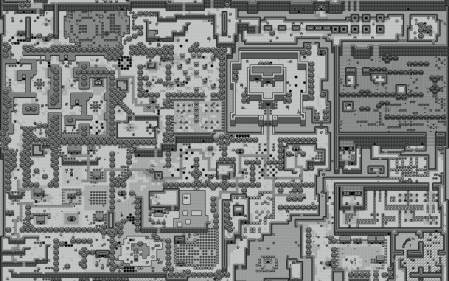

Curious? Wanna know who has a RBD device mapped?

W Important note: **this method only works with the Emperor version of Ceph and above.**

Grab the image information:

<table><tbody><tr><td class="gutter"><pre class="line-numbers">1
2
3
4
5
6
</pre></td><td class="code"><pre><code class="bash">$ rbd info boot
rbd image 'boot':
    size 10240 MB in 2560 objects
    order 22 (4096 kB objects)
    block_name_prefix: rb.0.89ee.2ae8944a
    format: 1
</code></pre></td></tr></tbody></table>

Then list the objects part of the pool and get the image header. Eventually run:

<table><tbody><tr><td class="gutter"><pre class="line-numbers">1
2
</pre></td><td class="code"><pre><code class="bash">$ rados -p rbd listwatchers boot.rbd
watcher=192.168.251.102:0/2550823152 client.35321 cookie=1
</code></pre></td></tr></tbody></table>

As we can see the machine: `192.168.251.102` has the device `boot` mapped.
