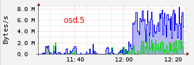
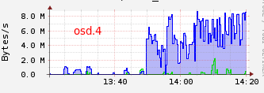
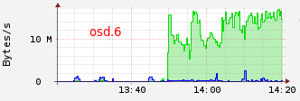

```
ceph health
HEALTH_WARN 1 near full osd(s)
```

Arrhh, Trying to optimize a little weight given to the OSD. Rebalancing load between osd seems to be easy, but do not always go as we would like…

# Increase osd weight

Before operation get the map of Placement Groups.

```
$ ceph pg dump > /tmp/pg_dump.1
```

Let’s go slowly, we will increase the weight of osd.13 with a step of 0.05.

```
$ ceph osd tree | grep osd.13
13  3                   osd.13  up  1   

$ ceph osd crush reweight osd.13 3.05
reweighted item id 13 name 'osd.13' to 3.05 in crush map

$ ceph osd tree | grep osd.13
13  3.05                osd.13  up  1
```

The new weight has been changed in the crushmap. Look at what is happening in the cluster.

```
$ ceph health details
HEALTH_WARN 2 pgs backfilling; 2 pgs stuck unclean; recovery 16884/9154554 degraded (0.184%)
pg 3.183 is stuck unclean for 434.029986, current state active+remapped+backfilling, last acting [1,13,5]
pg 3.83 is stuck unclean for 2479.504088, current state active+remapped+backfilling, last acting [5,13,12]
pg 3.183 is active+remapped+backfilling, acting [1,13,5]
pg 3.83 is active+remapped+backfilling, acting [5,13,12]
recovery 16884/9154554 degraded (0.184%)
```

Well, pg 3.183 and 3.83 is in active+remapped+backfilling state :

```
$ ceph pg map 3.183
osdmap e4588 pg 3.183 (3.183) -> up [1,13] acting [1,13,5]

$ ceph pg map 3.83
osdmap e4588 pg 3.83 (3.83) -> up [13,5] acting [5,13,12]
```

In this case, we can see that osd with id 13 has been added for this two placement groups. Pg 3.183 and 3.83 will respectively remove from osd 5 and 12. If we have a look on osd bandwidth, we can see those transfert osd.1 —> osd.13 and osd.5 —> osd.13 :

  

OSD 1 and 5 are primary for pg 3.183 and 3.83 (see acting table) and OSD 13 is writing.

I wait that cluster has finished. Then,

```
$ ceph pg dump > /tmp/pg_dump.3
```

Let us look at the change.

```
# Old map
$ egrep '^(3.183|3.83)' /tmp/pg_dump.1 | awk '{print $1,$9,$14,$15}'
3.183 active+clean [1,5] [1,5]
3.83 active+clean [12,5] [12,5]

# New map
$ egrep '^(3.183|3.83)' /tmp/pg_dump.3 | awk '{print $1,$9,$14,$15}'
3.183 active+clean [1,13] [1,13]
3.83 active+clean [13,5] [13,5]
```

So, for pg 3.183 and 3.83, osd 5 and 12 will be replace by osd13

# Deacrese osd weight

Same as above, but this time to reduce the weight for the osd in “near full ratio”.

```
$ ceph pg dump > /tmp/pg_dump.4

$ ceph osd tree | grep osd.7
7   2.65                osd.7   up  1

$ ceph osd crush reweight osd.7 2.6
reweighted item id 7 name 'osd.7' to 2.6 in crush map

$ ceph health detail
HEALTH_WARN 2 pgs backfilling; 2 pgs stuck unclean; recovery 17117/9160466 degraded (0.187%)
pg 3.ca is stuck unclean for 1097.132237, current state active+remapped+backfilling, last acting [4,6,7]
pg 3.143 is stuck unclean for 1097.456265, current state active+remapped+backfilling, last acting [12,6,7]
pg 3.143 is active+remapped+backfilling, acting [12,6,7]
pg 3.ca is active+remapped+backfilling, acting [4,6,7]
recovery 17117/9160466 degraded (0.187%)
```

On the osd bandwidth, we can see those transfert osd.4 —> osd.6 and osd.12 —> osd.6 :

  

OSD 4 and 12 are primary for pg 3.143 and 3.ca (see acting table) and OSD 6 is writing. The OSD 7 will be released from both PG who will both be added to the OSD 6. In my case, the osd 7 has no reading because it is only as replica for both pgs.

```
# Before
$ egrep '^(3.ca|3.143)' /tmp/pg_dump.3 | awk '{print $1,$9,$14,$15}'
3.143 active+clean [12,7] [12,7]
3.ca active+clean [4,7] [4,7]

# After
$ ceph pg dump > /tmp/pg_dump.5
$ egrep '^(3.ca|3.143)' /tmp/pg_dump.5 | awk '{print $1,$9,$14,$15}'
3.143 active+clean [12,6] [12,6]
3.ca active+clean [4,6] [4,6]
```

Well, obviously, the data are not really carried on the desired osd and now it is also too full. I think it will take a little time for something well balanced.

# Using crushtool

A good idea could be to test using `crushtool` with otpion —show-utilization.

Before retrieve current crushmap :

```
$ ceph osd getcrushmap -o crushmap.bin
```

You can show utilisation for a specific pool and rep size :

```
$ ceph osd dump | grep '^pool 0'
pool 0 'data' rep size 2 min_size 1 crush_ruleset 0 object_hash rjenkins pg_num 64 pgp_num 64 last_change 1 owner 0 
$ crushtool --test -i crushmap.bin --show-utilization --rule 0 --num-rep=2
  device 0: 123
  device 1: 145
  device 2: 125
  device 3: 121
  device 4: 139
  device 5: 133
  device 6: 129
  device 7: 142
  device 8: 146
  device 9: 139
  device 10:    146
  device 11:    143
  device 12:    129
  device 13:    136
  device 14:    152
```

Make modification, and test with new weight :

```
$ crushtool -d crushmap.bin -o crushmap.txt
# edit crushmap.txt
$ crushtool -c crushmap.txt -o crushmap-new.bin
$ crushtool --test -i crushmap-new.bin --show-utilization --rule 0 --num-rep=2
```

If all goes well, reimport crushmap :

```
$ ceph osd setcrushmap -i crushmap-new.bin
```

[http://ceph.com/docs/master/man/8/crushtool/](http://ceph.com/docs/master/man/8/crushtool/)

# osd reweight-by-utilization

Also, you can use `ceph osd reweight-by-utilization`.

[http://ceph.com/docs/master/rados/operations/control/#osd-subsystem](http://ceph.com/docs/master/rados/operations/control/#osd-subsystem)
