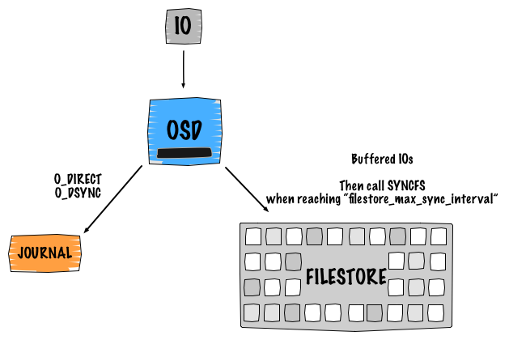
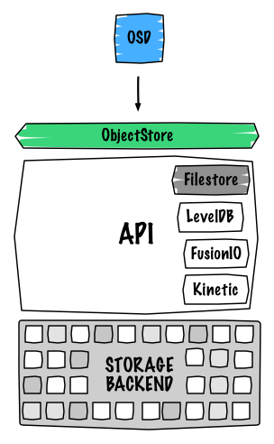
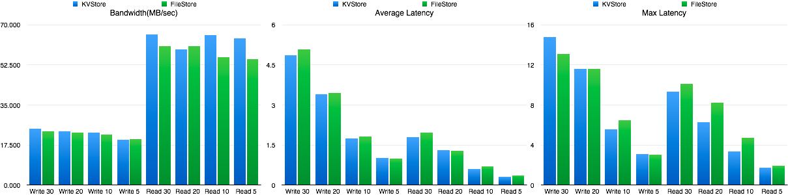
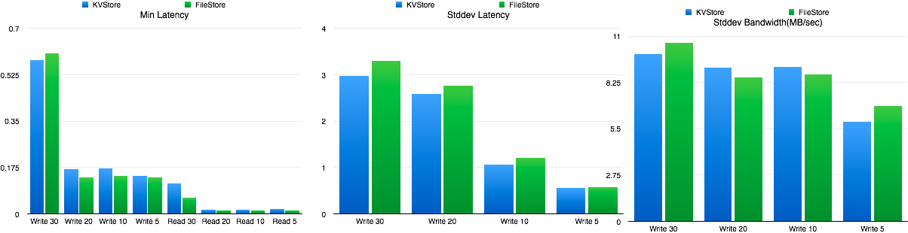

The Ceph developer summit is already behind us and wow! so many good things are around the corner! During this online event, we discussed the future of the Firefly release (planned for February 2014). During the last OpenStack summit in Hong Kong, I had the opportunity to discuss with Sage a new feature that might go into Firefly. This was obviously discussed during the CDS too. His plan is to add a multi-backend functionality for the filestore. And trust me this will definitely bring Ceph to another level.

  

  

# I. Current state of the integration

Before diving into the new implementation and what is about to change, I would like to give a brief introduction about the Ceph’s internal design. Detailed explanations can be find below the picture.



## I.1. A single write…

Ceph is Software Defined Storage which means that the replication and the availability of the data are served and ensured by a software intelligence. I believe it is important to understand how Ceph works internally (default logical design). The main point here is to show you what is happening under the hood while performing a write operation. So for this, let’s take an example of a single object write with a replica of 2. This leads to 4 IOs:

- Client sends his request to the primary OSD
- The first IO is written to the Ceph journal
- The journal uses libaio and writes with `O_DIRECT` and `O_DSYNC`. The write is processed with `writev()`
- The second IO is written to the backend filesystem with `buffered_io`. The write is processed with `writev()`
- The filestore calls `syncfs` and trim the journal when reaching `filestore_max_sync_interval` and waits for `syncfs` to finish before releasing the lock.

The same process is repeated to the secondary OSD for replication.

  

## I.2. About the journal

In the previous paragraph, I mentioned a journal but what does it do exactly? Well it does numerous things such as:

- Ensuring data and transaction consistency. It basically acts as a traditional filesystem journal, so it can replay stuff if something goes wrong.
- Provides atomic transactions. It keeps track of what was committed and what is going to be committed.
- Writes to the journal happen sequentially
- Works as a FIFO

Ceph OSD Daemon stops writes and synchronises the journal with the filesystem, allowing Ceph OSD Daemons to trim operations from the journal and reuse the space.

The above statements are not applicable if the OSD filesystem is Btrfs or ZFS. Traditionally, we recommend to use XFS or ext4 for the OSD filesystem, which makes the journal using the mode `writeahead`. We before write to the journal and then to the backend filesystem. This is a different approach with COW (Copy On Write) filesystems, the `writeparallel` mode is used. We write to the journal and the backend filesystem at the same time.

  

## I.3. Design penalty

Obviously, you already noticed that having a journal performing in `writeahead` mode causes a huge performance penalty while writing objects. Since we write twice, if the journal is stored on the same disk as the osd data this will result in the following:

```
Device:             wMB/s
sdb1 - journal      50.11
sdb2 - osd_data     40.25
```

Traditional enterprise SATA disks can deliver around 110 MB/sec for a sequential write IO pattern. So yes, basically we split into two our IOs.

In order to avoid (or hide) this effect there are several ways to implement the journal.

Usually, the Ceph journal is a just a file on the filesystem (under `/var/lib/ceph/osd/<osd-id>/journal`). First, this is extremely inefficient because of the filesystem overhead and second we don’t exactly know where the journal is placed on the hard drive disk (correlation between files and blocks).

Another way to implement it is by using a raw partition at the beginning of the OSD data disk. Basically, you just create a tiny partition using the first sectors. Since we are at the start of the device, we are sure that this is a fastest zone of the disk. The border is always faster and as soon as the arm gets closer to the center of the plater performance starts to decrease (it is a well known problem). It is probably the best way to use the journal if you don’t want to dedicate a disk for it.

Then if you want to bring higher performance you can use a separate spinning disk. Unfortunately, this won’t perform very well since the disk will spend most of its time seeking to write because of the concurrent journal writes occurring (multiple journal writes).

Finally, the best way to implement the journal is to use a separate SSD disk. Thanks to it, you get the common benefits of using a SSD such as: no seek, fast sequential writes and fast access times.

  

  

# II. Firefly: Object Store multi-backend

## II.1. Context

Currently, OSDs have a generic interface called `ObjectStore`, the only and default current implementation is called `FileStore`. The `FileStore` is a logical entity from Ceph that is responsible for the OSD data. In a nutshell, objects are being written as files on a filesystem. Generally, this happens under the `/var/lib/ceph/osd/<osd-id>/current/<pg-num>/` directory. Any filesystem layer brings some overhead and this is definitely a huge area for improvement. I would even say that is probably one of the last obvious bottleneck of distributed storage system.

A bunch of new key/value stores are emerging. Key/Value Stores are essentially really fast databases.

Two levels of KVS can be distinguished:

- Software:
    
    - [levelDB](https://code.google.com/p/leveldb/)
    - [RocksDB](https://github.com/facebook/rocksdb)
- Hardware:
    
    - [Fusionio NVMKV](https://opennvm.github.io/)
    - [Seagate Kinetic](https://github.com/Seagate/Kinetic-Preview)

  

**Another goodness from the key/value hardware stores is that they don’t even interact at the block layer level but directly at the data structure of the device.**

  

See below the general evolution:

|  | Type | Application | Access method | Level |
| --- | --- | --- | --- | --- |
|  | Flash disk | Application source code converts native data structures into block I/O | Conventional I/O Access | Block I/O |
|  | Flash beyond disk | Application source code does I/O with native data structures | Enhanced I/O | Atomic IO transaction - Key/value transaction - Native primitives |
|  | Flash as memory | Application source code manipulates native memory data structures | Memory Access | Extended memory - Persistent memory |

Some notes from [FusionIO](http://www.fusionio.com/) about Flash media benefits:

- 98% performance of raw writes Smarter media now natively understands atomic updates, with no additional metadata overhead.
- 2x longer flash media life, Atomic Writes can increase the life of flash media up to 2x due to reduction in write-ahead-logging and double- write buffering.
- 50% less code in key modules Atomic operations dramatically reduce application logic, such as journaling, built as work-arounds.

  

Extending the support of the `FileStore` for several hardware KVS backends will avoid the overhead generated by the filesystem since the filestore will directly talk to the device interface. Having a pluggable `FileStore` will allow it to talk to different APIs. Obviously, variant proprietary solution could be implemented later. It is just a matter of writing the backend.

Implementation logic:



  

## II.2. So what will radically change?

### II.2.1. Default backend

In my humble opinion, the legacy `file` backend will probably disappear in favor of levelDB or RocksDB. It has been proposed for [Emperor](http://wiki.ceph.com/01Planning/02Blueprints/Emperor/Add_LevelDB_support_to_ceph_cluster_backend_store). Haomai Wang recently gave some updates about the implementation on the [Ceph mailing list](http://www.spinics.net/lists/ceph-users/msg06089.html). The first pieces of the code can be found on [his Github](https://github.com/yuyuyu101/ceph/commit/6a69c9c555ee95a28a783d1b182cee89e156bf9d). [LevelDB](https://code.google.com/p/leveldb/) is a fast key-value storage library written at Google that provides an ordered mapping from string keys to string values.

The project provides plenty of features such as:

- Atomic transactions
- Multiple changes can be made in one atomic batch.

LevelDB has already been implemented for storing Monitor’s data since Cuttlefish.

  

### II.2.1. No more journal!

The journal is a legacy thing tighten with the `FileStore` implementation. As mentioned above, we avoid the filesystem overhead. Most of the KVS store will handle making things transactional. So basically, we don’t need to rely on a journal anymore to store the transaction, we just rely on the new backend.

Key/value DBs have a transaction parameter, so we take the transaction as is from the OSD and give it to the key/value store. Then, it will make sure that the transaction is atomic.

This implies a huge design improvement. For instance, a single object write with a replica count of 2 will lead to two IOs not four as it used to be.

  

### II.2.2. Performance improvement

We reduce one step lower the data path with this implementation thus this will inevitably boost up our performance.

Thanks to [Haomai Wang](http://www.wzxue.com/), we already have a preview of the performance:

  





Overall performance are higher than `FileStore`, it is not that a huge difference but keep in mind that it is currently a prototype.

For more information, please visit the [official blueprint](http://wiki.ceph.com/01Planning/02Blueprints/Firefly/osd%3A_new_key//value_backend).

  

  

> I feel really excited about this future implementation. It looks like things are getting serious with the Firefly release. Numerous features will be part of it such as erasure coding, tiering and the filestore multi-backend. Please also note that Firefly is likely to be the first LTS (Long Term Support) release of Ceph!
