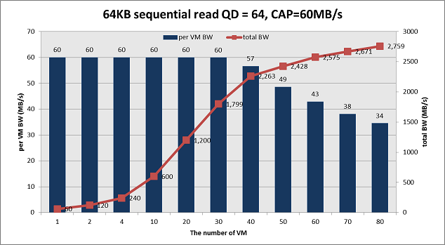
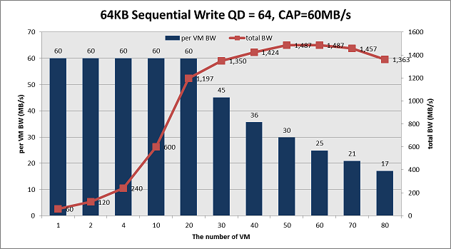
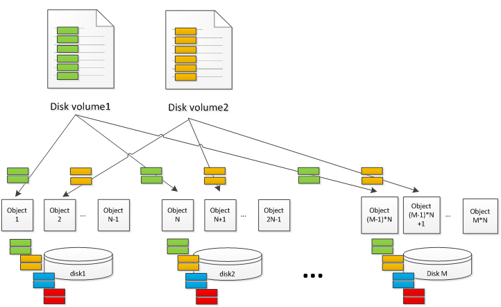
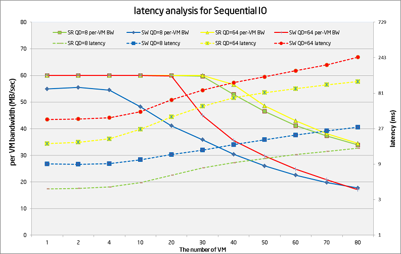
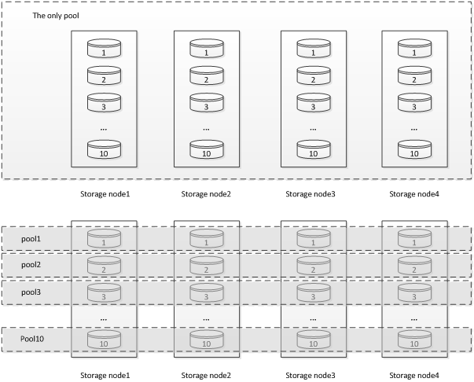
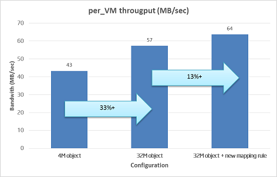

This is the 2nd post about Ceph RBD performance. In [part1](http://software.intel.com/en-us/blogs/2013/10/25/measure-ceph-rbd-performance-in-a-quantitative-way-part-i), we go talk about random IO perforamnce on Ceph. This time we share the sequential read/write testing data. In case you forget our hardware configurations, we use 40x 1TB SATA disks for data disk plus 12 SSD as journal. And 4x 10Gb links are used to connect the storage clusters with clients together, which provides enough network bandwidth. Below figures show the SR and SW performance with QD=64 and CAP=60MB/s per VM. With the number of Volume/VM increases, the per-VM throughput drops gradually. The SR max total throughput 2759MB/sec happens at VM=80 and SW peak total throughput 1487MB/sec happens at VM=50. However consider our pre-defined QoS requirement (Per-VM throughput is larger than 90% of the pre-defined target), we pick up VM=40 for SR and VM=30 for SW, which results in reported metrics as 2263MB/sec (SR) and 1197MB/sec (SW).

Is the result good enough? With the similar approach as we do for random IO, we measure the native disk performance as the reference. We observe ~160MB/sec sequential bandwidth per disk for both read and write. And we measure ~900MB/sec for single 10Gb NIC. In theory, the 40 SATA disks are expected to deliver 6400MB/sec for read and 3200MB/sec for write (replica=2). And 4x 10Gb can deliver ~3600MB/sec bandwidth. Thus the final Ceph efficiency is 57% for SR and 37% for SW as below table. comparing to random IO testing result, this is not a perfect result.

Let’s take a look at Ceph architecture to understand the data better. Below figure illustrates a conceptual Ceph cluster, which has M disks and each disk is mapped with N-1 objects. The size of volume disk is marked as Volume\_Size. Assuming the object size is Size\_O, each virtual disk volume is composed of Volume\_Size/Size\_O objects. To simplify the problem, some components (e.g. PG and replica impact) are ignored on purpose. The IO requests from virtual disk volumes are distributed to different objects based on CRUSH algorithm and become the real read/write hit on disks. Due to several objects map to the same physical disks, the original logical sequential IO streams mix together (green, orange, blue and read blocks). And the real IO pattern on each physical disk becomes random with disk seeking happen. As the result, latency becomes much longer and total throughput drops a lot. 

Blktrace result proves our assumptions. We collect ~37K IO traces in two experiments. In the left figure, we run 40 VM. All of them generate full sequential read. In the right figure, we run 20 sequential IO VM and 20 random IO VM at the same time. Even on the all sequential IO case, there is 26% IO non-adjacent – which means seeking happen. When there is half random IO load, the need-seeking IO ratio increases to 59%. In a real product environment, we believe the random IO steam ratio should be higher, which expects to make more impact to sequential IO steam performance.

Below figure shows the per-VM BW and latency analysis for sequential read/write pattern under different FIO queue size (QD) and volume/VM number. There are several findings:

- Read performance is better than write – because the write generates twice physical IO comparing to read.
- SSD journal doesn’t bring the same benefit as we observe in random IO tests. We believe this is due to sequential IO has a much higher bandwidth throughput, which utilizes the cache space very quickly.
- For QD=8 cases, the read latency starts from 4ms and ends with 15ms. The write latency starts from 9ms and ends with 28ms. Further study shows the physical IO pattern becomes more random w/ a higher VM number, which is reasonable.
- For QD=64 cases, the read latency starts from 17ms and ends with 116ms. The write latency starts from 36ms and ends with 247ms. The larger starting latency is abnormal because at this point the storage cluster is far from full of load. Latency breakdown tests tell us most of the latency comes from the client side, which shows potential optimization opportunity.

We believe the low sequential IO performance issue is not only a challenge for Ceph, but for all other distributed storage system with the similar design. Per our understanding, there are potentially two general ways to improve the sequential IO performance: to make random IO run faster or to optimize the IO pattern to increase sequential IO percent.

- Firstly let’s look at the possibility to reduce the random IO latency. One way is to optimize the existing software code. Remember we observe 36ms latency for SW with only one VM QD=64? The latency is extreme high consider the storage cluster is far from full of load at this moment. We believe the extra latency comes from software issues (locking, single thread queue etc.) By removing those software bottlenecks, we should be able to shorten the IO latency and improve the total throughput. The other way is to speed up the file store part, either by adding more memory or taking SSD as a write back/through cache. The 2nd one seems more interesting because the cost advantage comparing to DRAM and usually the journal may not use all the SSD space. However this need more experiments to understand the bandwidth requirement if we use the same SSD for journal and cache. There are some related BP talking about this – like the Cache Tier (although it use SSD cache at the different level per my understanding) and new NAND interface support etc.
- The 2nd way is to change the IO pattern thus there is a higher adjacent IO percent with less seeking happens. There are two cases where the logical sequential IO stream is interrupted: The 1st one is the when the logical address of the same volume increases, the mapping object moves from one object to the other object (either on the same physical storage node or a different one). The 2nd case is that it is interrupted by other IO read/write to the same hard disk but from a different volume. Accordingly, we can also try two tuning methods. The 1st is to use bigger object size – thus the possibility of jumping to a different objects/nodes becomes less. And the 2nd one is to use better mapping rules. By default, we put all the disks into the same pool. Thus the virtual address space from one virtual volume is also distributed to all the physical disks. In this case, there are many IO streams from different volumes hit the same hard disk, resulting in a higher fragmented access pattern. The better way is to create multiple pools. Each pool has limited disks and serves less volumes. Thus there are fewer IO streams share the same hard disks, resulting in a better sequential pattern. Below figure demonstrates the two configurations. The idea is from the best paper “[Copysets: Reducing the Frequency of Data Loss in Cloud Storage](https://www.usenix.org/conference/atc13/copysets-reducing-frequency-data-loss-cloud-storage)” in ATC 2013. The author’s original goal is to reduce the disk lost impact, which is valid for Ceph case. We suggest we may consider to keep this as “best practice” and add some function into Ceph to ease administrator’s work. 

We did some tests to verify the two tuning options as below figure. The left bar (4MB object) is the default configuration with 4MB object size and one pool for all disks. The 2nd bar (32MB object) is the 32MB object size with the one pool for all disks. And the rightest bar (32MB object + new mapping rule) is the 32MB object size and 10pool with 4 disks each. With 40VM/volume and same pressure load, the average per-VM bandwidth is increased from 43MB/sec to 57MB/sec (33% gain) and 64MB/sec (13% gain). This seems to be a pretty good start. For next step, we will continue to try different tuning parameters to understand the tradeoff and identify the optimization opportunity to achieve a high sequential throughput. For example, Sage Weil from Inktank suggest we should turn on the RBD client cache, which is expected to increase the read/write package size, thus reduce the latency of each IO.

As the summary, the default sequential IO performance of Ceph is not promising enough. Although by applying some tuning BKM the performance becomes better, further study and optimization is still required. If you have any suggestions or comments on this topic, please mail me (**jiangang.duan@intel.com**) to let us know. Again thanks for teams’ work to provide the data and help review. On next part, I hope we can share more things about how to use SSD for Ceph.

BTW, I delivered the session “Is Open Source Good Enough? A Deep Study of Swift and Ceph Performance” on this month HongKong openstack conference ([link](http://www.openstack.org/summit/openstack-summit-hong-kong-2013/session-videos/presentation/is-open-source-good-enough-a-deep-study-of-swift-and-ceph-performance)). Thanks for all the guys come to my talk especially consider it is the last session on the last day. :)

- [openstack ceph](http://software.intel.com/en-us/tags/45358)

## Icon Image: 

- [Cloud Computing](http://software.intel.com/en-us/search/site/language/en?query=Cloud%20Computing)

- [Cloud Services](http://software.intel.com/en-us/search/site/language/en?query=Cloud%20Services)
- [Server](http://software.intel.com/en-us/search/site/language/en?query=Server)
