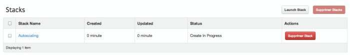
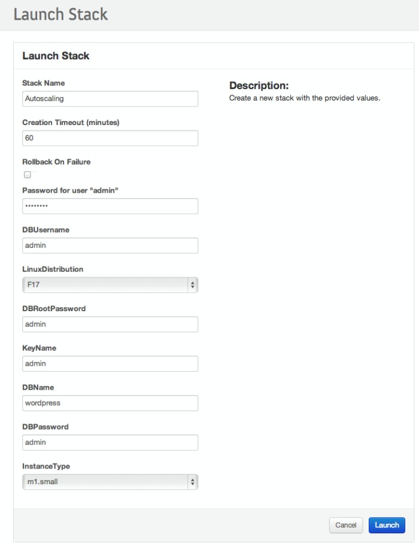
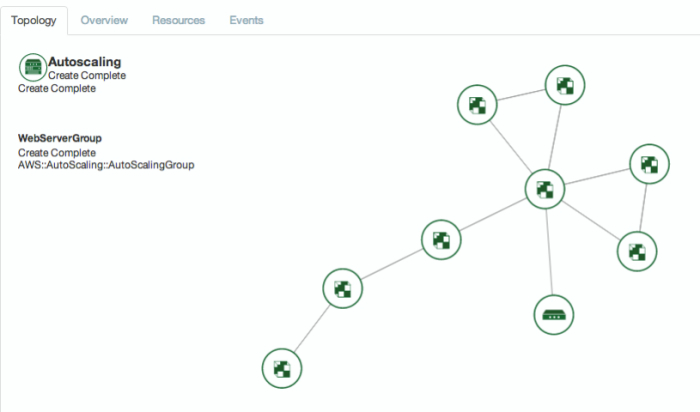
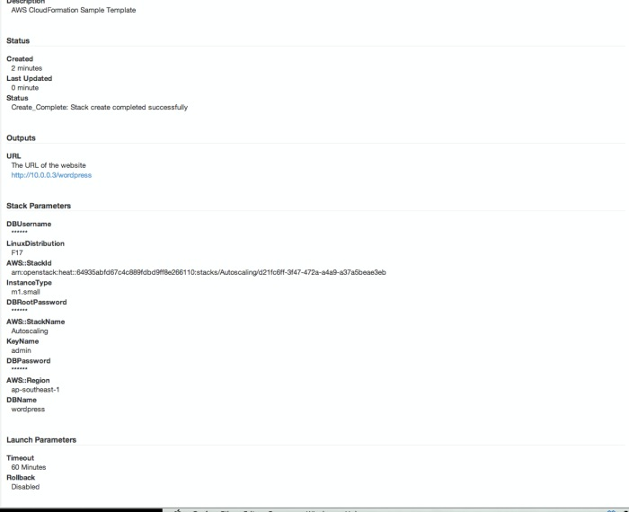
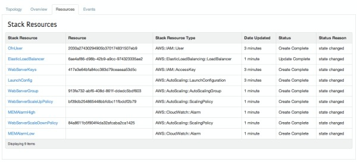
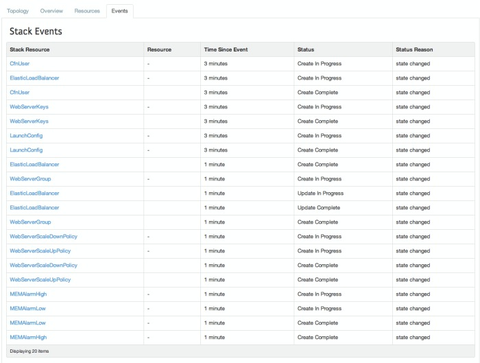
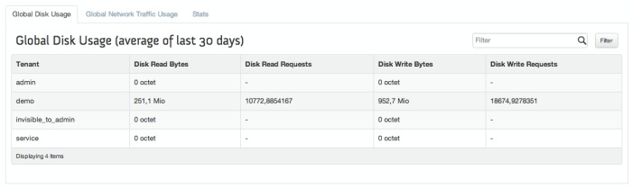
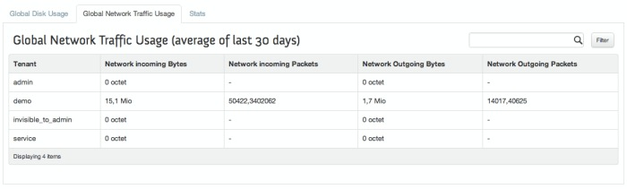
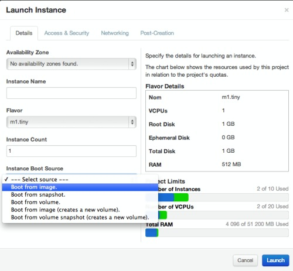
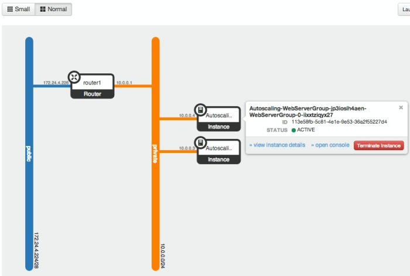

The Havana milestone release of the Horizon dashboard brought an absolutely wonderful panel for Heat, the orchestration service and Ceilometer, the metering service. Quick preview before the Havana’s official release.

  

# I. Heat

Grab a simple [Wordpress template](https://raw.github.com/openstack/heat-templates/master/cfn/F17/WordPress_Single_Instance.template):

Create your stack:

Describe it:

Topology animation. The first time I clicked on the button and saw this animation, I was really impressed. It’s really fancy, smooth and you can move the whole thing by dragging one item and move with your mouse. Pretty funny :D.

Stack overview:

Stack Resources:

Stack events:

  

# II. Ceilometer

**Note: admin panel only**

Disk usage:

Network usage:

Graph:

  

# III. Minor enhancements

## III.1 Instance boot

The instance boot panel also got a fresh new look while trying to boot from different soruces:

## III.2. Network topology

The network topology panel also had a nice re-looking. We now have 2 differents views (small and normal), depends on the number of instances you run. Another cool thing is that you can directly interact with the VM from the network topology panel and for instance request a termination or the console.

  

> Thanks for reading!
