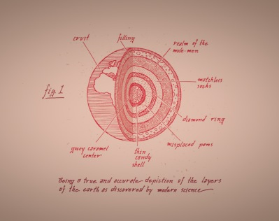

The goal of this little analysis was to determine the overhead generated by Ceph. One important point was also to estimate the deviance brought by Ceph between RAW IOs from disk and Ceph IOs.

The benchmark plan:

- Benchmark the disk to get RAW performances
- Run a Ceph IO. Then verify the performances, basically I expect them to be close from the RAW benchmarks.
- Run a RADOS Bench. Then estimate the effect of the first write to the OSD and the filestore flush.

The test ran on a 1TB disk @7.2K RPM.

The workload was run in order to simulate RBD objects writes. The fio template used is the following:

```
[global]
ioengine=libaio
invalidate=1
ramp_time=5
exec_prerun="echo 3 > /proc/sys/vm/drop_caches"
iodepth=1
runtime=300
time_based
direct=1 
bs=4m
filename=/dev/sdb1

[seq-write]
stonewall
rw=write

[seq-read]
stonewall
rw=read
```

Below the FIO results:

```
seq-write: (groupid=0, jobs=1): err= 0: pid=4230
  write: io=44900MB, bw=153016KB/s, iops=37 , runt=300475msec

seq-read: (groupid=2, jobs=1): err= 0: pid=4272
  read : io=48204MB, bw=164268KB/s, iops=40 , runt=300490msec
```

The bandwidth announced by FIO was 149.4MB/sec for the sequential writes and 160.4MB/sec for the sequential reads.

  

Then, I compared my RAW results with a Ceph IO:

<table><tbody><tr><td class="gutter"><pre class="line-numbers"><span class="line-number">1</span>
<span class="line-number">2</span>
<span class="line-number">3</span>
<span class="line-number">4</span>
</pre></td><td class="code"><pre><code class="bash"><span class="line"><span class="nv">$ </span>ceph tell osd.0 bench
</span><span class="line">osd.0: <span class="o">{</span> <span class="s2">"bytes_written"</span>: 1073741824,
</span><span class="line">  <span class="s2">"blocksize"</span>: 4194304,
</span><span class="line">  <span class="s2">"bytes_per_sec"</span>: <span class="s2">"145153639.000000"</span><span class="o">}</span>
</span></code></pre></td></tr></tbody></table>

So basically 138.4MB/sec from the ceph osd bench against 149.4MB/sec for FIO. I would say that’s fine since FIO ran for 43GB and the ceph osd bench only wrote 1GB.

  

Finally, I ran a write RADOS bench **locally** with a concurrency of 1 on a pool with a replica size of 1 during 300 seconds. Basically, all the IOs were send one by one, each time waiting for the OSD ack.

  

A single object write with a replica of 1 leads to 2 IOs:

- Client sends his request to the primary OSD
- First IO is written to the Ceph journal with o\_direct and aio
- The filestore flushes the IO to the backend fs with buffered IO

The command I used:

<table><tbody><tr><td class="gutter"><pre class="line-numbers"><span class="line-number">1</span>
</pre></td><td class="code"><pre><code class="bash"><span class="line"><span class="nv">$ </span>rados -p leseb bench 300 write -b 4194304 -t 1 --no-cleanup
</span></code></pre></td></tr></tbody></table>

Results below:

```
Total time run:         300.097605
Total writes made:      6188
Write size:             4194304
Bandwidth (MB/sec):     82.480

Stddev Bandwidth:       8.39157
Max bandwidth (MB/sec): 100
Min bandwidth (MB/sec): 0
Average Latency:        0.0484891
Stddev Latency:         0.0146481
Max latency:            0.329817
Min latency:            0.029509
```

  

> As far as I saw, the difference between the RAW results (FIO runs) and the ceph osd tell wasn’t that big, which is quite normal in the end. The RADOS bench wasn’t that bad as well, the impact on the drive is less than expected. Just keep in mind that the test was run locally, thus no network communications were involved and only one replica was set.
