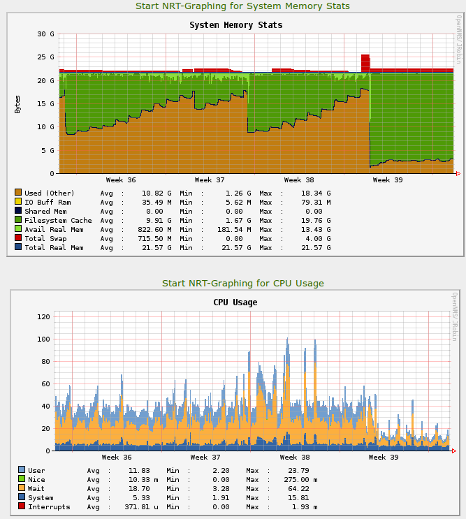

Memory leaks disappeared and CPU load dramatically reduced. Yay!

  

The upgrade started during the **week 39**.

  

The first graph shows the amount of RAM used before and after the Ceph upgrade. As you might know, they were numerous memory leaks in Argonaut and the picture clearly demonstrates that. It’s obvious that the upgrade solved them.

The second graph shows the CPU usage by the Ceph OSDs. Once again, the upgrade improved the general CPU utilisation.

  

> Significant improvements!
