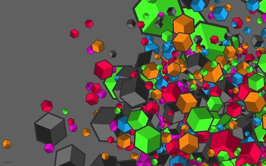

The title of the article is not that explicit, actually I had trouble to find a proper one. Thus let me clarify a bit. Here is the context I was wondering if Glance was capable of converting images within its store. The quick answer is no, but I think such feature is worth to be implemented. Glance could be able to convert a QCOW2 image to a RAW format. Usually if you already have an image within let’s say a Ceph cluster (RBD), you have to download the image (since you probably don’t have the source image file anymore), then manually convert it with qemu-img (QCOW2 –> RAW) and eventually import it into Glance. Enough talk about this, I’ll address this in a future article. For now let’s stick to the first matter. Imagine that you have a KVM cluster backed by a Ceph Cluster and your CTO wants you to migrate the whole environment to OpenStack because it’s trendy (joking, OpenStack just rocks!). You’re not going to backup all your images and then build a new cluster or something like that, you might want OpenStack (Glance) to be aware of your Ceph cluster. Generally speaking you _just_ have to connect Glance to one of your image pool. After this, the only thing to do is to create (it’s more registering the images ID and metadata than creating a new image) into Glance. No worries here’s the explanation. Longest introduction ever.

In this article, I’m assuming that Glance is already connected to Ceph and to the proper RBD pool. Before starting anything, please understand that **within the current Grizzly stable branch, the RBD backend is not implemented**. That’s funny because we don’t need that much to implement it. The bug report is on [launchpad](https://bugs.launchpad.net/glance/+bug/1176994) and the proposed feature is under review on [Gerrit](https://review.openstack.org/#/c/28325/).

However if you want to enable the fix now:

- Go to the line **278** of `/opt/stack/glance/glance/api/v1/images.py`
- Then simply edit the line like so:

<table><tbody><tr><td class="gutter"><pre class="line-numbers">1
</pre></td><td class="code"><pre><code class="python">for scheme in ['s3', 'swift', 'http', 'rbd']:
</code></pre></td></tr></tbody></table>

## Let’s test this!

Get the image size from the rbd client:

<table><tbody><tr><td class="gutter"><pre class="line-numbers">1
2
3
4
5
6
</pre></td><td class="code"><pre><code class="bash">$ rbd -p images info ubuntu-raw
rbd image 'ubuntu-raw':
size 2048 MB in 512 objects
order 22 (4096 KB objects)
block_name_prefix: rb.0.3ded.2eb141f2
format: 1
</code></pre></td></tr></tbody></table>

Eventually create/register the new image:

<table><tbody><tr><td class="gutter"><pre class="line-numbers">1
2
3
4
5
6
7
8
9
10
11
12
13
14
15
16
17
18
19
20
21
</pre></td><td class="code"><pre><code class="bash">$ glance image-create --size 2147483648 --name ubuntu-rbd --store rbd --disk-format raw --container-format ovf --location rbd://ubuntu-raw
+------------------+--------------------------------------+
| Property         | Value                                |
+------------------+--------------------------------------+
| checksum         | None                                 |
| container_format | ovf                                  |
| created_at       | 2013-05-06T15:29:26                  |
| deleted          | False                                |
| deleted_at       | None                                 |
| disk_format      | raw                                  |
| id               | 0d47c421-b079-44ff-bcc5-ee711d500512 |
| is_public        | False                                |
| min_disk         | 0                                    |
| min_ram          | 0                                    |
| name             | ubuntu-rbd-hack                      |
| owner            | 19292b3b597b4ecc9a41103cc312a42f     |
| protected        | False                                |
| size             | 2147483648                           |
| status           | active                               |
| updated_at       | 2013-05-06T15:29:26                  |
+------------------+--------------------------------------+
</code></pre></td></tr></tbody></table>

R Note about the URI from the `--location` option, there are 2 way to build it, it can be:

- `rbd://<fsid>/<pool>/<image>/<snapshot>`
- `rbd://<image-name>` ; Glance will figured out the pool since you put it into the Glance configuration.

**It either 1 or 4 field(s).**

  

> Of course the example was only with one image but the method will definitely work for a whole Ceph cluster with tons of images!
