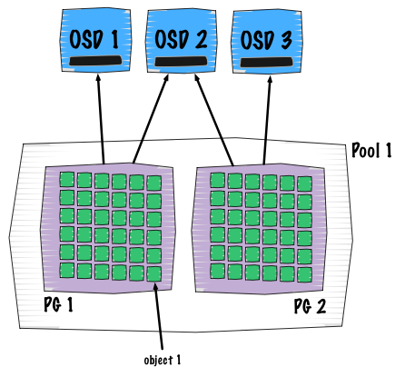

Ceph IO patterns analysis part 1: **The Good**.

  

  

> It's all about performance. The art of benchmarking is really complex. It is always difficult to predict, analyse and interpret your benchmarks. Sometimes you get number but you do not know their meaning, is it good? Is it bad? How good or bad is it? During the article, I will do my best to give you the best possible understand of how Ceph works internally.

  

# The good

## I.1. Deterministic object placement

I believe it is well known now but let me re-explain the concept again. The way Ceph determines objects placement is somehow unique.

A client will write (placement and dependancies are explained on the picture above):

- \=> to single pool (flat entity that contains objects)
- \=> this pools contains placement groups (see them as shards of pools)
- \=> this PG contain objects
- \=> these objects belong to only one placement group

Everything is computation based, this makes the whole process repeatable and deterministic. So no lookup on hash table, only formulas and calculation. The formula is more known as the CRUSH algorithm is the one that determines the placement of an object within the cluster.

  

## I.2. Aggregation: cluster level

  

> **As soon as you write into Ceph, all the objects get equally spead accross the entire cluster, understanding machines and disks.**.

  

The picture above takes the common case of a RBD block device either mapped on a physical host or inside a virtual machine. The behavior remains the same so we don't need to separate both cases. In the situation, a client generates a lot of random operations with 4K blocks. Obviously, each OSD represents a hard drive disk.

As explained on the previous section, each time a client wants to perform an IO operation it has to calculate the placement location. Thanks to the CRUSH algorithm, all the 4K IOs are distributed over the entire cluster taking advantage of the full network speed, disk IOPs and bandwidth.

Note: the possible bottleneck here could be the switch backplane, always make sure that it can sustain the maximum speed of each link.

  

## I.2. Aggregation: OSD level

  

> **As soon as an IO goes into an OSD, no matter how the original pattern was, it becomes sequential**.

  

The picture above describes the situation where object client computations end up into the same OSD as the other client. This is a really common case, moreover this is what is happening all the time. Multiple clients computing their object location and they all end up into a specific OSD.

The good thing here is that writes into the journal get serialized. Basically client writes get queued into the journal, waiting to be flushed to the backend store, just as they were entering a FIFO.

Note: the good to really benefit of this design is to use a dedicated disk to store your journals, typically a SSD.

Acknowledgement effectiveness: The primary OSD sends out the data to its replicas simultaneously with putting it into the journal.

  

> See you next time for the next part: **The Bad**.
