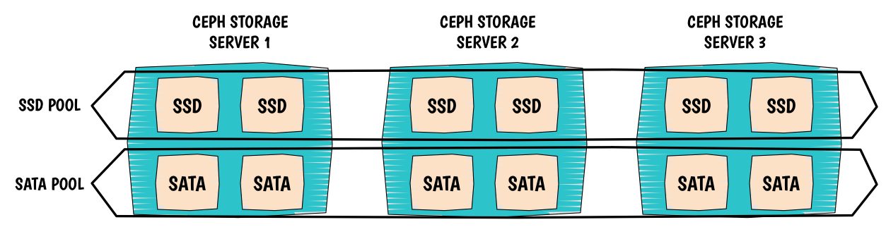

The use case is simple, I want to use both SSD disks and SATA disks within the same machine and ultimately create pools pointing to SSD or SATA disks. In order to achieve our goal, we need to modify the CRUSH map. My example has 2 SATA disks and 2 SSD disks on each host and I have 3 hosts in total.

  

To illustrate, please refer to the following picture:



  

# I. CRUSH Map

CRUSH is very flexible and topology aware which is extremely useful in our scenario. We are about to create two different `root` or entry point from which the CRUSH algorithm will go through to store our objects. We will have one root for our SSD disks and another one for our SATA disks. Looking at the CRUSH map below you will see that we duplicated our topology, it is like we let CRUSH thinking that we had two different platforms which not entirely true. We only represented a logical view of what we wish to accomplish.

Here the CRUSH map:

```
##
# OSD SATA DECLARATION
##
host ceph-osd2-sata {
  id -2   # do not change unnecessarily
  # weight 0.000
  alg straw
  hash 0  # rjenkins1
  item osd.0 weight 1.000
  item osd.3 weight 1.000
}
host ceph-osd1-sata {
  id -3   # do not change unnecessarily
  # weight 0.000
  alg straw
  hash 0  # rjenkins1
  item osd.2 weight 1.000
  item osd.5 weight 1.000
}
host ceph-osd0-sata {
  id -4   # do not change unnecessarily
  # weight 0.000
  alg straw
  hash 0  # rjenkins1
  item osd.1 weight 1.000
  item osd.4 weight 1.000
}

##
# OSD SSD DECLARATION
##

host ceph-osd2-ssd {
  id -22    # do not change unnecessarily
  # weight 0.000
  alg straw
  hash 0  # rjenkins1
  item osd.6 weight 1.000
  item osd.9 weight 1.000
}
host ceph-osd1-ssd {
  id -23    # do not change unnecessarily
  # weight 0.000
  alg straw
  hash 0  # rjenkins1
  item osd.8 weight 1.000
  item osd.11 weight 1.000
}
host ceph-osd0-ssd {
  id -24    # do not change unnecessarily
  # weight 0.000
  alg straw
  hash 0  # rjenkins1
  item osd.7 weight 1.000
  item osd.10 weight 1.000
}
```

Now we create our two roots containing our OSDs:

```
##
# SATA ROOT DECLARATION
##

root sata {
  id -1   # do not change unnecessarily
  # weight 0.000
  alg straw
  hash 0  # rjenkins1
  item ceph-osd2-sata weight 2.000
  item ceph-osd1-sata weight 2.000
  item ceph-osd0-sata weight 2.000
}

##
# SATA ROOT DECLARATION
##

root ssd {
  id -21    # do not change unnecessarily
  # weight 0.000
  alg straw
  hash 0  # rjenkins1
  item ceph-osd2-ssd weight 2.000
  item ceph-osd1-ssd weight 2.000
  item ceph-osd0-ssd weight 2.000
}
```

I create 2 new rules:

```
##
# SSD RULE DECLARATION
##

# rules
rule ssd {
 ruleset 0
 type replicated
 min_size 1
 max_size 10
 step take ssd
 step chooseleaf firstn 0 type host
 step emit
}

##
# SATA RULE DECLARATION
##

rule sata {
 ruleset 1
 type replicated
 min_size 1
 max_size 10
 step take sata
 step chooseleaf firstn 0 type host
 step emit
}
```

Compile and inject the new map:

`bash $ crushtool -c lamap.txt -o lamap.coloc $ sudo ceph osd setcrushmap -i lamap.coloc`

Then see the result:

\`\`\`bash $ sudo ceph osd tree

# id weight type name up/down reweight

\-21 12 root ssd -22 2 host ceph-osd2-ssd 6 1 osd.6 up 1 9 1 osd.9 up 1 -23 2 host ceph-osd1-ssd 8 1 osd.8 up 1 11 1 osd.11 up 1 -24 2 host ceph-osd0-ssd 7 1 osd.7 up 1 10 1 osd.10 up 1 -1 12 root sata -2 2 host ceph-osd2-sata 0 1 osd.0 up 1 3 1 osd.3 up 1 -3 2 host ceph-osd1-sata 2 1 osd.2 up 1 5 1 osd.5 up 1 -4 2 host ceph-osd0-sata 1 1 osd.1 up 1 4 1 osd.4 up 1 \`\`\`

  

# II. CRUSH rules

  

# Pools configuration

Create pools:

`bash root@ceph-mon0:~# ceph osd pool create ssd 128 128 pool 'ssd' created root@ceph-mon0:~# ceph osd pool create sata 128 128 pool 'sata' created`

Assign rules to the pools:

`bash root@ceph-mon0:~# ceph osd pool set ssd crush_ruleset 0 set pool 8 crush_ruleset to 0 root@ceph-mon0:~# ceph osd pool set sata crush_ruleset 1 set pool 9 crush_ruleset to 1`

Result from `ceph osd dump`:

```
pool 8 'ssd' replicated size 2 min_size 1 crush_ruleset 0 object_hash rjenkins pg_num 128 pgp_num 128 last_change 116 flags hashpspool stripe_width 0
pool 9 'sata' replicated size 2 min_size 1 crush_ruleset 1 object_hash rjenkins pg_num 128 pgp_num 128 last_change 117 flags hashpspool stripe_width 0
```

  

# III. OSDs configuration

Yes, you can disable updating the crushmap on start of the daemon:

```
[osd]
osd crush update on start = false
```

  

> WoW!
