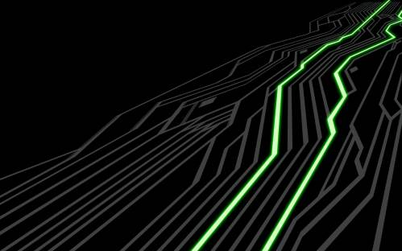

A simple in-memory backend that stores objects in RAM is available since version 0.76 and will land with Firefly. Quick look at this new feature.

  

W **DON'T DO THIS IN PRODUCTION**

  

The refactoring of `Filestore` brought a new way to store Ceph objects. You do not need any disks, all the objects live in the memory of your server. Obviously, this is extremely dangerous because if the server crashes or if the OSD process dies, you loose all the objects. On the other hand, if you gracefully stop or restart your OSD process, all your objects will get written on your hard drive disk.

To configure it just append the following line into your `ceph.conf` file:

```
osd objectstore = memstore
```
