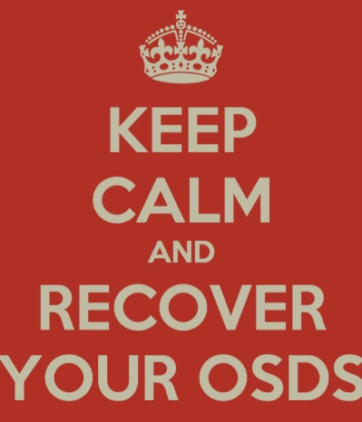

A common recommendation is to store OSD journal on a SSD drive which implies loosing your OSD if this journal fails. This article assumes that your OSDs have been originally deployed with `ceph-disk`. You will also realise that it's really simple to bring your OSDs back to life after replacing your faulty SSD with a new one.

Even if OSDs have segfaulted, data directories are still mounted so you can easily get the journal FSID:

`bash $ journal_uuid=$(sudo cat /var/lib/ceph/osd/ceph-0/journal_uuid) $ sudo sgdisk --new=1:0:+20480M --change-name=1:'ceph journal' --partition-guid=1:$journal_uuid --typecode=1:$journal_uuid --mbrtogpt -- /dev/sdk`

The journal symlink should not be broken anymore and available at `/var/lib/ceph/osd/ceph-0/journal`. Now we recreate the journal on our new partition and start our OSD.

`bash $ sudo ceph-osd --mkjournal -i 20 $ sudo service ceph start osd.20`

Bonus script:

\`\`\`bash

# !/bin/bash

osds="1 2 3" journal\_disk=/dev/sdk

for osd\_id in osds; do partition=1 journal\_uuid=$(sudo cat /var/lib/ceph/osd/ceph-$osd\_id/journal\_uuid) sudo sgdisk --new=$partition:0:+20480M --change-name=$partition:'ceph journal' --partition-guid=$partition:$journal\_uuid --typecode=$partition:$journal\_uuid --mbrtogpt -- $journal\_disk sudo ceph-osd --mkjournal -i $osd\_id sudo service ceph start osd.$osd\_id $((partition++)) done \`\`\`

  

> Simple right? To create more partitions, simply change the 1 in the sgdisk command with another number which represents the partition number.
