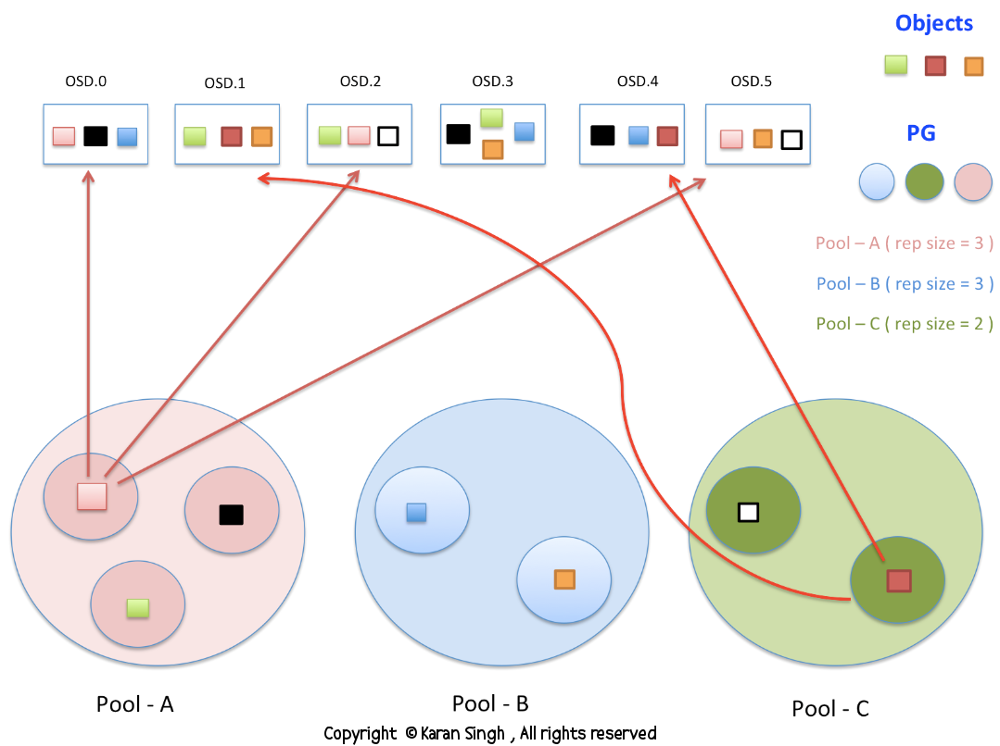

###   

### HOW :: Data is Storage Inside Ceph Cluster 

  

  

  
  

  

This is something definitely your would be wondering about , How Data \_ \_ \_ Ceph Cluster ? 

  

Now showing a easy to understand ceph data storage diagram.

  

  

\## POOLS : Ceph cluster has POOLS , pools are the logical group for storing objects .These pools are made up of PG ( Placement Groups ). At the time of pool creation we have to provide number of placement groups that the pool is going to contain , number of object replicas ( usually takes default value , if other not specified )

  

- Creating a pool ( pool-A ) with 128 placement groups

\# ceph osd pool create pool-A 128  
pool 'pool-A' created

- Listing pools

\# ceph osd lspools  
0 data,1 metadata,2 rbd,36 pool-A,

- Find out total number of placement groups being used by pool

\# ceph osd pool get pool-A pg\_num  
pg\_num: 128

- Find out replication level being used by pool ( see rep size value for replication )

\# ceph osd dump | grep -i pool-A  
pool 36 'pool-A' rep size 2 min\_size 1 crush\_ruleset 0 object\_hash rjenkins pg\_num 128 pgp\_num 128 last\_change 4051 owner 0

- Changing replication level for a pool ( compare from above step , rep size changed )

\# ceph osd pool set pool-A size 3  
set pool 36 size to 3  
#  
\# ceph osd dump | grep -i pool-A  
pool 36 'pool-A' rep size 3 min\_size 1 crush\_ruleset 0 object\_hash rjenkins pg\_num 128 pgp\_num 128 last\_change 4054 owner 0

  

This means all the objects of pool-A will be replicated 3 times on 3 different OSD's

  

Now , Putting some data in pool-A , and data would be stored in the form of objects  :-) thumb rule.

  

\# dd if=/dev/zero of=object-A bs=10M count=1  
1+0 records in  
1+0 records out  
10485760 bytes (10 MB) copied, 0.0222705 s, 471 MB/s  
#  
  
\# dd if=/dev/zero of=object-B bs=10M count=1  
1+0 records in  
1+0 records out  
10485760 bytes (10 MB) copied, 0.0221176 s, 474 MB/s  
#

- Putting some objects in pool-A

\# rados -p pool-A put object-A  object-A

\# rados -p pool-A put object-B  object-B

- checking how many objects  does the pool contains

\# rados -p pool-A ls  
object-A  
object-B  
#

  

\## PG ( Placement Group ): Ceph cluster links objects --> PG . These PG containing objects are spread across multiple OSD and improves reliability. 

  

\## Object : Object is the smallest unit of data storage in ceph cluster , Each & Everything is stored in the form of objects , thats why ceph cluster is also known as Object Storage Cluster. Objects are mapped to PG , and these Objects / their copies always spreaded on different OSD. This is how ceph is designed. 

  

- Locating object , to which PG it belongs and stored where ??

\# ceph osd map pool-A object-A  
osdmap e4055 pool 'pool-A' (36) object 'object-A' -> pg 36.b301e3e8 (36.68) -> up \[122,63,62\] acting \[122,63,62\]  
#

\# ceph osd map pool-A object-B  
osdmap e4055 pool 'pool-A' (36) object 'object-B' -> pg 36.47f173fb (36.7b) -> up \[153,110,118\] acting \[153,110,118\]  
#

Now , we already created a pool-A , changed its replication level to 3 , added objects ( object-A and object-B ) to pool-A . Observe the above output. It throws a lot of information

  

1. OSD map version id is e4055
2. pool name is pool-A
3. pool id is 36
4. object name ( which was enquired , object-A and object-B )
5. Placement Group id to which this object belongs is  ( 36.68 ) and ( 36.7b )
6. Our pool-A has replication level set to 3 , so every object of this pool should have 3 copies on different OSD , here our object's 3 copies resides on OSD.122 , OSD.63 and OSD.62

- Login to ceph nodes containing OSD 122 , 63 and 62
- You can see your OSD mounted

\# df -h /var/lib/ceph/osd/ceph-122  
Filesystem            Size  Used Avail Use% Mounted on  
/dev/sdj1             2.8T  1.8T  975G  65% /var/lib/ceph/osd/ceph-122  
#

- Browse to the directory where ACTUAL OBJECTS are stored

\# pwd  
/var/lib/ceph/osd/ceph-122/current  
#

- Under this directory if you do a ls command , you will see PG ID , In our case the PG id is 36.68  for object-A

\# ls -la | grep -i 36.68  
drwxr-xr-x 1 root root    54 Jan 24 16:45 36.68\_head  
#

- Browse to the PG head directory , give ls and Here you go you reached to your OBJECT.

\# pwd  
/var/lib/ceph/osd/ceph-122/current/36.68\_head  
#  
\# ls -l  
total 10240  
\-rw-r--r-- 1 root root 10485760 Jan 24 16:45 object-A\_\_head\_B301E3E8\_\_24  
#

  

Moral of the Story

  

- Ceph storage cluster can have more than one Pools
- Each pool SHOULD have multiple Placement Groups . More the PG , better your cluster performance , more reliable your setup would be.
- A PG contains multiple Objects.
- A PG is spreaded on multiple OSD , i.e Objects are spreaded across OSD. The first OSD mapped to PG will be its primary OSD and the other ODS's of same PG will be its secondary OSD.
- An Object can be mapped to exactly one PG
- Many PG's can be mapped to ONE OSD

  

How much PG you need for a POOL :

  

  

           (OSDs \* 100)  
Total PGs = ------------ 
              Replicas

  

\# ceph osd stat  
     osdmap e4055: 154 osds: 154 up, 154 in  
#

  

Applying formula gives me  = ( 154 \* 100 ) / 3 = 5133.33

  

Now , round up this value to the next power of 2 , this will give you the number of PG you should have for a pool having replication size of 3 and total 154 OSD in entire cluster.

  

Final Value = 8192 PG

  

  

