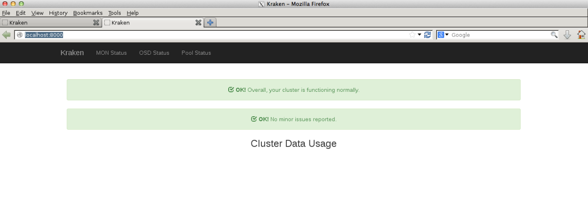
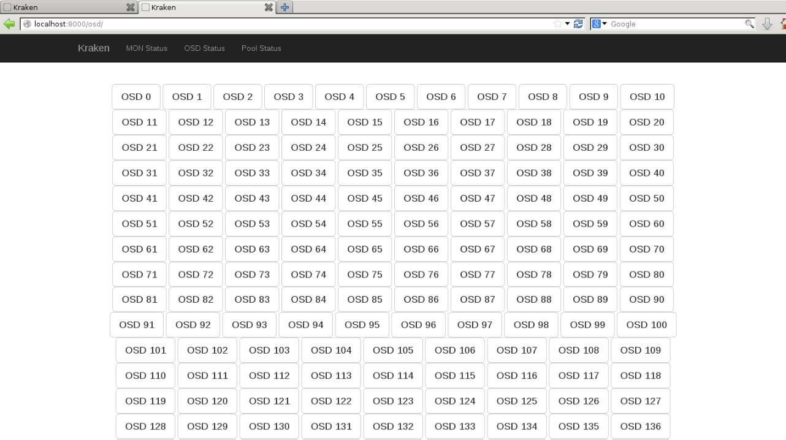
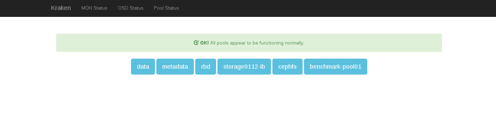

  

  

  

Kraken :: The Free Ceph Dashboard is Finally Live

  

Kraken is a Free ceph dashboard for monitoring and statistics. Special thanks to Donald Talton for this beautiful dashboard. 

  

  

Installing **Kraken**

- Install Prerequisites 

\# yum install git

\# yum install django

\# yum install python-pip

  
\# pip install requests

  

  
Requirement already satisfied (use --upgrade to upgrade): requests in /usr/lib/python2.7/site-packages

  

  
Cleaning up...

  

  
#

  

  
\# pip install django

  

  
Requirement already satisfied (use --upgrade to upgrade): django in /usr/lib/python2.7/site-packages

  

  
Cleaning up...

  

  
#

  

\# yum install screen

- Create a new user account 

\# useradd kraken

- Clone kraken from github

\# cd /home/kraken

\# git clone https://github.com/krakendash/krakendash

  
Cloning into 'krakendash'...

  

  
remote: Counting objects: 511, done.

  

  
remote: Compressing objects: 100% (276/276), done.

  

  
remote: Total 511 (delta 240), reused 497 (delta 226)

  

  
Receiving objects: 100% (511/511), 1.53 MiB | 343.00 KiB/s, done.

  

  
Resolving deltas: 100% (240/240), done.

  

  
#

  

- Exceute _api.sh_ and _django.sh_ one by one , these would get launched in screens , use ctrl A  and D  to detach from screen

  

\# ./api.sh

  
\[detached from 14662.api\]

  

  
\# ./django.sh

  

  
\[detached from 14698.django\]

  

  
#

  

  
\# ps -ef | grep -i screen

  

  
root     14662     1  0 07:29 ?        00:00:00 SCREEN -S api sudo ceph-rest-api -c /etc/ceph/ceph.conf --cluster ceph -i admin

  

  
root     14698     1  0 07:30 ?        00:00:00 SCREEN -S django sudo python krakendash/kraken/manage.py runserver 0.0.0.0:8000

  

  
root     14704 14472  0 07:30 pts/0    00:00:00 grep --color=auto -i screen

  

  
#

  

- Open your browser and navigate to _http://localhost:8000/_

  

  

  

  

  

  

  

  

  

  

  

- Great you have a Ceph GUI dashboard running now :-)
- Watch out this space for new features of kraken

  

  

  

