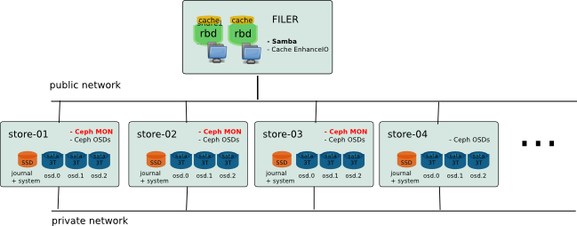
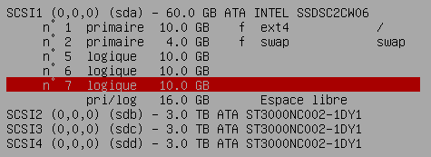
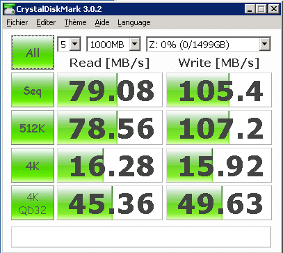

The aim is showing that it is possible to create a low-cost storage, efficient and scalable, using opensource solutions. In the example below, I am using [Ceph](http://ceph.com/) for scalability and reliability, combined with [EnhanceIO](https://github.com/stec-inc/EnhanceIO/) to ensure very good performance.

## Architecture

The idea was to create a storage with two parts: the storage itself (backing store) and a large cache to keep good performance on all data actually used. In fact, the volume needs may be important, but in the context of use for office, the data really used every day is only a portion of this storage. In my case, I intend to use Ceph deployed on low-cost hardware to ensure a scalable and reliable conformatble volume, based on small servers with large SATA drives. Data access will be via [Samba](http://www.samba.org/) shares on a slightly more powerful machine with an SAS Array to create a big cache. (Since Firefly, it would be more interesting to use ceph cache tiering)



## Hardware

#### Ceph Part (Backing Store)

The material you choose should match the requirements of both performance and cost. To keep prices extremely competitive machines chosen here are based on Supermicro hardware without additional disk controller. Initially, the ceph storage is composed of 5 machines: store-01-02 store, store-03-04 store, store-05. Each node is build with simple CPU Core 2, 4 GB Memory, 1 SSD Drive (Intel 520 60GB) for system and Ceph journal and 3 SATA Drive of 3 TO (Seagate CS 3TB) with no specific Drive controller (Using onbord controller).

#### Samba / EnhanceIO Part (File Server and Cache)

The cache must be on the same server as the file server. In my case, I use Dell server with 10 sas drive 10k in Raid10 for the cache.

#### Network

I do not provide for a specific network, just a gigabit switch with vlan to separate public / private network for Ceph OSD and interface bonding for file server.

The system is currently used everyday since more than one year. And it works perfectly.

# Installation

Here is some detail of the installation (from what I remember or I noted):

## Ceph Cluster

The current configuration is running on Ceph Cuttlefish (v0.61) and Debian Wheezy. (Installation made in June 2013.)

#### Debian install and partitionning

The operating system is installed on the SSD with 3 others partitions for osd journal.



```
$ apt-get install vim sudo sysstat ntp smartmontools
$ vim /etc/default/smartmontools
$ vim /etc/smartd.conf
```

#### Kernel upgrade

The use of the kernel version 3.12 available in backports seems improve memory footprint on the osd node.

```
$ echo "deb http://ftp.fr.debian.org/debian wheezy-backports main" >> /etc/apt/sources.list
$ apt-get install -t wheezy-backports linux-image-3.12-0.bpo.1-amd64
```

#### Ceph Installation

( Based on the official documentation: [http://ceph.com/docs/master/start/](http://ceph.com/docs/master/start/) )

On each server create a ceph user

```
$ useradd -d /home/ceph -m ceph
$ passwd ceph

$ vim [[/etc/hosts]]
192.168.0.1       store-b1-01
192.168.0.2       store-b1-02
192.168.0.3       store-b1-03
192.168.0.4       store-b1-04
192.168.0.5       store-b1-05

$ echo "ceph ALL = (root) NOPASSWD:ALL" | sudo tee /etc/sudoers.d/ceph
$ chmod 0440 /etc/sudoers.d/ceph
```

On store-b1-01 (deployment server)

Create a new key for ssh authentification :

```
$ ssh-keygen

$ cluster="store-b1-01 store-b1-02 store-b1-03 store-b1-04 store-b1-05"
$ for i in $cluster; do
      ssh-copy-id ceph@$i
  done

$ vim /root/.ssh/config
Host store*
        User ceph
```

Install ceph-deploy and its dependencies

```
$ wget -q -O- 'https://ceph.com/git/?p=ceph.git;a=blob_plain;f=keys/release.asc' | sudo apt-key add -
$ echo deb http://eu.ceph.com/debian-cuttlefish/ $(lsb_release -sc) main | sudo tee /etc/apt/sources.list.d/ceph.list
$ apt-get update
$ apt-get install python-pkg-resources python-setuptools ceph-deploy collectd
$ curl http://python-distribute.org/distribute_setup.py | python
$ easy_install pushy
```

Install ceph on cluster

```
$ ceph-deploy install $cluster
$ ceph-deploy new store-b1-01 store-b1-02 store-b1-03
$ vim ceph.conf
$ ceph-deploy mon create store-b1-01 store-b1-02 store-b1-03
```

Cluster deployment

```
$ ceph-deploy gatherkeys store-b1-01
$ ceph-deploy osd create \
            store-b1-01:/dev/sdb:/dev/sda5 \
            store-b1-01:/dev/sdc:/dev/sda6 \
            store-b1-01:/dev/sdd:/dev/sda7 \
            store-b1-02:/dev/sdb:/dev/sda5 \
            store-b1-02:/dev/sdc:/dev/sda6 \
            store-b1-02:/dev/sdd:/dev/sda7 \
            store-b1-03:/dev/sdb:/dev/sda5 \
            store-b1-03:/dev/sdc:/dev/sda6 \
            store-b1-03:/dev/sdd:/dev/sda7 \
            store-b1-04:/dev/sdb:/dev/sda5 \
            store-b1-04:/dev/sdc:/dev/sda6 \
            store-b1-04:/dev/sdd:/dev/sda7 \
            store-b1-05:/dev/sdb:/dev/sda5 \
            store-b1-05:/dev/sdc:/dev/sda6 \
            store-b1-05:/dev/sdd:/dev/sda7
```

Add in fstab:

```
/dev/sdb1       /var/lib/ceph/osd/ceph-0        xfs     inode64,noatime         0       0
/dev/sdc1       /var/lib/ceph/osd/ceph-1        xfs     inode64,noatime         0       0
/dev/sdd1       /var/lib/ceph/osd/ceph-2        xfs     inode64,noatime         0       0
```

One can check that all osd have been created, and check the cluster status :

```
$ ceph osd tree

# id    weight  type name   up/down reweight
-1  41.23   root default
-8  41.23       datacenter DC1
-7  41.23           rack b1
-2  8.24                host store-b1-01
0   2.65                    osd.0   up  1   
1   2.65                    osd.1   up  1   
2   2.65                    osd.2   up  1   
-3  8.24                host store-b1-02
3   2.65                    osd.3   up  1   
4   2.65                    osd.4   up  1   
5   2.65                    osd.5   up  1   
-4  8.24                host store-b1-03
6   2.65                    osd.6   up  1   
7   2.65                    osd.7   up  1   
8   2.65                    osd.8   up  1   
-5  8.24                host store-b1-04
9   2.65                    osd.9   up  1   
10  2.65                    osd.10  up  1   
11  2.65                    osd.11  up  1   
-6  8.24                host store-b1-05
12  2.65                    osd.12  up  1   
13  2.65                    osd.13  up  1   
14  2.65                    osd.14  up  1   
```

## File Server

#### Debian interface bonding

```
$ apt-get install ifenslave

$ vim /etc/network/interface
auto bond0
iface bond0 inet static
        address 192.168.0.12
        netmask 255.255.0.0
        gateway 192.168.0.1
        slaves eth0 eth1
        bond-mode 802.3ad

$ echo "alias bond0 bonding
options bonding mode=4 miimon=100 lacp_rate=1" > vim /etc/modprobe.d/bonding.conf

$ echo "bonding" >> /etc/modules
```

#### Kernel Version

The kernel version is important for using KRBD. I recommend to use at least kernel 3.10.26 or later.

```
$ apt-get install debconf-utils dpkg-dev debhelper build-essential kernel-package libncurses5-dev
$ cd /usr/src/
$ wget http://www.kernel.org/pub/linux/kernel/v3.0/linux-3.6.11.tar.bz2
$ tar xjf linux-3.6.11.tar.bz2
```

#### RBD

Create rbd volume (Format 1) :

```
$ rbd create datashare/share1 --image-format=1 --size=1048576

$ mkdir /share1
$ echo "/dev/rbd/datashare/share1   /share1 xfs _netdev,barrier=0,nodiratime        0   0" >> /etc/fstab
```

#### EnhanceIO

The choice of cache mechanism is focused on “EnhanceIO” because it allows to enable or disable cache while a source volume is being used. This is particularly useful when we want to resize a volume without interrupting service.

Build EnhanceIO :

```
$ apt-get install build-essential dkms
$ git clone https://github.com/stec-inc/EnhanceIO.git
$ cd EnhanceIO/
$ wget http://ftp.de.debian.org/debian/pool/main/e/enhanceio/enhanceio_0+git20130620-3.debian.tar.xz
$ tar xJf enhanceio_0+git20130620-3.debian.tar.xz
$ dpkg-buildpackage -rfakeroot -b
$ dpkg -i ../*.deb
```

Create cache :

For exemple in write-though : (/dev/sdb2 is a local partition dedicate for cache)

```
$ eio_cli create -d /dev/rbd1 -s /dev/sdb2 -p lru -m wt -b 4096 -c share1
```

If you want to use write-back cache, you can protect the file system to mount before the cache by using a symbolic link in the udev script. ( [https://github.com/ksperis/EnhanceIO/commit/954e167fdb580d514747512ce2bd1c9c29a77418](https://github.com/ksperis/EnhanceIO/commit/954e167fdb580d514747512ce2bd1c9c29a77418) )

#### Samba

Packages installation

```
$ echo "deb http://ftp.sernet.de/pub/samba/3.6/debian wheezy main" >> /etc/apt/sources.list
$ apt-get update
$ apt-get install sernet-samba sernet-winbind xfsprogs krb5-user acl attr
```

Update startup script

```
$ vim /etc/init.d/samba
# Should-Start:      slapd cups rbdmap
# Should-Stop:       slapd cups rbdmap

$ insserv -d samba
```

Configure and join the domain ( [https://help.ubuntu.com/community/ActiveDirectoryWinbindHowto](https://help.ubuntu.com/community/ActiveDirectoryWinbindHowto) )

```
$ vi /etc/krb5.conf
...
$ kinit Administrator@AD.MYDOMAIN.COM

$ vim /etc/samba/smb.conf
[global]
    workgroup = MYDOMAIN
    realm = AD.MYDOMAIN.COM
    netbios name = MYNAS
    wins server = 192.168.0.4
    server string = %h server
    dns proxy = no
    log file = /var/log/samba/log.%m
    log level = 1
    max log size = 1000
    syslog = 0
    panic action = /usr/share/samba/panic-action %d
    security = ADS
    winbind separator = +
    client use spnego = yes
    winbind use default domain = yes
    domain master = no
    local master = no
    preferred master = no
    encrypt passwords = true
    passdb backend = tdbsam
    obey pam restrictions = yes
    unix password sync = yes
    passwd program = /usr/bin/passwd %u
    passwd chat = *Enter\snew\s*\spassword:* %n\n *Retype\snew\s*\spassword:* %n\n *password\supdated\ssuccessfully* .
    pam password change = yes
    idmap uid = 10000-20000
    idmap gid = 10000-20000
    template shell = /bin/bash
    template homedir = /share4/home/%D/%U
    winbind enum groups = yes
    winbind enum users = yes
    map acl inherit = yes
    vfs objects = acl_xattr recycle shadow_copy2
    recycle:repository =.recycle/%u 
    recycle:keeptree = yes
    recycle:exclude = *.tmp
    recycle:touch = yes
    shadow:snapdir = .snapshots
    shadow:sort = desc
    ea support = yes
    map hidden = no
    map system = no
    map archive = no
    map readonly = no
    store dos attributes = yes
    load printers = no
    printing=bsd
    printcap name = /dev/null
    disable spoolss = yes
    guest account = invité
    map to guest = bad user

$================================================================

[share0]
    comment = My first share
    path = /share0
    writable = yes
    valid users = @"MYDOMAIN+Domain Admins" "MYDOMAIN+laurent"

[share1]
    comment = Other share
    path = /share1
    writable = yes
    valid users = @"MYDOMAIN+Domain Admins" "MYDOMAIN+laurent"

....


$ /etc/init.d/samba restart
$ net join -U Administrator
$ wbinfo -u
$ wbinfo -g

$ vi /etc/nsswitch.conf
passwd:         compat winbind
group:          compat winbind
```

#### Virtual Shadow Copy

Using this script : [https://github.com/ksperis/autosnap-rbd-shadow-copy](https://github.com/ksperis/autosnap-rbd-shadow-copy)

#### TimeMachine Backup

Fisrt, create rbd timemachine and mount to /mnt/timemachine with noatime and uquota if you want to use per user quota (Do not add to the autosnap script.)

Install avahi

```
$ apt-get install avahi-daemon avahi-utils

$ vim /etc/avahi/services/smb.service
<?xml version="1.0" standalone='no'?>
<!DOCTYPE service-group SYSTEM "avahi-service.dtd">
<service-group>
  <name replace-wildcards="yes">%h (File Server)</name>
  <service>
    <type>_smb._tcp</type>
    <port>445</port>
  </service>
  <service>
    <type>_device-info._tcp</type>
    <port>0</port>
    <txt-record>model=RackMac</txt-record>
  </service>
</service-group>

$ vim /etc/avahi/services/timemachine.service
<?xml version="1.0" standalone="no"?>
<!DOCTYPE service-group SYSTEM "avahi-service.dtd">
<service-group>
  <name replace-wildcards="yes">%h (Time Machine)</name>
  <service>
    <type>_afpovertcp._tcp</type>
    <port>548</port>
  </service>
  <service>
    <type>_device-info._tcp</type>
    <port>0</port>
    <txt-record>model=TimeCapsule</txt-record>
  </service>
  <service>
    <type>_adisk._tcp</type>
    <port>9</port>
    <txt-record>sys=waMA=00:1d:09:63:87:e0,adVF=0x100</txt-record>
    <txt-record>dk0=adVF=0x83,adVN=TimeMachine</txt-record>
  </service>
</service-group>
```

Install netatalk and configure like this :

```
$ apt-get install netatalk
$ vim /etc/netatalk/afpd.conf
- -tcp -noddp -nozeroconf -uamlist uams_dhx.so,uams_dhx2.so -nosavepassword -setuplog "default log_info /var/log/afpd.log"


$ vim /etc/netatalk/AppleVolumes.default   (Remove home directory + Add :)
/mnt/timemachine/ "TimeMachine" cnidscheme:dbd options:usedots,upriv,tm allow:@"MYDOMAIN+Domain Users"

$ vim /etc/pam.d/netatalk
auth       required     pam_winbind.so
account    required     pam_winbind.so
session    required     pam_unix.so
```

Setting quota for a user : (Do not use soft limits, because it will not be recognized by timemachine.)

```
$ xfs_quota -x -c 'limit bhard=1024g user1' /mnt/timemachine
```

## Benchmark



( For sequential IO, bandwidth is limited by the network card on the client side. )
