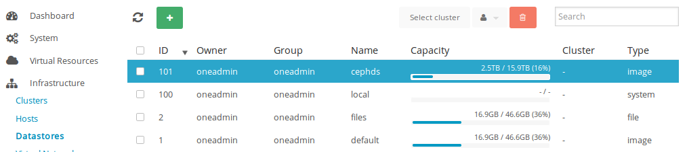

A quick howto to install OpenNebula 4.8 with support for Ceph on Debian Wheezy.

<table><tbody><tr><td class="gutter"><pre class="line-numbers"><span class="line-number">1</span>
<span class="line-number">2</span>
<span class="line-number">3</span>
<span class="line-number">4</span>
<span class="line-number">5</span>
<span class="line-number">6</span>
<span class="line-number">7</span>
<span class="line-number">8</span>
<span class="line-number">9</span>
<span class="line-number">10</span>
<span class="line-number">11</span>
<span class="line-number">12</span>
</pre></td><td class="code"><pre><code class="bash"><span class="line"><span class="nv">$ </span>onedatastore show cephds
</span><span class="line">DATASTORE 101 INFORMATION
</span><span class="line">ID             : 101
</span><span class="line">NAME           : cephds
</span><span class="line">USER           : oneadmin
</span><span class="line">GROUP          : oneadmin
</span><span class="line">CLUSTER        : -
</span><span class="line">TYPE           : IMAGE
</span><span class="line">DS_MAD         : ceph
</span><span class="line">TM_MAD         : ceph
</span><span class="line">BASE PATH      : /var/lib/one//datastores/101
</span><span class="line">DISK_TYPE      : RBD
</span></code></pre></td></tr></tbody></table>

# OpenNebula Installation

## OpenNebula Frontend

Install OpenNebula repo

```
wget -q -O- http://downloads.opennebula.org/repo/Ubuntu/repo.key | apt-key add -
echo "deb http://downloads.opennebula.org/repo/4.8/Debian/7/ stable opennebula" > /etc/apt/sources.list.d/opennebula.list
```

Download packages

```
apt-get update
apt-get install opennebula opennebula-sunstone nfs-kernel-server
```

Configure and start the service

```
sed -i -e 's/:host: 127.0.0.1/:host: 0.0.0.0/g' /etc/one/sunstone-server.conf
/etc/init.d/opennebula-sunstone restart
```

Export NFS

```
echo "/var/lib/one/ *(rw,sync,no_subtree_check,root_squash)" >> /etc/exports
service nfs-kernel-server restart
```

Configure SSH Public Key

```
su - oneadmin
$ cp ~/.ssh/id_rsa.pub ~/.ssh/authorized_keys


$ cat << EOT > ~/.ssh/config
Host *
    StrictHostKeyChecking no
    UserKnownHostsFile /dev/null
EOT
$ chmod 600 ~/.ssh/config
```

## OpenNebula Compute Nodes

Install OpenNebula repo

```
wget -q -O- http://downloads.opennebula.org/repo/Ubuntu/repo.key | apt-key add -
echo "deb http://downloads.opennebula.org/repo/4.8/Debian/7/ stable opennebula" > /etc/apt/sources.list.d/opennebula.list
```

Download packages

```
apt-get update
apt-get install opennebula-node nfs-common bridge-utils
```

Network config

```
vim /etc/network/interfaces
    ...
    bridge_ports eth0
    bridge_fd 9
    bridge_hello 2
    bridge_maxage 12
    bridge_stp off
```

Fstab

```
vim /etc/fstab
10.2.0.130:/var/lib/one/  /var/lib/one/  nfs   soft,intr,rsize=8192,wsize=8192,noauto
mount /var/lib/one/
```

Qemu config

```
cat << EOT > /etc/libvirt/qemu.conf
user  = "oneadmin"
group = "oneadmin"
dynamic_ownership = 0
EOT
```

# Ceph configuration

I suppose that you have already a Ceph cluster running.

Now create a pool “one” for Opennebula and create auth key.

```
ceph osd pool create one 128 128
ceph osd pool set one crush_ruleset 2
ceph auth get-or-create client.one mon 'allow r' osd 'allow rwx pool=one'
[client.one]
    key = AQCfTjVUeOPqIhAAiCAiBIgYd85fuMFT0dXVpA==
```

## Add Ceph firefly for support rbd on libvirt + qemu

Before, you need compile rbd support for libvirt and qemu. You can have a look to this post : [http://cephnotes.ksperis.com/blog/2013/09/12/using-ceph-rbd-with-libvirt-on-debian-wheezy](http://cephnotes.ksperis.com/blog/2013/09/12/using-ceph-rbd-with-libvirt-on-debian-wheezy) (If you do not want to compile qemu you can directluy download those packages here : [http://ksperis.com/files/qemu-kvm\_1.1.2+dfsg-6\_amd64.deb,](http://ksperis.com/files/qemu-kvm_1.1.2+dfsg-6_amd64.deb,) [http://ksperis.com/files/qemu-kvm\_1.1.2+dfsg-6\_amd64.deb](http://ksperis.com/files/qemu-kvm_1.1.2+dfsg-6_amd64.deb))

On each node, add Ceph firefly repo, and reinstall libvirt and qemu packages

```
apt-get install lsb-release
wget -q -O- 'https://ceph.com/git/?p=ceph.git;a=blob_plain;f=keys/release.asc' | sudo apt-key add -
echo deb http://ceph.com/debian-firefly/ $(lsb_release -sc) main | sudo tee /etc/apt/sources.list.d/ceph.list
apt-get update
apt-get install librados2 librbd1

dpkg -i qemu-kvm_1.1.2+dfsg-6+deb7u4_amd64.deb qemu-utils_1.1.2+dfsg-6a+deb7u4_amd64.deb
```

Create the secret for libvirt :

```
echo "
<secret ephemeral='no' private='no'>
   <usage type='ceph'>
     <name>client.one secret</name>
   </usage>
</secret>" > secret.xml


service libvirt reload
```

Add ceph datastore on OpenNebula

```
$ su - oneadmin
$ vim ceph.one
NAME         = cephds
DS_MAD       = ceph
TM_MAD       = ceph
DISK_TYPE    = RBD
POOL_NAME    = one
BRIDGE_LIST  ="onenode1 onenode2 onenode3"
CEPH_HOST    ="192.168.0.1:6789 192.168.0.2:6789 192.168.0.3:6789"
CEPH_SECRET  ="26a8b4d7-eb24-bf85-396d-fbf0x252e402"
CEPH_USER    ="one"

$ onedatastore create ceph.one
ID: 101
```

Example config :

```
$ onedatastore show cephds
DATASTORE 101 INFORMATION                                                       
ID             : 101                 
NAME           : cephds              
USER           : oneadmin            
GROUP          : oneadmin            
CLUSTER        : - 
TYPE           : IMAGE               
DS_MAD         : ceph                
TM_MAD         : ceph                
BASE PATH      : /var/lib/one//datastores/101
DISK_TYPE      : RBD                 

DATASTORE CAPACITY                                                              
TOTAL:         : 15.9T               
FREE:          : 13.4T               
USED:          : 2.5T                
LIMIT:         : - 

PERMISSIONS                                                                     
OWNER          : um- 
GROUP          : u-- 
OTHER          : --- 

DATASTORE TEMPLATE                                                              
BASE_PATH="/var/lib/one//datastores/"
BRIDGE_LIST="onenode1 onenode2 onenode3"
CEPH_HOST="192.168.0.1:6789 192.168.0.2:6789 192.168.0.3:6789"
CEPH_SECRET="26a8b4d7-eb24-bf85-396d-fbf0x252e402"
CEPH_USER="one"
CLONE_TARGET="SELF"
DISK_TYPE="RBD"
DS_MAD="ceph"
LN_TARGET="NONE"
POOL_NAME="one"
TM_MAD="ceph"
TYPE="IMAGE_DS"

IMAGES         
9              
10             
11             
12             
16             
21             
24             
27             
28             
29             
31             
32             
```

Try import image in new datastore :

```
$ oneimage create
    --name "CentOS-6.5_x86_64"
    --path "http://appliances.c12g.com/CentOS-6.5/centos6.5.qcow2.gz"
    --driver qcow2
    --datastore cephds
```

Datastore view in Sunstone :



More details here :

[http://ceph.com/community/ceph-support-in-opennebula-4-0/](http://ceph.com/community/ceph-support-in-opennebula-4-0/)

[http://archives.opennebula.org/documentation:archives:rel4.0:ceph\_ds](http://archives.opennebula.org/documentation:archives:rel4.0:ceph_ds)
