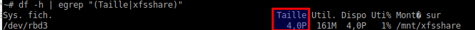
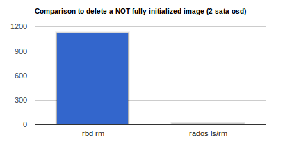
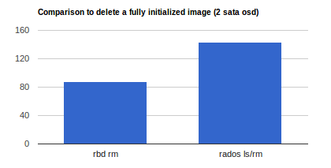

Create a disk with an insane size can be fun, but a little hard to remove.



Here’s a little trick (use with caution!) to remove a too big image for `rm rbd` (if image is not initialized, or not fully).

## Image format 1 :

```
$ rbd info rbdbigsize
rbd image 'rbdbigsize':
    size 1862 PB in 500000000000 objects
    order 22 (4096 kB objects)
    block_name_prefix: rb.0.47aa.74b0dc51
    format: 1
```

Remove the header file :

```
$ rados -p rbd rm rbdbigsize.rbd
```

Remove all rbd data : (This may take some time depending on the space already used on the blockdevice.)

```
$ rados -p rbd ls | grep '^rb.0.47aa.74b0dc51' | xargs -n 200  rados -p rbd rm
```

Finally, remove from rbd list :

```
$ rbd rm rbdbigsize
2014-06-12 16:27:20.838596 7fd86dff3760 -1 librbd::ImageCtx: error finding header: (2) No such file or directory
Removing image: 100% complete...done.
```

## Image format 2 :

```
$  rbd info rbdbigsize
rbd image 'rbdbigsize':
        size 1024 TB in 268435456 objects
        order 22 (4096 kB objects)
        block_name_prefix: rbd_data.81d12ae8944a
        format: 2
        features: layering
```

Remove header

```
$ rados -p rbd rm rbd_id.rbdbigsize 
$ rados -p rbd rm rbd_header.81d12ae8944a
```

Remove all rbd data :

```
$ rados -p rbd ls | grep '^rbd_data.81d12ae8944a.' | xargs -n 200  rados -p rbd rm
```

Remove from rbd list :

```
$ rbd rm rbdbigsize
2014-06-12 17:37:24.483587 7f413506c760 -1 librbd::ImageCtx: error finding header: (2) No such file or directory
Removing image: 100% complete...done.
```

## Time comparison :

Example of delete time for blockdevice of 1PB just formatted.

```
$ rbd create rbdbigsize --size=1073741824 --image-format=2
$ rbd map rbdbigsize
$ mkfs.xfs /dev/rbd0
$ rbd unmap /dev/rbd0

$ rados -p rbd ls | grep '^rbd_data.81d12ae8944a.' | wc -l
1536
```

The block device is composed solely of 1536 block and can be quickly removed via `rados rm` :

```
$ time rados -p rbd ls | grep '^rbd_data.81d12ae8944a.' | xargs -n 200  rados -p rbd rm
real    0m10.073s
user    0m1.244s
sys 0m0.228s
```

To compare:

```
$ time rbd rm rbdbigsize
Removing image: 100% complete...done.

real    1123m5.409s
user    686m19.924s
sys     229m56.596s
```



## Fully initialized image :

Of course, deleting a fully initialized image is faster with simple “rbd rm”. :)

```
$ rbd create rbdbigsize --size 1048576
$ rbd map rbdbigsize; dd if=/dev/zero of=/dev/rbd0; rbd unmap /dev/rbd0;
$ time (rados -p rbd ls | grep `rbd info rbdbigsize | grep block_name_prefix | grep -o 'rb.*$'` | xargs -n 200  rados -p rbd rm; rados -p rbd rm rbdbigsize.rbd; rbd rm rbdbigsize)

real    143m6.373s
user    2m49.100s
sys     0m22.080s


$ rbd create rbdbigsize --size 1048576
$ rbd map rbdbigsize; dd if=/dev/zero of=/dev/rbd0; rbd unmap /dev/rbd0;
$ time rbd rm rbdbigsize

real   88m44.121s
user    1m5.464s
sys     0m25.244s
```


