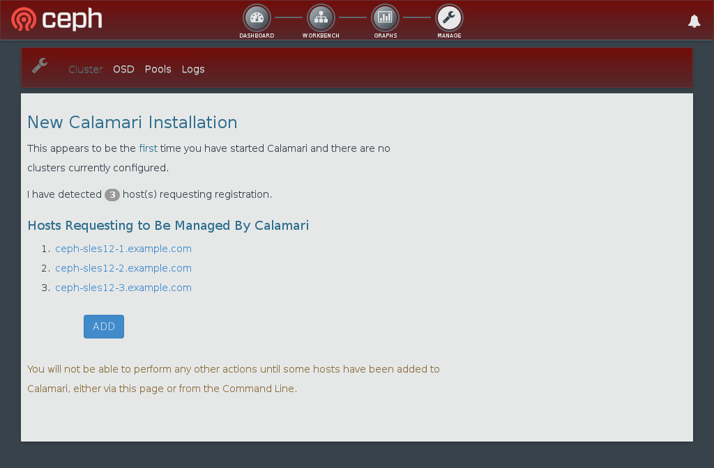
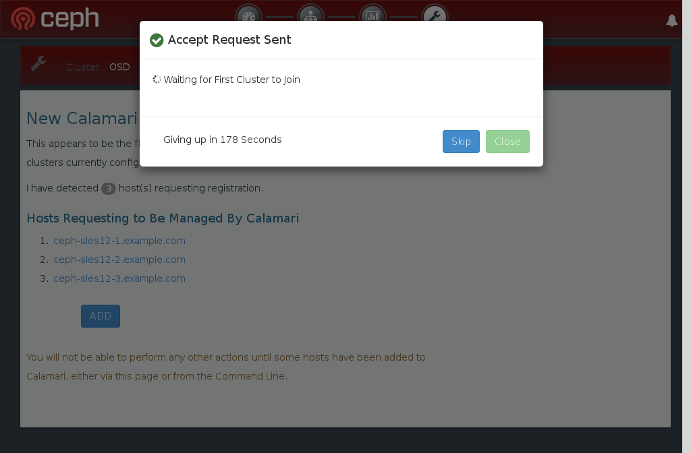
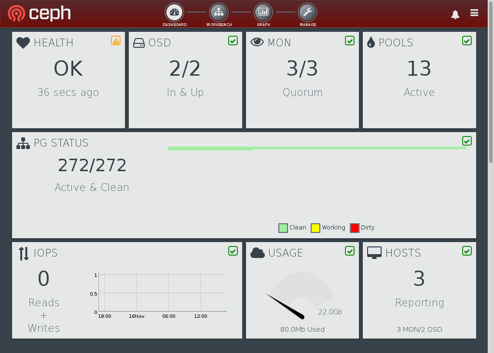

A few days ago I told [Andrew Wafaa](https://twitter.com/awafaa) I’d [write up some notes](https://twitter.com/tserong/status/532103203072901120) for him and publish them here. I became hungry contemplating this work, so decided cooking was the first order of business:

It turned out reasonably well for a first attempt. Could’ve been crispier, and it was quite salty, but the pepper and chilli definitely worked (I’m pretty sure the chilli was dried [bhut jolokia](http://en.wikipedia.org/wiki/Bhut_Jolokia) I harvested last summer). But this isn’t a post about food, it’s about some [software I’ve packaged](https://build.opensuse.org/project/show/systemsmanagement:calamari) for managing [Ceph](http://ceph.com/) clusters on [openSUSE](http://www.opensuse.org/en/) and [SUSE Linux Enterprise Server](https://www.suse.com/products/server/).

Specifically, this post is about [Calamari](http://www.inktank.com/software/future-of-calamari/), which was originally delivered as a proprietary dashboard as part of [Inktank Ceph Enterprise](http://www.inktank.com/enterprise/), but has since been [open sourced](http://ceph.com/community/ceph-calamari-goes-open-source/). It’s a [Django](https://www.djangoproject.com/) app, split into a [backend REST API](https://github.com/ceph/calamari) and a [frontend GUI](https://github.com/ceph/calamari-clients) implemented in terms of that backend. The upstream build process uses [Vagrant](https://www.vagrantup.com/), and is fine for development environments, but (TL;DR) doesn’t work for building more generic distro packages inside [OBS](https://build.opensuse.org/). So I’ve got a [separate branch](https://github.com/SUSE/calamari/tree/wip-suse-disruptive) that unpicks the build a little bit, makes sure Calamari is installed to FHS paths instead of `/opt/calamari`, and relies on regular packages for all its dependencies rather than packing everything into a Python [virtualenv](http://docs.python-guide.org/en/latest/dev/virtualenvs/). I posted some more details about this to the [Calamari mailing list](http://lists.ceph.com/pipermail/ceph-calamari-ceph.com/2014-October/000449.html).

Getting Calamari running on openSUSE is pretty straightforward, assuming you’ve already got a Ceph cluster configured. In addition to your Ceph nodes you will need one more host (which can be a VM, if you like), on which Calamari will be installed. Let’s call that the admin node.

First, on every node (i.e. all Ceph nodes and your admin node), add the systemsmanagement:calamari repo (replace openSUSE\_13.2 to match your actual distro):

\# zypper ar -f http://download.opensuse.org/repositories/systemsmanagement:/calamari/openSUSE\_13.2/systemsmanagement:calamari.repo

Next, on your admin node, install and initialize Calamari. The `calamari-ctl` command will prompt you to create an administrative user, which you will use later to log in to Calamari.

\# zypper in calamari-clients
# calamari-ctl initialize

Third, on each of your Ceph nodes, install, configure and start salt-minion (replace CALAMARI-SERVER with the hostname/FQDN of your admin node):

\# zypper in salt-minion
# echo "master: CALAMARI-SERVER" > /etc/salt/minion.d/calamari.conf
# systemctl enable salt-minion
# systemctl start salt-minion

Now log in to Calamari in your web browser (go to http://CALAMARI-SERVER/). Calamari will tell you your Ceph hosts are requesting they be managed by Calamari. Click the “Add” button to allow this.

 

Once that’s complete, click the “Dashboard” link at the top to view the cluster status. You should see something like this:

And you’re done. Go explore. You might like to put some load on your cluster and see what the performance graphs do.

## Concerning ceph-deploy

The instructions above have you manually installing and configuring salt-minion on each node. This isn’t too much of a pain, but is even easier with ceph-deploy which lets you do the whole lot with one command:

ceph-deploy calamari connect --master <calamari-fqdn> <node1> \[<node2> ...\]

Unfortunately, at the time of writing, we don’t have a version of ceph-deploy on OBS which supports the `calamari connect` command on openSUSE or SLES. I do have [a SUSE-specific patch](http://ourobengr.com/wp-uploads/2014/11/ceph-deploy-calamari-suse.patch_.txt) for ceph-deploy to fix this (feel free to use this if you like), but rather than tacking that onto [our build of ceph-deploy](https://build.opensuse.org/package/show/filesystems/ceph-deploy) I’d rather push something more sensible upstream, given the patch as written would break support for other distros.

## Distros systemsmanagement:calamari Builds Against

The [systemsmanagement:calamari](https://build.opensuse.org/project/show/systemsmanagement:calamari) project presently builds everything for openSUSE 13.1, 13.2, Tumbleweed and Factory. You should be able to use the packages supplied to run a Calamari server on any of these distros.

Additionally, I’m building salt (which is how the Ceph nodes talk to Calamari) and diamond (the metrics collector) for SLE 11 SP3 and SLE 12. This means you should be able to use these packages to connect Calamari running on openSUSE to a Ceph cluster running on SLES, should you so choose. If you try that and hit any missing Python dependencies, you’ll need to get these from [devel:languages:python](https://build.opensuse.org/project/show/devel:languages:python).

## Disconnecting a Ceph Cluster from Calamari

To completely disconnect a Ceph cluster from Calamari, first, on each Ceph node, stop salt and diamond:

\# systemctl disable salt-minion
# systemctl stop salt-minion
# systemctl disable diamond
# systemctl stop diamond

Then, make the Calamari server forget the salt keys, ceph nodes and ceph cluster. You need to use the backend REST API for this. Visit each of /api/v2/key, /api/v2/server and /api/v2/cluster in your browser. Look at the list of resources, and for each item to be deleted, construct the URL for that and click “Delete”. John Spray also [mentioned this](http://lists.ceph.com/pipermail/ceph-calamari-ceph.com/2014-July/000208.html) on the mailing list, and helpfully included a [couple of screenshots](http://imgur.com/a/FCaH9).

## Multiple Cluster Kinks

When doing development or testing, you might find yourself destroying and recreating clusters on the same set of Ceph nodes. If you keep your existing Calamari instance running through this, it’ll still remember the old cluster, but will also be aware of the new cluster. You may then see errors about the cluster state being stale. This is because the Calamari backend supports multiple clusters, but the frontend doesn’t (this is [planned for version 1.3](http://tracker.ceph.com/issues/8243)), and the old cluster obviously isn’t providing updates any more, as it no longer exists. To cope with this, on the Calamari server, run:

\# calamari-ctl clear --yes-i-am-sure
# calamari-ctl initialize

This will make Calamari forget all the old clusters and hosts it knows about, but will not clear out the salt minion keys from the salt master. This is fine if you’re reusing the same nodes for your new cluster.

## Sessions to Attend at SUSECon

[SUSECon](http://www.susecon.com/) starts tomorrow (or the day after, depending on what timezone you’re in). It would be the height of negligence for me to not mention the Ceph related sessions several of my esteemed colleagues are running there:

- [FUT7537](https://susecon2014.smarteventscloud.com/connect/sessionDetail.ww?SESSION_ID=7537) – SUSE Storage – Software Defined Storage Introduction and Roadmap: Getting your tentacles around data growth
- [HO8025](https://susecon2014.smarteventscloud.com/connect/sessionDetail.ww?SESSION_ID=8025) – SUSE Storage / Ceph hands-on session
- [TUT8103](https://susecon2014.smarteventscloud.com/connect/sessionDetail.ww?SESSION_ID=8103) – SUSE Storage: Sizing and Performance
- [TUT6117](https://susecon2014.smarteventscloud.com/connect/sessionDetail.ww?SESSION_ID=6117) – Quick-and-Easy Deployment of a Ceph Storage Cluster with SLES – With a look at SUSE Studio, Manager and Build Service
- [OFOR7540](https://susecon2014.smarteventscloud.com/connect/sessionDetail.ww?SESSION_ID=7540) – Software Defined Storage / Ceph Round Table
- [FUT8701](https://susecon2014.smarteventscloud.com/connect/sessionDetail.ww?SESSION_ID=8701) – The Big Picture: How the SUSE Management, Cloud and Storage Products Empower Your Linux Infrastructure
- [CAS7994](https://susecon2014.smarteventscloud.com/connect/sessionDetail.ww?SESSION_ID=7994) – Ceph distributed storage for the cloud, an update of enterprise use-cases at BMW

_Update: for those who were hoping for an actual food recipe, please see [this discussion](https://plus.google.com/102823315014449393181/posts/fVUDAQyAgCG)._

Source: Tim Serong ([Salt and Pepper Squid with Fresh Greens](http://ourobengr.com/2014/11/salt-and-pepper-squid-with-fresh-greens/))
