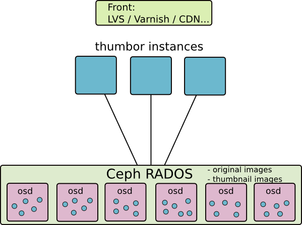

An example of using the python-ceph library for thumbnailing service.

Thumbor is an opensource tool for thumbnail generation developed by globo.

The tool allows to make a number of operations (crop, resize, filters …) directly via the URL. It also uses face detection algos or points of interest to enhance Crop or Auto Resize. Original images are imported via an url or directly using Restful API.

For interfacing with Ceph, two methods are possible: - Use the S3 API (via Rados GW) - Use librados and python wrapper for librados.

In this example, it is the second case that I present because it optimizes latency between the application and the storage cluster.



## Installation :

Thumbor installation :

```
apt-get install libjpeg-dev libpng-dev libtiff-dev libjasper-dev libcurl4-gnutls-dev libwebp-dev
apt-get install python-dev python-pycurl python-opencv
apt-get install python-pip
pip install thumbor
```

thumbor\_ceph storage plugin installation :

```
apt-get install python-ceph
pip install thumbor_ceph
```

## Configuration :

Generate initial thumbor config file :

```
thumbor-config > /etc/thumbor.conf
```

For more configuration options: [https://github.com/thumbor/thumbor/wiki/Configuration](https://github.com/thumbor/thumbor/wiki/Configuration)

Populate /etc/ceph/ with ceph.conf and admin keyring

Create a ceph pool for thumbor :

```
ceph osd pool create thumbor 128 128
```

Section File Storage in /etc/thumbor.conf

```
################################# File Storage #################################
STORAGE = 'thumbor_ceph.storages.ceph_storage'
CEPH_STORAGE_POOL = 'thumbor'
```

Section Upload

```
#################################### Upload ####################################
UPLOAD_PHOTO_STORAGE = 'thumbor_ceph.storages.ceph_storage'
```

Section Result Storage

```
################################ Result Storage ################################
RESULT_STORAGE = 'thumbor_ceph.result_storages.ceph_storage'
CEPH_RESULT_STORAGE_POOL = 'thumbor'
```

## Launch thumbor

```
# thumbor -l debug
2014-05-27 10:27:24 thumbor:DEBUG INIT RADOS Storage (ID:c3eb3343-d06c-438f-ae49-cf998468824d)
2014-05-27 10:27:24 thumbor:DEBUG INIT RADOS Result Storage (ID:c3eb3343-d06c-438f-ae49-cf998468824d)
2014-05-27 10:27:24 root:DEBUG thumbor running at 0.0.0.0:8888
```

## Usage

Now you can easily resize ceph logo  from this images  with this url :

```
http://localhost:8888/unsafe/0x0:36x36/http://ceph.com/wp-content/themes/ceph/images/logo.png
```

[https://github.com/thumbor/thumbor/wiki/Usage](https://github.com/thumbor/thumbor/wiki/Usage)

## More

- [https://github.com/thumbor/thumbor](https://github.com/thumbor/thumbor)
    
- [http://www.dadoune.com/blog/best-thumbnailing-solution-set-up-thumbor-on-aws/](http://www.dadoune.com/blog/best-thumbnailing-solution-set-up-thumbor-on-aws/)
    
- [http://99designs.com/tech-blog/blog/2013/07/01/thumbnailing-with-thumbor/](http://99designs.com/tech-blog/blog/2013/07/01/thumbnailing-with-thumbor/)
- [http://tech.yipit.com/2013/01/03/how-yipit-scales-thumbnailing-with-thumbor-and-cloudfront/](http://tech.yipit.com/2013/01/03/how-yipit-scales-thumbnailing-with-thumbor-and-cloudfront/)
- [http://heynemann.logdown.com/posts/152158-scaling-thumbor](http://heynemann.logdown.com/posts/152158-scaling-thumbor)
