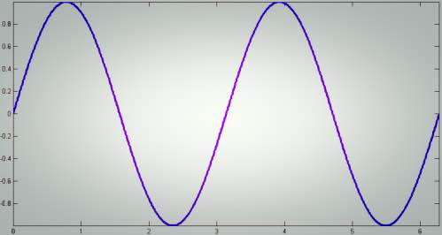

Simple trick to analyse the write patterns applied to your Ceph journal.

Assuming your journal device is /dev/sdb1, checking for 10 seconds:

`bash $ iostat -dmx /dev/sbd1 10 | awk '/[0-9]/ {print $8}' 16.25`

Now converting sectors to KiB.

```
16.25 * 512 / 1024 = 8
```

And yes, I was sending 8K requests :).

Here we rely on the `avgrq-sz` column from iostat.
