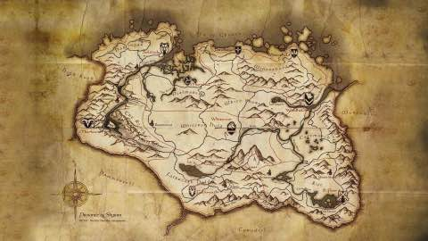

The Hammer release brought the support of a new feature for RBD images called object map. The object map tracks which blocks of the image are actually allocated and where. This is especially useful for operations on clones like resize, import, export, flattening and size calculation since the client does not need to calculate where each object is located. The client will just look up on that table.

  

There are currently several features available:

- `layering`: layering support, **where id is 1**
- `striping`: striping v2 support, **where id is 2**
- `exclusive-lock`: exclusive locking support, **where id is 4**
- `object-map`: object map support (requires exclusive-lock), **where id is 8**

To enable one feature you have two options:

- using the CLI with the `rbd` command
- from your `ceph.conf` by using the `rbd_default_features` flag

If you want to use a single option simply put its id, if you want more features you have to sum the ids. For example: to use `exclusive-lock` simply do:

```
$ rbd create bar -s 1024 --image-format=2 --image-features=4
$ rbd info bar
rbd image 'bar':
        size 1024 MB in 256 objects
        order 22 (4096 kB objects)
        block_name_prefix: rbd_data.5e7d2ae8944a
        format: 2
        features: exclusive
        flags:
```

Same in your `ceph.conf` with `rbd_default_features = 4`

To enable `object-map`, you need `exclusive-lock` so you need to sum `4+8`:

```
$ rbd create bar -s 1024 --image-format=2 --image-features=12
$ rbd info bar
rbd info bar
rbd image 'bar':
        size 1024 MB in 256 objects
        order 22 (4096 kB objects)
        block_name_prefix: rbd_data.5e962ae8944a
        format: 2
        features: exclusive, object map
        flags:
```

Same in your `ceph.conf` with `rbd_default_features = 12`

If you want to check the map

```
$ rados -p rbd ls |grep 5ea22ae8944a
rbd_header.5ea22ae8944a
rbd_object_map.5ea22ae8944a

$ rados -p rbd get rbd_object_map.5ea22ae8944a rbd_object_map.5ea22ae8944a
```

  

The future CLI version will be easier, as you won't need to use digits anymore. The proper name of the feature will be used instead. After the image creation, you will be able to add more features too.

```
$ rbd create leseb -s 1024 --image-format 2 --image-feature exclusive-lock
$ rbd feature enable leseb object-map
```

  

> Enjoy!
