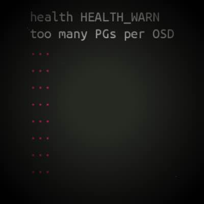

Quick tip.

Sometimes by running `ceph -s`, you can get a WARNING state saying:

```
health HEALTH_WARN
too many PGs per OSD (438 > max 300)
```

To suppress this warning, append the following configuration options into your `ceph.conf`:

```
mon_pg_warn_max_per_osd = 0
```

Eventually **restart all your Ceph monitors**.
