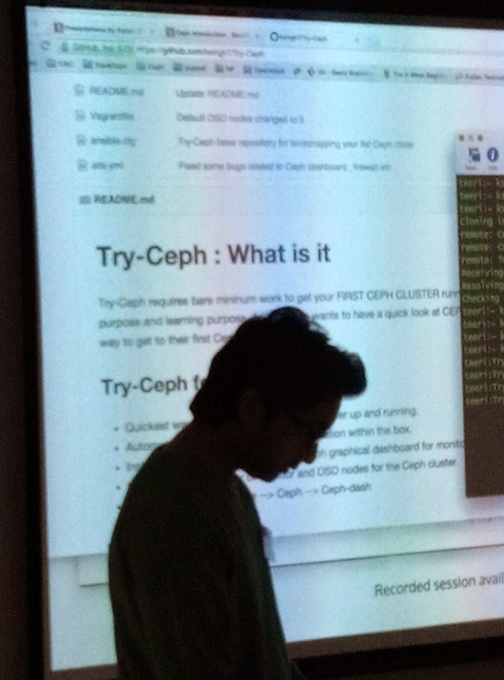

## 

## **Ceph Meetup Helsinki , Finland 22nd Jan 2015**

  

It has been a good start to 2015. We the geeks of "Helsinki Metropolitan Area" express our sincere thanks to Red Hat Folks for arranging an unofficial "Ceph Day" sort of Ceph Meetup.

  

From my point of view expecting any event on CEPH in Finland , is like day dreaming. But hopefully not from now. 

  

Here is my presentation during the meetup. Hope you enjoy and learn something new out of it. **Read it carefully "There is something new for YOU"**

  
  
               

<iframe aline="midele" allowfullscreen frameborder="0" height="420" mozallowfullscreen="" scrolling="no" src="http://slides.com/karansingh-1/deck/embed" webkitallowfullscreen="" width="576"></iframe>

  
  
  

## Introducing Try-Ceph

  

Since this was the first presentation on Ceph , in-order to keep the audience awake and into the gravity of Ceph. I have presented a LIVE DEMONSTRATION  of Ceph which the audience really enjoyed.  
  

### **So What is Try-Ceph**

Its a shortest and the quickest way to get your TEST Ceph cluster UP and Running in Just 10 Minutes **_\--yes-i-am-really-really-serious_**

### Its a TWO Step Process 

  

Step - 1 : **\# git clone https://github.com/ksingh7/Try-Ceph.git**

Step - 2 : **\# vagrant up**

  

###   

### Checkout the documentation

  

**[https://github.com/ksingh7/Try-Ceph/blob/master/README.md](https://github.com/ksingh7/Try-Ceph/blob/master/README.md)**

  

  

### Checkout the recorded session

  

**[https://www.youtube.com/watch?v=lki1fQptIRk](https://www.youtube.com/watch?v=lki1fQptIRk)**

  

  

##  Some Pictures from the Meetup

  

  

  

  

  

  

