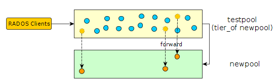
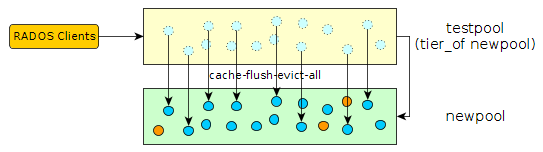
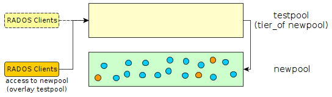
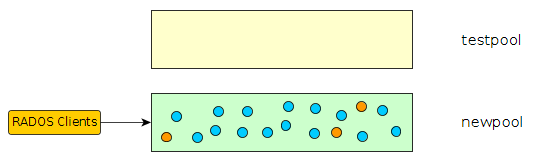

You have probably already be faced to migrate all objects from a pool to another, especially to change parameters that can not be modified on pool. For example, to migrate from a replicated pool to an EC pool, change EC profile, or to reduce the number of PGs… There are different methods, depending on the contents of the pool (RBD, objects), size…

# The simple way

The simplest and safest method to copy all objects with the “rados cppool” command. However, it need to have read only access to the pool during the copy.

For example for migrating to an EC pool :

<table><tbody><tr><td class="gutter"><pre class="line-numbers"><span class="line-number">1</span>
<span class="line-number">2</span>
<span class="line-number">3</span>
<span class="line-number">4</span>
<span class="line-number">5</span>
</pre></td><td class="code"><pre><code class="bash"><span class="line"><span class="nv">pool</span><span class="o">=</span>testpool
</span><span class="line">ceph osd pool create <span class="nv">$pool</span>.new 4096 4096 erasure default
</span><span class="line">rados cppool <span class="nv">$pool</span> <span class="nv">$pool</span>.new
</span><span class="line">ceph osd pool rename <span class="nv">$pool</span> <span class="nv">$pool</span>.old
</span><span class="line">ceph osd pool rename <span class="nv">$pool</span>.new <span class="nv">$pool</span>
</span></code></pre></td></tr></tbody></table>

But it does not work in all cases. For example with EC pools : “error copying pool testpool => newpool: (95) Operation not supported”.

# Using Cache Tier

**This must to be used with caution, make tests before using it on a cluster in production. It worked for my needs, but I can not say that it works in all cases.**

I find this method interesting method, because it allows transparent operation, reduce downtime and avoid to duplicate all data. The principle is simple: use the cache tier, but in reverse order.

At the begning, we have 2 pools : the current “testpool”, and the new one “newpool”


## Setup cache tier

Configure the existing pool as cache pool :

<table><tbody><tr><td class="gutter"><pre class="line-numbers"><span class="line-number">1</span>
<span class="line-number">2</span>
</pre></td><td class="code"><pre><code class="bash"><span class="line">ceph osd tier add newpool testpool --force-nonempty
</span><span class="line">ceph osd tier cache-mode testpool forward
</span></code></pre></td></tr></tbody></table>

In `ceph osd dump` you should see something like that :

```
--> pool 58 'testpool' replicated size 3 .... tier_of 80 
```

Now, all new objects will be create on new pool :



Now we can force to move all objects to new pool :

<table><tbody><tr><td class="gutter"><pre class="line-numbers"><span class="line-number">1</span>
</pre></td><td class="code"><pre><code class="bash"><span class="line">rados -p testpool cache-flush-evict-all
</span></code></pre></td></tr></tbody></table>



## Switch all clients to the new pool

(You can also do this step earlier. For example, just after the cache pool creation.) Until all the data has not been flushed to the new pool you need to specify an overlay to search objects on old pool :

<table><tbody><tr><td class="gutter"><pre class="line-numbers"><span class="line-number">1</span>
</pre></td><td class="code"><pre><code class="bash"><span class="line">ceph osd tier <span class="nb">set</span>-overlay newpool testpool
</span></code></pre></td></tr></tbody></table>

In `ceph osd dump` you should see something like that :

```
--> pool 80 'newpool' replicated size 3 .... tiers 58 read_tier 58 write_tier 58
```

With overlay, all operation will be forwarded to the old testpool :



Now you can switch all the clients to access objects on the new pool.

## Finish

When all data is migrate, you can remove overlay and old “cache” pool :

<table><tbody><tr><td class="gutter"><pre class="line-numbers"><span class="line-number">1</span>
<span class="line-number">2</span>
</pre></td><td class="code"><pre><code class="bash"><span class="line">ceph osd tier remove-overlay newpool
</span><span class="line">ceph osd tier remove newpool testpool
</span></code></pre></td></tr></tbody></table>



## In-use object

During eviction you can find some error :

```
....
rb.0.59189e.2ae8944a.000000000001   
rb.0.59189e.2ae8944a.000000000023   
rb.0.59189e.2ae8944a.000000000006   
testrbd.rbd 
failed to evict testrbd.rbd: (16) Device or resource busy
rb.0.59189e.2ae8944a.000000000000   
rb.0.59189e.2ae8944a.000000000026   
...
```

List watcher on object can help :

<table><tbody><tr><td class="gutter"><pre class="line-numbers"><span class="line-number">1</span>
<span class="line-number">2</span>
</pre></td><td class="code"><pre><code class="bash"><span class="line">rados -p testpool listwatchers testrbd.rbd
</span><span class="line"><span class="nv">watcher</span><span class="o">=</span>10.20.6.39:0/3318181122 client.5520194 <span class="nv">cookie</span><span class="o">=</span>1
</span></code></pre></td></tr></tbody></table>

# Using Rados Export/Import

For this, you need to use a temporary local directory.

<table><tbody><tr><td class="gutter"><pre class="line-numbers"><span class="line-number">1</span>
<span class="line-number">2</span>
<span class="line-number">3</span>
<span class="line-number">4</span>
<span class="line-number">5</span>
<span class="line-number">6</span>
<span class="line-number">7</span>
<span class="line-number">8</span>
<span class="line-number">9</span>
<span class="line-number">10</span>
<span class="line-number">11</span>
<span class="line-number">12</span>
<span class="line-number">13</span>
</pre></td><td class="code"><pre><code class="bash"><span class="line">rados <span class="nb">export</span> --create testpool tmp_dir
</span><span class="line"><span class="o">[</span>exported<span class="o">]</span>     rb.0.4975.2ae8944a.000000002391
</span><span class="line"><span class="o">[</span>exported<span class="o">]</span>     rb.0.4975.2ae8944a.000000004abc
</span><span class="line"><span class="o">[</span>exported<span class="o">]</span>     rb.0.4975.2ae8944a.0000000018ce
</span><span class="line">...
</span><span class="line">
</span><span class="line">rados import tmp_dir newpool
</span><span class="line">
</span><span class="line"><span class="c"># Stop All IO</span>
</span><span class="line"><span class="c"># And redo a sync of modified objects</span>
</span><span class="line">
</span><span class="line">rados <span class="nb">export</span> --workers 5 testpool tmp_dir
</span><span class="line">rados import --workers 5 tmp_dir newpool
</span></code></pre></td></tr></tbody></table>
