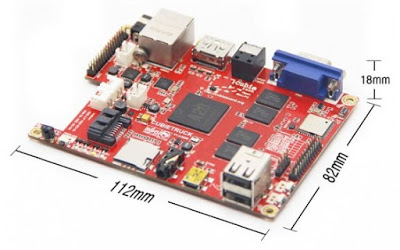

  
Last week was [Hackweek](https://hackweek.suse.com/), a week full of fun and innovation at [SUSE](https://www.suse.com/). I decided to use the time to work on a USB storage gateway for Ceph.  
  

  
  
The concept is simple - create a USB device that, when configured and connected, exposes remote Ceph RADOS Block Device (RBD) images for access as USB mass storage, allowing for:  

- Ceph storage usage by almost any system with a USB port
    - Including dumb systems such as TVs, MP3 players and mobile phones
- Boot from RBD images
    - Many systems are capable of booting from a USB mass storage device
- Minimal configuration
    - Network, Ceph credentials and image details should be all that's needed for configuration

  
  

#### Hardware

I already own a [Cubietruck](http://linux-sunxi.org/Cubietruck), which has the following desirable characteristics for this project:  

- Works with a mainline Linux Kernel
- Is reasonably small and portable
- Supports power and data transfer via a single mini-USB port
- Performs relatively well

- Dual-core 1GHz processor and 2GB RAM
- Gigabit network adapter and WiFi 802.11 b/g/n

  
Possible alternatives worth evaluation include [C.H.I.P](http://getchip.com/pages/chip) (smaller and cheaper), [NanoPi2](http://nanopi.io/nanopi2.html), and [UP](https://www.kickstarter.com/projects/802007522/up-intel-x5-z8300-board-in-a-raspberry-pi2-form-fa/description) (faster). I should take this opportunity to mention that I do gladly accept hardware donations!  
  
  

#### Base System

I decided on using openSUSE Tumbleweed as the base operating system for this project. An [openSUSE](https://www.opensuse.org/) Tubleweed ARM port for the Cubietruck is available for download at:  
[http://download.opensuse.org/ports/armv7hl/factory/images/openSUSE-Tumbleweed-ARM-JeOS-cubietruck.armv7l-Current.raw.xz](http://download.opensuse.org/ports/armv7hl/factory/images/openSUSE-Tumbleweed-ARM-JeOS-cubietruck.armv7l-Current.raw.xz)  
  
Installation is as straightforward as copying the image to an SD card and booting - I documented the installation procedure on the [openSUSE Wiki](https://en.opensuse.org/HCL:Cubietruck).  
Releases prior to Build350 exhibit boot issues due to the U-Boot device-tree path. However, this has been fixed in recent builds.  
  
  

#### Kernel

The Linux kernel currently shipped with the openSUSE image does not include support for acting as a USB mass storage gadget, nor does it include Ceph RBD support. In order to obtain these features, and also reduce the size of the base image, I built a mainline Linux kernel (4.4-rc4) using a minimal [custom kernel configuration](https://raw.githubusercontent.com/ddiss/ceph_usb_gateway/master/.config):  

~/> sudo zypper install --no-recommends git-core gcc make ncurses-devel bc  
~/> git clone git://git.kernel.org/pub/scm/linux/kernel/git/torvalds/linux.git  
~/> cd linux  
~/linux/> wget https://raw.githubusercontent.com/ddiss/ceph\_usb\_gateway/master/.config  
          # or \`make sunxi\_defconfig menuconfig\`  
          #     ->enable Ceph, sunxi and USB gadget modules  
~/linux/> make oldconfig  
~/linux/> make -j2 zImage dtbs modules  
~/linux/> sudo make install modules\_install  
~/linux/> sudo cp arch/arm/boot/zImage /boot/zImage-$(make kernelrelease)  
~/linux/> sudo cp arch/arm/boot/dts/sun7i-a20-cubietruck.dtb /boot/dtb-4.3.0-2/  
~/linux/> sudo cp arch/arm/boot/dts/sun7i-a20-cubietruck.dtb /boot/dtb/  

  
This build procedure takes a long time to complete. Cross compilation could be used to improve build times.  
I plan on publishing a USB gadget enabled ARM kernel on the [Open Build Service](https://build.opensuse.org/) in the future, which would allow for simple installation via _zypper_ - watch this space!  
  
  

#### Ceph RADOS Block Device (RBD) mapping

To again save space, I avoided installation of user-space Ceph packages by using the bare kernel _sysfs_ interface for RBD image mapping.  
The Ceph RBD kernel module must be loaded prior to use:  

\# modprobe rbd

  
Ceph RADOS block devices can be mapped using the following command:  

\# echo -n "${MON\_IP}:6789 name=${AUTH\_NAME},secret=${AUTH\_SECRET} " 

          "${CEPH\_POOL} ${CEPH\_IMG} -" > /sys/bus/rbd/add  

  
_$MON\_IP_ can be obtained from _ceph.conf_. Similarly, the _$AUTH\_NAME_ and _$AUTH\_SECRET_ credentials can be retrieved from a regular Ceph keyring file.  
_$CEPH\_POOL_ and _$CEPH\_IMG_ correspond to the location of the RBD image.  
  
A locally mapped RBD block device can be subsequently removed via:  

\# echo -n "${DEV\_ID}" > /sys/bus/rbd/remove  

  
_$DEV\_ID_ can be determined from the numeric suffix assigned to the _/dev/rbdX_ device path.  
  
Images can't be provisioned without the Ceph user-space utilities installed, so should be performed on a separate system (e.g. an OSD) prior to mapping on the Cubietruck. E.g. To provision a 10GB image:  

\# rbd create --size=10240 --pool ${CEPH\_POOL} ${CEPH\_IMG}

  
With my Cubietruck connected to the network via the ethernet adapter, I observed streaming read (/dev/rbd -> /dev/null) throughput at ~37MB/s, and the same value for streaming writes (/dev/zero -> /dev/rbd). Performance appears to be constrained by [limitations](http://linux-sunxi.org/Ethernet#GMAC) of the Cubietruck hardware.  
  
  

#### USB Mass Storage Gadget

The Linux kernel mass storage gadget module is configured via _[configfs](http://lxr.free-electrons.com/source/Documentation/usb/gadget_configfs.txt)_. A device can be exposed as a USB mass storage device with the following procedure:  

\# modprobe sunxi configfs libcomposite usb\_f\_mass\_storage  
  
\# mount -t configfs configfs /sys/kernel/config  
\# cd /sys/kernel/config/usb\_gadget/  
\# mkdir -p ceph  
\# cd ceph  
  
\# mkdir -p strings/0x409  
\# echo "fedcba9876543210" > strings/0x409/serialnumber  
\# echo "openSUSE" > strings/0x409/manufacturer  
\# echo "Ceph USB Drive" > strings/0x409/product  
  
\# mkdir -p functions/mass\_storage.usb0  
\# echo 1 > functions/mass\_storage.usb0/stall  
\# echo 0 > functions/mass\_storage.usb0/lun.0/cdrom  
\# echo 0 > functions/mass\_storage.usb0/lun.0/ro  
\# echo 0 > functions/mass\_storage.usb0/lun.0/nofua  
\# echo "$DEV" > functions/mass\_storage.usb0/lun.0/file  
  
\# mkdir -p configs/c.1/strings/0x409  
\# echo "Config 1: mass-storage" > configs/c.1/strings/0x409/configuration  
\# echo 250 > configs/c.1/MaxPower  
\# ln -s functions/mass\_storage.usb0 configs/c.1/  
  
\# ls /sys/class/udc > UDC  

_$DEV_ corresponds to a /dev/X device path, which should be a locally mapped RBD device path. The module can however also use local files as backing for USB mass storage.  
  
  

#### Boot-Time Automation

By default, Cubietruck boots when the board is connected to a USB host via the mini-USB connection.  
With RBD image mapping and USB mass storage exposure now working, the process can be run automatically on boot via a simple script: [rbd\_usb\_gw.sh](https://raw.githubusercontent.com/ddiss/ceph_usb_gateway/master/rbd_usb_gw.sh)  
Furthermore, a systemd service can be added:  

\[Unit\]  
Wants=network-online.target  
After=network-online.target  
  
\[Service\]  
\# XXX assume that rbd\_usb\_gw.sh is present in /bin  
ExecStart=/bin/rbd\_usb\_gw.sh %i  
Type=oneshot  
RemainAfterExit=yes  

  
Finally, this service can be triggered by [Wicked](https://github.com/openSUSE/wicked) when the network interface comes online, with the following entry added to _/etc/sysconfig/network/config_:  

POST\_UP\_SCRIPT="systemd:rbd-mapper@.service"  

  
  

#### Boot Performance Optimisation

A significant reduction in boot time can be achieved by running everything from _[initramfs](https://en.wikipedia.org/wiki/Initramfs)_, rather than booting to the full Linux distribution.  
Generating a minimal _initramfs_ image, with support for mapping and exposing RBD images is straightforward, thanks to the _Dracut_ utility:  

\# dracut --no-compress    
         --kver "\`uname -r"   
         --install "ps rmdir dd vim grep find df modinfo"   
         --add-drivers "rbd musb\_hdrc sunxi configfs"   
         --no-hostonly --no-hostonly-cmdline   
         --modules "bash base network ifcfg"   
         --include /bin/rbd\_usb\_gw.sh /lib/dracut/hooks/emergency/02\_rbd\_usb\_gw.sh   
         myinitrd  

  
The _rbd\_usb\_gw.sh_ script is installed into the _initramfs_ image as a _Dracut_ emergency hook, which sees it executed as soon as _initramfs_ has booted.  
  
To ensure that the network is up prior to the launch of _rbd\_usb\_gw.sh_, the kernel DHCP client (_CONFIG\_IP\_PNP\_DHCP_) can be used by appending _ip=dhcp_ to the boot-time kernel parameters. This can be set from the _U-Boot_ bootloader prompt:  

\=> setenv append 'ip=dhcp'

\=> boot

  
The new _initramfs_ image must be committed to the boot partition via:  
  

\# cp myinitrd /boot/

\# rm /boot/initrd

\# sudo ln -s /boot/myinitrd /boot/initrd

  
**Note:** In order to boot back to the full Linux distribution, you will have to mount the /boot partition and revert the _/boot/initrd_ symlink to its previous target.  
  
  

#### Future Improvements

- Support configuration of the device without requiring console access

- Run an embedded web-server, or expose a configuration filesystem via USB 

- Install the operating system onto on-board NAND storage,
- Further improve boot times

- Avoid U-Boot device probes

- Experiment with the new [_f\_tcm_](http://permalink.gmane.org/gmane.linux.scsi.target.devel/10677) USB gadget module

- Expose RBD images via USB and iSCSI

  
  

#### Credits

Many thanks to:  

- My employer, SUSE Linux, for encouraging me to work on projects like this during Hackweek.
- The [linux-sunxi](https://linux-sunxi.org/) community, for their excellent contributions to the mainline Linux kernel.
- Colleagues Dirk, Bernhard, Alex and Andreas for their help in bringing up openSUSE Tumbleweed on my Cubietruck board.

Source: David Disseldorp ([Ceph USB Storage Gateway](http://blog.elastocloud.org/2015/12/ceph-usb-storage-gateway.html))
