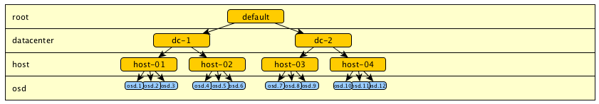
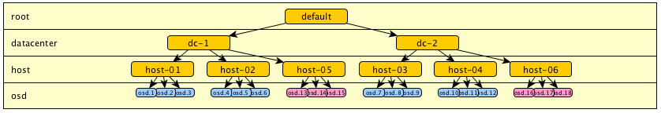
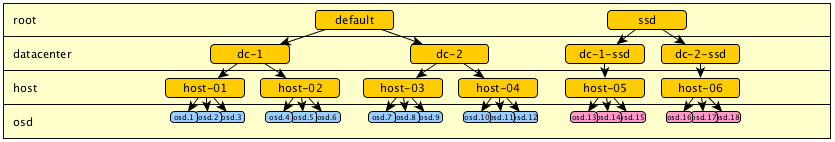
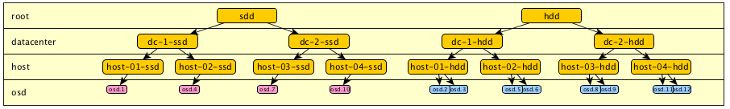
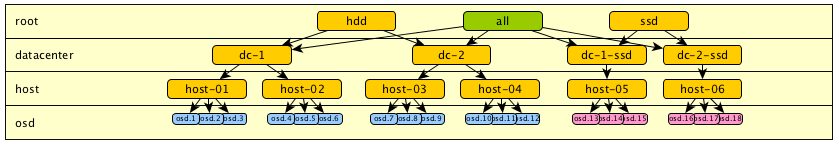
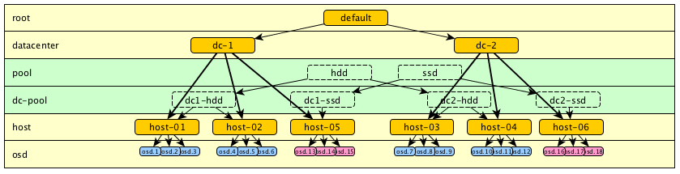
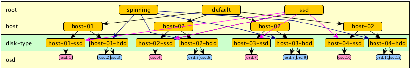
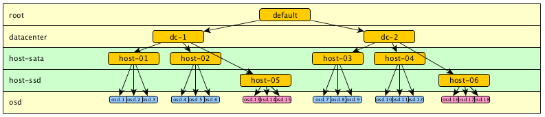

It is not always easy to know how to organize your data in the Crushmap, especially when trying to distribute the data geographically while separating different types of discs, eg SATA, SAS and SSD. Let’s see what we can imagine as Crushmap hierarchy.

Take a simple example of a distribution on two datacenters.  (Model 1.1)

With the introduction of cache pools we can easily imagine adding ssd drives to our cluster. Take the example of ssd added on new hosts. We then left with two types of disks to manage. In a hierarchy that only describing the physical division of the cluster, we would end up with this type of hierarchy:  (Model 1.2)

However, we soon realized that this configuration does not allow to separate the types of discs for use in a specific pool.

To separate these discs and organize Crushmap, the simplest method is still to duplicate the tree from the root. Thus we get two points entered “default” (that could be rename “hdd”) and “ssd”.  An other example with hdd and ssd mixed on same hardware (you need to split each host) :  (Model 1.3)

The problem is that we have segmented all the cluster by drive type. It was therefore no more entry point into our tree to select any disk in “dc-1” or in “dc-2”. For example, we can no longer define a rule to store data on a specific data center regardless of the type of disc.

What we can do is add other entry points to the root level. For example, to permit access all drives :  (Model 1.4)

If we wants to keep a certain logic in the tree, it is also possible to add more levels, some more “logical” for exemple for disks types, and other that represent physical distribution. They can be placed wherever we want and named as we wish. For example, here I added the level “pool” that one could also have called “type” or otherwise.   (Model 1.5)

Ok, it works, but it is difficult to read. Moreover, it becomes unreadable when the SSD and HDD are mixed on the same hosts as it involves duplicating each host. Also, there is no more physical data placement logic. We can try to insert a level between HOST and OSD:  (Model 1.6)

Ok, it may be advantageous in the case of a small cluster, or in the case where there is no need for other levels. Let’s try something else, we can also try using another organization, such as separating the osd in different levels and use that in the specific rules. For examble, have `step chooseleaf firstn 5 type host-sata` to select sata drive, and `step chooseleaf firstn 5 type host-ssd` to select ssd drive.  (Model 1.7)

But this do NOT WORK. Indeed, the algorithm will try to take an OSD in each branch of the tree. If no OSD is found, it will try again to retrace. But this operation is quite random, and you can easily end up with insufficient replications.

Make the test of this with this crushmap :

- 1 rule for select one ssd on each DC
    
- 1 rule for select one sata on each DC
    
- 1 rule for select one sata on 2 diffrents hosts
    

<table><tbody><tr><td class="gutter"><pre class="line-numbers"><span class="line-number">1</span>
<span class="line-number">2</span>
<span class="line-number">3</span>
<span class="line-number">4</span>
<span class="line-number">5</span>
<span class="line-number">6</span>
<span class="line-number">7</span>
<span class="line-number">8</span>
<span class="line-number">9</span>
<span class="line-number">10</span>
<span class="line-number">11</span>
<span class="line-number">12</span>
<span class="line-number">13</span>
<span class="line-number">14</span>
<span class="line-number">15</span>
<span class="line-number">16</span>
<span class="line-number">17</span>
<span class="line-number">18</span>
<span class="line-number">19</span>
<span class="line-number">20</span>
<span class="line-number">21</span>
<span class="line-number">22</span>
<span class="line-number">23</span>
<span class="line-number">24</span>
<span class="line-number">25</span>
<span class="line-number">26</span>
<span class="line-number">27</span>
<span class="line-number">28</span>
<span class="line-number">29</span>
<span class="line-number">30</span>
<span class="line-number">31</span>
<span class="line-number">32</span>
<span class="line-number">33</span>
<span class="line-number">34</span>
<span class="line-number">35</span>
<span class="line-number">36</span>
<span class="line-number">37</span>
<span class="line-number">38</span>
<span class="line-number">39</span>
<span class="line-number">40</span>
<span class="line-number">41</span>
<span class="line-number">42</span>
<span class="line-number">43</span>
<span class="line-number">44</span>
<span class="line-number">45</span>
<span class="line-number">46</span>
<span class="line-number">47</span>
<span class="line-number">48</span>
<span class="line-number">49</span>
<span class="line-number">50</span>
<span class="line-number">51</span>
<span class="line-number">52</span>
<span class="line-number">53</span>
<span class="line-number">54</span>
<span class="line-number">55</span>
<span class="line-number">56</span>
<span class="line-number">57</span>
<span class="line-number">58</span>
<span class="line-number">59</span>
<span class="line-number">60</span>
<span class="line-number">61</span>
<span class="line-number">62</span>
<span class="line-number">63</span>
<span class="line-number">64</span>
<span class="line-number">65</span>
<span class="line-number">66</span>
<span class="line-number">67</span>
<span class="line-number">68</span>
<span class="line-number">69</span>
<span class="line-number">70</span>
<span class="line-number">71</span>
<span class="line-number">72</span>
<span class="line-number">73</span>
<span class="line-number">74</span>
<span class="line-number">75</span>
<span class="line-number">76</span>
<span class="line-number">77</span>
<span class="line-number">78</span>
<span class="line-number">79</span>
<span class="line-number">80</span>
<span class="line-number">81</span>
<span class="line-number">82</span>
<span class="line-number">83</span>
<span class="line-number">84</span>
<span class="line-number">85</span>
<span class="line-number">86</span>
<span class="line-number">87</span>
<span class="line-number">88</span>
<span class="line-number">89</span>
<span class="line-number">90</span>
<span class="line-number">91</span>
<span class="line-number">92</span>
<span class="line-number">93</span>
<span class="line-number">94</span>
<span class="line-number">95</span>
<span class="line-number">96</span>
<span class="line-number">97</span>
<span class="line-number">98</span>
<span class="line-number">99</span>
<span class="line-number">100</span>
<span class="line-number">101</span>
<span class="line-number">102</span>
<span class="line-number">103</span>
<span class="line-number">104</span>
<span class="line-number">105</span>
<span class="line-number">106</span>
<span class="line-number">107</span>
<span class="line-number">108</span>
<span class="line-number">109</span>
<span class="line-number">110</span>
<span class="line-number">111</span>
<span class="line-number">112</span>
<span class="line-number">113</span>
<span class="line-number">114</span>
<span class="line-number">115</span>
<span class="line-number">116</span>
<span class="line-number">117</span>
<span class="line-number">118</span>
<span class="line-number">119</span>
<span class="line-number">120</span>
<span class="line-number">121</span>
<span class="line-number">122</span>
<span class="line-number">123</span>
<span class="line-number">124</span>
<span class="line-number">125</span>
<span class="line-number">126</span>
<span class="line-number">127</span>
<span class="line-number">128</span>
<span class="line-number">129</span>
<span class="line-number">130</span>
<span class="line-number">131</span>
<span class="line-number">132</span>
<span class="line-number">133</span>
<span class="line-number">134</span>
<span class="line-number">135</span>
<span class="line-number">136</span>
<span class="line-number">137</span>
<span class="line-number">138</span>
</pre></td><td class="code"><pre><code class=""><span class="line"># begin crush map
</span><span class="line">tunable choose_local_tries 0
</span><span class="line">tunable choose_local_fallback_tries 0
</span><span class="line">tunable choose_total_tries 50
</span><span class="line">tunable chooseleaf_descend_once 0
</span><span class="line">tunable chooseleaf_vary_r 0
</span><span class="line">
</span><span class="line"># devices
</span><span class="line">device 0 osd.0
</span><span class="line">device 1 osd.1
</span><span class="line">device 2 osd.2
</span><span class="line">device 3 osd.3
</span><span class="line">device 4 osd.4
</span><span class="line">device 5 osd.5
</span><span class="line">device 6 osd.6
</span><span class="line">device 7 osd.7
</span><span class="line">device 8 osd.8
</span><span class="line">device 9 osd.9
</span><span class="line">device 10 osd.10
</span><span class="line">device 11 osd.11
</span><span class="line">device 12 osd.12
</span><span class="line">device 13 osd.13
</span><span class="line">device 14 osd.14
</span><span class="line">device 15 osd.15
</span><span class="line">device 16 osd.16
</span><span class="line">device 17 osd.17
</span><span class="line">device 18 osd.18
</span><span class="line">
</span><span class="line"># types
</span><span class="line">type 0 osd
</span><span class="line">type 1 host-ssd
</span><span class="line">type 2 host-sata
</span><span class="line">type 3 datacenter
</span><span class="line">type 4 root
</span><span class="line">
</span><span class="line"># buckets
</span><span class="line">host-sata host-01 {
</span><span class="line">  alg straw
</span><span class="line">  hash 0
</span><span class="line">  item osd.1 weight 1.000
</span><span class="line">  item osd.2 weight 1.000
</span><span class="line">  item osd.3 weight 1.000
</span><span class="line">}
</span><span class="line">host-sata host-02 {
</span><span class="line">  alg straw
</span><span class="line">  hash 0
</span><span class="line">  item osd.4 weight 1.000
</span><span class="line">  item osd.5 weight 1.000
</span><span class="line">  item osd.6 weight 1.000
</span><span class="line">}
</span><span class="line">host-sata host-03 {
</span><span class="line">  alg straw
</span><span class="line">  hash 0
</span><span class="line">  item osd.7 weight 1.000
</span><span class="line">  item osd.8 weight 1.000
</span><span class="line">  item osd.9 weight 1.000
</span><span class="line">}
</span><span class="line">host-sata host-04 {
</span><span class="line">  alg straw
</span><span class="line">  hash 0
</span><span class="line">  item osd.10 weight 1.000
</span><span class="line">  item osd.11 weight 1.000
</span><span class="line">  item osd.12 weight 1.000
</span><span class="line">}
</span><span class="line">
</span><span class="line">host-ssd host-05 {
</span><span class="line">  alg straw
</span><span class="line">  hash 0
</span><span class="line">  item osd.13 weight 1.000
</span><span class="line">  item osd.14 weight 1.000
</span><span class="line">  item osd.15 weight 1.000
</span><span class="line">}
</span><span class="line">host-ssd host-06 {
</span><span class="line">  alg straw
</span><span class="line">  hash 0
</span><span class="line">  item osd.16 weight 1.000
</span><span class="line">  item osd.17 weight 1.000
</span><span class="line">  item osd.18 weight 1.000
</span><span class="line">}
</span><span class="line">
</span><span class="line">datacenter dc1 {
</span><span class="line">  alg straw
</span><span class="line">  hash 0
</span><span class="line">  item host-01 weight 1.000
</span><span class="line">  item host-02 weight 1.000
</span><span class="line">  item host-05 weight 1.000
</span><span class="line">}
</span><span class="line">datacenter dc2 {
</span><span class="line">  alg straw
</span><span class="line">  hash 0
</span><span class="line">  item host-03 weight 1.000
</span><span class="line">  item host-04 weight 1.000
</span><span class="line">  item host-06 weight 1.000
</span><span class="line">}
</span><span class="line">
</span><span class="line">root default {
</span><span class="line">  alg straw
</span><span class="line">  hash 0
</span><span class="line">  item dc1 weight 1.000
</span><span class="line">  item dc2 weight 1.000
</span><span class="line">}
</span><span class="line">
</span><span class="line"># rules
</span><span class="line">
</span><span class="line">rule sata-rep_2dc {
</span><span class="line">  ruleset 0
</span><span class="line">  type replicated
</span><span class="line">  min_size 2
</span><span class="line">  max_size 2
</span><span class="line">  step take default
</span><span class="line">  step choose firstn 0 type datacenter
</span><span class="line">  step chooseleaf firstn 1 type host-sata
</span><span class="line">  step emit
</span><span class="line">}
</span><span class="line">
</span><span class="line">rule ssd-rep_2dc {
</span><span class="line">  ruleset 1
</span><span class="line">  type replicated
</span><span class="line">  min_size 2
</span><span class="line">  max_size 2
</span><span class="line">  step take default
</span><span class="line">  step choose firstn 0 type datacenter
</span><span class="line">  step chooseleaf firstn 1 type host-ssd
</span><span class="line">  step emit
</span><span class="line">}
</span><span class="line">
</span><span class="line">rule sata-all {
</span><span class="line">  ruleset 2
</span><span class="line">  type replicated
</span><span class="line">  min_size 2
</span><span class="line">  max_size 2
</span><span class="line">  step take default
</span><span class="line">  step chooseleaf firstn 0 type host-sata
</span><span class="line">  step emit
</span><span class="line">}
</span><span class="line">
</span><span class="line">
</span><span class="line"># end crush map</span></code></pre></td></tr></tbody></table>

To test the placement, we can use those commands :

```
crushtool -c crushmap.txt -o crushmap-new.bin
crushtool --test -i crushmap-new.bin --show-utilization --rule 0 --num-rep=2
crushtool --test -i crushmap-new.bin --show-choose-tries --rule 0 --num-rep=2
```

Check the utilization :

```
$ crushtool --test -i crushmap-new.bin --show-utilization  --num-rep=2 | grep ^rule
rule 0 (sata-rep_2dc), x = 0..1023, numrep = 2..2
rule 0 (sata-rep_2dc) num_rep 2 result size == 0:   117/1024
rule 0 (sata-rep_2dc) num_rep 2 result size == 1:   448/1024
rule 0 (sata-rep_2dc) num_rep 2 result size == 2:   459/1024
rule 1 (ssd-rep_2dc), x = 0..1023, numrep = 2..2
rule 1 (ssd-rep_2dc) num_rep 2 result size == 0:    459/1024
rule 1 (ssd-rep_2dc) num_rep 2 result size == 1:    448/1024
rule 1 (ssd-rep_2dc) num_rep 2 result size == 2:    117/1024
rule 2 (sata-all), x = 0..1023, numrep = 2..2
rule 2 (sata-all) num_rep 2 result size == 0:   113/1024
rule 2 (sata-all) num_rep 2 result size == 1:   519/1024
rule 2 (sata-all) num_rep 2 result size == 2:   392/1024
```

For all the rules, the number of replication is insufficient for a part of the sample. Particularly for drives in a minor amount (in that case ssd). Looking at the number of retry to chooose an osd, we see that it will be useless to increase the “choose\_total\_tries” which is sufficient :

```
$ crushtool --test -i crushmap-new.bin --show-choose-tries --rule 0 --num-rep=2
 0:      4298
 1:       226
 2:       130
 3:        59
 4:        38
 5:        11
 6:        10
 7:         3
 8:         0
 9:         2
10:         1
11:         0
12:         2

$ crushtool --test -i crushmap-new.bin --show-choose-tries --rule 1 --num-rep=2
 0:      2930
 1:       226
 2:       130
 3:        59
 4:        38
 5:        11
 6:        10
 7:         3
 8:         0
 9:         2
10:         1
11:         0
12:         2

$ crushtool --test -i crushmap-new.bin --show-choose-tries --rule 2 --num-rep=2
 0:      2542
 1:        52
 2:        12
```

We can test to increase the number of osd for testing (It’s not very pretty…) :

in sata-rep\_2dc : `step chooseleaf firstn 5 type host-sata`

in ssd-rep\_2dc : `step chooseleaf firstn 5 type host-ssd`

in sata-all : `step chooseleaf firstn 15 type host-sata`

```
$ crushtool --test -i crushmap-new.bin --show-utilization  --num-rep=2 | grep ^rule
rule 0 (sata-rep_2dc), x = 0..1023, numrep = 2..2
rule 0 (sata-rep_2dc) num_rep 2 result size == 1:   1/1024
rule 0 (sata-rep_2dc) num_rep 2 result size == 2:   1023/1024
rule 1 (ssd-rep_2dc), x = 0..1023, numrep = 2..2
rule 1 (ssd-rep_2dc) num_rep 2 result size == 0:    20/1024
rule 1 (ssd-rep_2dc) num_rep 2 result size == 1:    247/1024
rule 1 (ssd-rep_2dc) num_rep 2 result size == 2:    757/1024
rule 2 (sata-all), x = 0..1023, numrep = 2..2
rule 2 (sata-all) num_rep 2 result size == 2:   1024/1024
```

It’s better, we see that for the rule “sata-all” it works pretty well, by cons, when there are fewer disk, the number of replications is always not correct. The idea of this distribution was attractive, but quickly realizes that this can not work.

If people have explored this way, or have examples of advanced CRUSHMAP, I encourage you to share them. I’m curious of all that can be done with this. Meanwhile, the best is yet to make it simple to suit your needs. In most cases, the 1.3 model will be perfect.

More details on CRUSH algorithm : [http://ceph.com/papers/weil-crush-sc06.pdf](http://ceph.com/papers/weil-crush-sc06.pdf)
