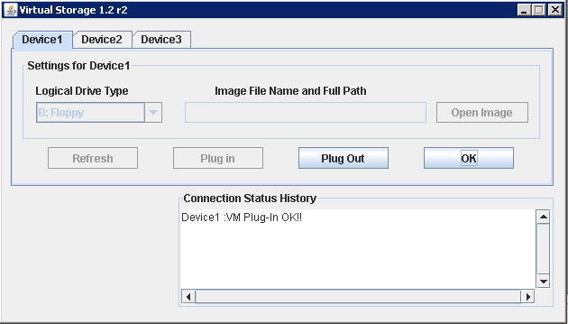
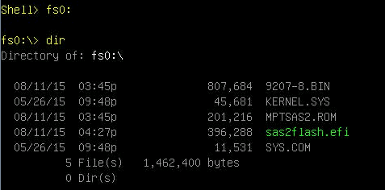
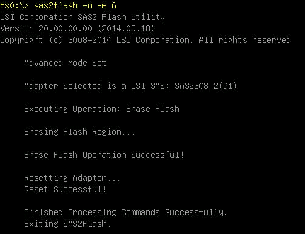
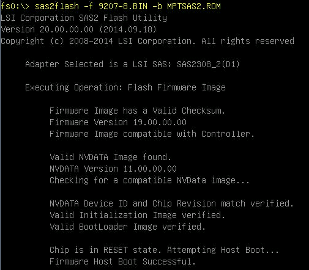
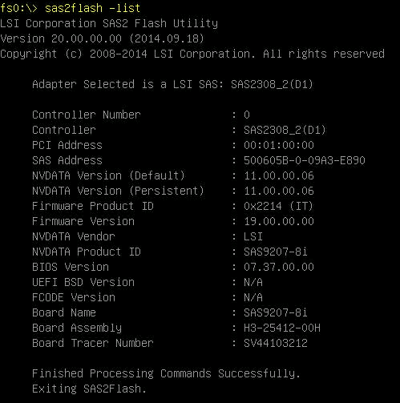

After numerous problems encountered with the P20 firmware on this card model, here are the steps I followed to flash in P19 Version.

Since, no more problems :)

The model of the card is a LSI 9207-8i (SAS2308 controler) with IT FW:

```
lspci | grep LSI
01:00.0 Serial Attached SCSI controller: LSI Logic / Symbios Logic SAS2308 PCI-Express Fusion-MPT SAS-2 (rev 05)
```

I use :

- Virtual Floppy Drive : [http://sourceforge.net/projects/vfd/](http://sourceforge.net/projects/vfd/)
    
- Freedos : [http://www.fdos.org/bootdisks/autogen/FDOEM.144.gz](http://www.fdos.org/bootdisks/autogen/FDOEM.144.gz)
    
- Installer P20 for UEFI : [http://www.avagotech.com/products/server-storage/host-bus-adapters/sas-9207-8i#downloads](http://www.avagotech.com/products/server-storage/host-bus-adapters/sas-9207-8i#downloads)
    
- 9207\_8i\_Package\_P19\_IR\_IT\_Firmware\_BIOS\_for\_MSDOS\_Windows : [http://www.avagotech.com/products/server-storage/host-bus-adapters/sas-9207-8i#downloads](http://www.avagotech.com/products/server-storage/host-bus-adapters/sas-9207-8i#downloads)
    

With VFD I create an new 2.88 MB floppy that contain :

```
KERNEL.SYS     from Freedos
sys.com        from Freedos
sas2flash.efi  from Installer P20 for UEFI
mptsas2.rom    from 9207_8i_Package_P19_IR_IT_Firmware_BIOS_for_MSDOS_Windows
9207-8.bin     from 9207_8i_Package_P19_IR_IT_Firmware_BIOS_for_MSDOS_Windows (IT firmware in my case)
```


Virtual Storage plugin on Supermicro to connect Drive B :



Reboot server and press F11 on startup to access boot menu and start with Built-in EFI Shell.


Go into floppy drive (fs0:, or fs1:, fs2:, …) and verify content :



Before starting to flash, verify your card with `sas2flash -list`. If you have more than one controler you can specify the controler with `-c controler_id` for the next commands.

Next, you will need to erase all the content of the card (to avoid error like “Cannot downgrade NVDATA version…”)

```
sas2flash -o -e 6
```



Flash with the new firmware and bios :

```
sas2flash -f 9207-8.bin -b mptsas2.rom
```

 

Verify the new firmware version :



To see the firmware version on OS :

```
# sas2ircu 0 DISPLAY

LSI Corporation SAS2 IR Configuration Utility.
Version 16.00.00.00 (2013.03.01) 
Copyright (c) 2009-2013 LSI Corporation. All rights reserved. 

Read configuration has been initiated for controller 0
------------------------------------------------------------------------
Controller information
------------------------------------------------------------------------
  Controller type                         : SAS2308_2
  BIOS version                            : 7.37.00.00
  Firmware version                        : 19.00.00.00
  Channel description                     : 1 Serial Attached SCSI
  Initiator ID                            : 0
  Maximum physical devices                : 1023
  Concurrent commands supported           : 10240
  Slot                                    : 16
  Segment                                 : 0
  Bus                                     : 1
  Device                                  : 0
  Function                                : 0
  RAID Support                            : No
...
```

SAS2Flash Utility Guide : [http://www.lsi.com/sep/Documents/oracle/files/SAS2\_Flash\_Utility\_Software\_Ref\_Guide.pdf](http://www.lsi.com/sep/Documents/oracle/files/SAS2_Flash_Utility_Software_Ref_Guide.pdf)

Thread “Lots of trouble with LSI 9207-8e HBAs – Issue caused by LSI P20 92XX HBA Firmware” [https://community.nexenta.com/thread/1053](https://community.nexenta.com/thread/1053)
