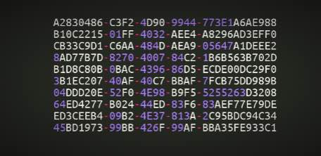

While playing with Ceph on DevStack I noticed that after several rebuild I ended up with the following error from nova-scheduler:

```
Secret not found: rbd no secret matches uuid '3092b632-4e9f-40ca-9430-bbf60cefae36'
```

Actually this error is reported by libvirt itself which somehow keeps the secret in-memory (I believe) even when a new virsh secret is applied. The only solution I have found so far to this issue is to restart libvirt:

`bash $ sudo service libvirt-bin restart`
