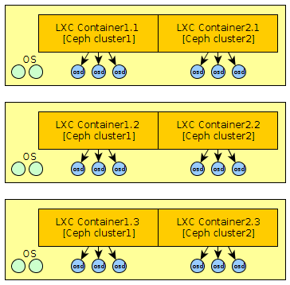

Ceph makes it easy to create multiple cluster on the same hardware with the naming of clusters. If you want a better insolation you can use LXC, for example to allow a different version of Ceph between your clusters.



For this you will need access to the physical disks from the container. You just allow access to the device with cgroup and create the device with mknod :

```
# Retrieve the major and minor number for a device :
$ ls -l /dev/sda5
brw-rw---T 1 root disk 8, 5 janv. 26 18:47 /dev/sda5

$ mknod /var/lib/lxc/container-cluster1/rootfs/dev/sda5 b 8 5
$ echo "lxc.cgroup.devices.allow = b 8:7 rwm" >> /var/lib/lxc/container-cluster1/config
```

However, if you want to use “ceph-deploy” you may be faced to many problems for the deployment of OSD. Indeed, tools needs to access access to all devices to work correctly. It will therefore also need to create all partition on physical host and add a line like that: `lxc.cgroup.devices.allow = b 8:* r` in lxc config. Also, udev is not active in the container, so it will need to create all devices or make a bind mount for /dev. `mount -o bind /dev /var/lib/lxc/container-cluster1/rootfs/dev/`. Then, udev rules will not run…. The easiest way remains the manual deployment for this part or use for example ceph-ansible which will certainly allows to be more flexible.
