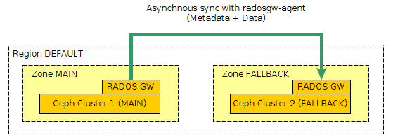

This is a simple example of federated gateways config to make an asynchonous replication between two Ceph clusters.



( This configuration is based on Ceph documentation : [http://ceph.com/docs/master/radosgw/federated-config/](http://ceph.com/docs/master/radosgw/federated-config/) )

Here I use only one region (“default”) and two zones (“main” and “fallback”), one for each cluster.

Note that in this example, I use 3 placement targets (default, hot, cold) that correspond respectively on pool .main.rgw.buckets, .main.rgw.hot.buckets, .main.rgw.cold.buckets. Be carefull to replace the tags {MAIN\_USER\_ACCESS}, {MAIN\_USER\_SECRET}, {FALLBACK\_USER\_ACESS}, {FALLBACK\_USER\_SECRET} by corresponding values.

First I created region and zones files, that will be require on the 2 clusters :

The region file “region.conf.json” :

<table><tbody><tr><td class="gutter"><pre class="line-numbers"><span class="line-number">1</span>
<span class="line-number">2</span>
<span class="line-number">3</span>
<span class="line-number">4</span>
<span class="line-number">5</span>
<span class="line-number">6</span>
<span class="line-number">7</span>
<span class="line-number">8</span>
<span class="line-number">9</span>
<span class="line-number">10</span>
<span class="line-number">11</span>
<span class="line-number">12</span>
<span class="line-number">13</span>
<span class="line-number">14</span>
<span class="line-number">15</span>
<span class="line-number">16</span>
<span class="line-number">17</span>
<span class="line-number">18</span>
<span class="line-number">19</span>
<span class="line-number">20</span>
<span class="line-number">21</span>
<span class="line-number">22</span>
<span class="line-number">23</span>
<span class="line-number">24</span>
<span class="line-number">25</span>
</pre></td><td class="code"><pre><code class="json"><span class="line"><span class="p">{</span> <span class="nt">"name"</span><span class="p">:</span> <span class="s2">"default"</span><span class="p">,</span>
</span><span class="line">  <span class="nt">"api_name"</span><span class="p">:</span> <span class="s2">"default"</span><span class="p">,</span>
</span><span class="line">  <span class="nt">"is_master"</span><span class="p">:</span> <span class="s2">"true"</span><span class="p">,</span>
</span><span class="line">  <span class="nt">"endpoints"</span><span class="p">:</span> <span class="p">[</span>
</span><span class="line">        <span class="s2">"http:\/\/s3.mydomain.com:80\/"</span><span class="p">],</span>
</span><span class="line">  <span class="nt">"master_zone"</span><span class="p">:</span> <span class="s2">"main"</span><span class="p">,</span>
</span><span class="line">  <span class="nt">"zones"</span><span class="p">:</span> <span class="p">[</span>
</span><span class="line">        <span class="p">{</span> <span class="nt">"name"</span><span class="p">:</span> <span class="s2">"main"</span><span class="p">,</span>
</span><span class="line">          <span class="nt">"endpoints"</span><span class="p">:</span> <span class="p">[</span>
</span><span class="line">                <span class="s2">"http:\/\/s3.mydomain.com:80\/"</span><span class="p">],</span>
</span><span class="line">          <span class="nt">"log_meta"</span><span class="p">:</span> <span class="s2">"true"</span><span class="p">,</span>
</span><span class="line">          <span class="nt">"log_data"</span><span class="p">:</span> <span class="s2">"true"</span><span class="p">},</span>
</span><span class="line">        <span class="p">{</span> <span class="nt">"name"</span><span class="p">:</span> <span class="s2">"fallback"</span><span class="p">,</span>
</span><span class="line">          <span class="nt">"endpoints"</span><span class="p">:</span> <span class="p">[</span>
</span><span class="line">                <span class="s2">"http:\/\/s3-fallback.mydomain.com:80\/"</span><span class="p">],</span>
</span><span class="line">          <span class="nt">"log_meta"</span><span class="p">:</span> <span class="s2">"true"</span><span class="p">,</span>
</span><span class="line">          <span class="nt">"log_data"</span><span class="p">:</span> <span class="s2">"true"</span><span class="p">}],</span>
</span><span class="line">  <span class="nt">"placement_targets"</span><span class="p">:</span> <span class="p">[</span>
</span><span class="line">        <span class="p">{</span> <span class="nt">"name"</span><span class="p">:</span> <span class="s2">"default-placement"</span><span class="p">,</span>
</span><span class="line">          <span class="nt">"tags"</span><span class="p">:</span> <span class="p">[]},</span>
</span><span class="line">        <span class="p">{</span> <span class="nt">"name"</span><span class="p">:</span> <span class="s2">"cold-placement"</span><span class="p">,</span>
</span><span class="line">          <span class="nt">"tags"</span><span class="p">:</span> <span class="p">[]},</span>
</span><span class="line">        <span class="p">{</span> <span class="nt">"name"</span><span class="p">:</span> <span class="s2">"hot-placement"</span><span class="p">,</span>
</span><span class="line">          <span class="nt">"tags"</span><span class="p">:</span> <span class="p">[]}],</span>
</span><span class="line">  <span class="nt">"default_placement"</span><span class="p">:</span> <span class="s2">"default-placement"</span><span class="p">}</span>
</span></code></pre></td></tr></tbody></table>

a zone file “zone-main.conf.json” :

<table><tbody><tr><td class="gutter"><pre class="line-numbers"><span class="line-number">1</span>
<span class="line-number">2</span>
<span class="line-number">3</span>
<span class="line-number">4</span>
<span class="line-number">5</span>
<span class="line-number">6</span>
<span class="line-number">7</span>
<span class="line-number">8</span>
<span class="line-number">9</span>
<span class="line-number">10</span>
<span class="line-number">11</span>
<span class="line-number">12</span>
<span class="line-number">13</span>
<span class="line-number">14</span>
<span class="line-number">15</span>
<span class="line-number">16</span>
<span class="line-number">17</span>
<span class="line-number">18</span>
<span class="line-number">19</span>
<span class="line-number">20</span>
<span class="line-number">21</span>
<span class="line-number">22</span>
<span class="line-number">23</span>
<span class="line-number">24</span>
<span class="line-number">25</span>
<span class="line-number">26</span>
</pre></td><td class="code"><pre><code class="json"><span class="line"><span class="p">{</span> <span class="nt">"domain_root"</span><span class="p">:</span> <span class="s2">".main.domain.rgw"</span><span class="p">,</span>
</span><span class="line">  <span class="nt">"control_pool"</span><span class="p">:</span> <span class="s2">".main.rgw.control"</span><span class="p">,</span>
</span><span class="line">  <span class="nt">"gc_pool"</span><span class="p">:</span> <span class="s2">".main.rgw.gc"</span><span class="p">,</span>
</span><span class="line">  <span class="nt">"log_pool"</span><span class="p">:</span> <span class="s2">".main.log"</span><span class="p">,</span>
</span><span class="line">  <span class="nt">"intent_log_pool"</span><span class="p">:</span> <span class="s2">".main.intent-log"</span><span class="p">,</span>
</span><span class="line">  <span class="nt">"usage_log_pool"</span><span class="p">:</span> <span class="s2">".main.usage"</span><span class="p">,</span>
</span><span class="line">  <span class="nt">"user_keys_pool"</span><span class="p">:</span> <span class="s2">".main.users"</span><span class="p">,</span>
</span><span class="line">  <span class="nt">"user_email_pool"</span><span class="p">:</span> <span class="s2">".main.users.email"</span><span class="p">,</span>
</span><span class="line">  <span class="nt">"user_swift_pool"</span><span class="p">:</span> <span class="s2">".main.users.swift"</span><span class="p">,</span>
</span><span class="line">  <span class="nt">"user_uid_pool"</span><span class="p">:</span> <span class="s2">".main.users.uid"</span><span class="p">,</span>
</span><span class="line">  <span class="nt">"system_key"</span><span class="p">:</span> <span class="p">{</span>
</span><span class="line">      <span class="nt">"access_key"</span><span class="p">:</span> <span class="s2">"{MAIN_USER_ACCESS}"</span><span class="p">,</span>
</span><span class="line">      <span class="nt">"secret_key"</span><span class="p">:</span> <span class="s2">"{MAIN_USER_SECRET}"</span><span class="p">},</span>
</span><span class="line">  <span class="nt">"placement_pools"</span><span class="p">:</span> <span class="p">[</span>
</span><span class="line">        <span class="p">{</span> <span class="nt">"key"</span><span class="p">:</span> <span class="s2">"default-placement"</span><span class="p">,</span>
</span><span class="line">          <span class="nt">"val"</span><span class="p">:</span> <span class="p">{</span> <span class="nt">"index_pool"</span><span class="p">:</span> <span class="s2">".main.rgw.buckets.index"</span><span class="p">,</span>
</span><span class="line">              <span class="nt">"data_pool"</span><span class="p">:</span> <span class="s2">".main.rgw.buckets"</span><span class="p">,</span>
</span><span class="line">              <span class="nt">"data_extra_pool"</span><span class="p">:</span> <span class="s2">".main.rgw.buckets.extra"</span><span class="p">}},</span>
</span><span class="line">        <span class="p">{</span> <span class="nt">"key"</span><span class="p">:</span> <span class="s2">"cold-placement"</span><span class="p">,</span>
</span><span class="line">          <span class="nt">"val"</span><span class="p">:</span> <span class="p">{</span> <span class="nt">"index_pool"</span><span class="p">:</span> <span class="s2">".main.rgw.buckets.index"</span><span class="p">,</span>
</span><span class="line">              <span class="nt">"data_pool"</span><span class="p">:</span> <span class="s2">".main.rgw.cold.buckets"</span><span class="p">,</span>
</span><span class="line">              <span class="nt">"data_extra_pool"</span><span class="p">:</span> <span class="s2">".main.rgw.buckets.extra"</span><span class="p">}},</span>
</span><span class="line">        <span class="p">{</span> <span class="nt">"key"</span><span class="p">:</span> <span class="s2">"hot-placement"</span><span class="p">,</span>
</span><span class="line">          <span class="nt">"val"</span><span class="p">:</span> <span class="p">{</span> <span class="nt">"index_pool"</span><span class="p">:</span> <span class="s2">".main.rgw.buckets.index"</span><span class="p">,</span>
</span><span class="line">              <span class="nt">"data_pool"</span><span class="p">:</span> <span class="s2">".main.rgw.hot.buckets"</span><span class="p">,</span>
</span><span class="line">              <span class="nt">"data_extra_pool"</span><span class="p">:</span> <span class="s2">".main.rgw.buckets.extra"</span><span class="p">}}]}</span>
</span></code></pre></td></tr></tbody></table>

And a zone file “zone-fallback.conf.json” :

<table><tbody><tr><td class="gutter"><pre class="line-numbers"><span class="line-number">1</span>
<span class="line-number">2</span>
<span class="line-number">3</span>
<span class="line-number">4</span>
<span class="line-number">5</span>
<span class="line-number">6</span>
<span class="line-number">7</span>
<span class="line-number">8</span>
<span class="line-number">9</span>
<span class="line-number">10</span>
<span class="line-number">11</span>
<span class="line-number">12</span>
<span class="line-number">13</span>
<span class="line-number">14</span>
<span class="line-number">15</span>
<span class="line-number">16</span>
<span class="line-number">17</span>
<span class="line-number">18</span>
<span class="line-number">19</span>
<span class="line-number">20</span>
<span class="line-number">21</span>
<span class="line-number">22</span>
<span class="line-number">23</span>
<span class="line-number">24</span>
<span class="line-number">25</span>
<span class="line-number">26</span>
<span class="line-number">27</span>
</pre></td><td class="code"><pre><code class="json"><span class="line"><span class="p">{</span> <span class="nt">"domain_root"</span><span class="p">:</span> <span class="s2">".fallback.domain.rgw"</span><span class="p">,</span>
</span><span class="line">  <span class="nt">"control_pool"</span><span class="p">:</span> <span class="s2">".fallback.rgw.control"</span><span class="p">,</span>
</span><span class="line">  <span class="nt">"gc_pool"</span><span class="p">:</span> <span class="s2">".fallback.rgw.gc"</span><span class="p">,</span>
</span><span class="line">  <span class="nt">"log_pool"</span><span class="p">:</span> <span class="s2">".fallback.log"</span><span class="p">,</span>
</span><span class="line">  <span class="nt">"intent_log_pool"</span><span class="p">:</span> <span class="s2">".fallback.intent-log"</span><span class="p">,</span>
</span><span class="line">  <span class="nt">"usage_log_pool"</span><span class="p">:</span> <span class="s2">".fallback.usage"</span><span class="p">,</span>
</span><span class="line">  <span class="nt">"user_keys_pool"</span><span class="p">:</span> <span class="s2">".fallback.users"</span><span class="p">,</span>
</span><span class="line">  <span class="nt">"user_email_pool"</span><span class="p">:</span> <span class="s2">".fallback.users.email"</span><span class="p">,</span>
</span><span class="line">  <span class="nt">"user_swift_pool"</span><span class="p">:</span> <span class="s2">".fallback.users.swift"</span><span class="p">,</span>
</span><span class="line">  <span class="nt">"user_uid_pool"</span><span class="p">:</span> <span class="s2">".fallback.users.uid"</span><span class="p">,</span>
</span><span class="line">  <span class="nt">"system_key"</span><span class="p">:</span> <span class="p">{</span>
</span><span class="line">    <span class="nt">"access_key"</span><span class="p">:</span> <span class="s2">"{FALLBACK_USER_ACESS}"</span><span class="p">,</span>
</span><span class="line">    <span class="nt">"secret_key"</span><span class="p">:</span> <span class="s2">"{FALLBACK_USER_SECRET}"</span>
</span><span class="line">         <span class="p">},</span>
</span><span class="line">  <span class="nt">"placement_pools"</span><span class="p">:</span> <span class="p">[</span>
</span><span class="line">        <span class="p">{</span> <span class="nt">"key"</span><span class="p">:</span> <span class="s2">"default-placement"</span><span class="p">,</span>
</span><span class="line">          <span class="nt">"val"</span><span class="p">:</span> <span class="p">{</span> <span class="nt">"index_pool"</span><span class="p">:</span> <span class="s2">".fallback.rgw.buckets.index"</span><span class="p">,</span>
</span><span class="line">              <span class="nt">"data_pool"</span><span class="p">:</span> <span class="s2">".fallback.rgw.buckets"</span><span class="p">,</span>
</span><span class="line">              <span class="nt">"data_extra_pool"</span><span class="p">:</span> <span class="s2">".fallback.rgw.buckets.extra"</span><span class="p">}},</span>
</span><span class="line">        <span class="p">{</span> <span class="nt">"key"</span><span class="p">:</span> <span class="s2">"cold-placement"</span><span class="p">,</span>
</span><span class="line">          <span class="nt">"val"</span><span class="p">:</span> <span class="p">{</span> <span class="nt">"index_pool"</span><span class="p">:</span> <span class="s2">".fallback.rgw.buckets.index"</span><span class="p">,</span>
</span><span class="line">              <span class="nt">"data_pool"</span><span class="p">:</span> <span class="s2">".fallback.rgw.cold.buckets"</span><span class="p">,</span>
</span><span class="line">              <span class="nt">"data_extra_pool"</span><span class="p">:</span> <span class="s2">".fallback.rgw.buckets.extra"</span><span class="p">}},</span>
</span><span class="line">        <span class="p">{</span> <span class="nt">"key"</span><span class="p">:</span> <span class="s2">"hot-placement"</span><span class="p">,</span>
</span><span class="line">          <span class="nt">"val"</span><span class="p">:</span> <span class="p">{</span> <span class="nt">"index_pool"</span><span class="p">:</span> <span class="s2">".fallback.rgw.buckets.index"</span><span class="p">,</span>
</span><span class="line">              <span class="nt">"data_pool"</span><span class="p">:</span> <span class="s2">".fallback.rgw.hot.buckets"</span><span class="p">,</span>
</span><span class="line">              <span class="nt">"data_extra_pool"</span><span class="p">:</span> <span class="s2">".fallback.rgw.buckets.extra"</span><span class="p">}}]}</span>
</span></code></pre></td></tr></tbody></table>

## On first cluster (MAIN)

I created the pools :

<table><tbody><tr><td class="gutter"><pre class="line-numbers"><span class="line-number">1</span>
<span class="line-number">2</span>
<span class="line-number">3</span>
<span class="line-number">4</span>
<span class="line-number">5</span>
<span class="line-number">6</span>
<span class="line-number">7</span>
<span class="line-number">8</span>
<span class="line-number">9</span>
<span class="line-number">10</span>
<span class="line-number">11</span>
<span class="line-number">12</span>
<span class="line-number">13</span>
<span class="line-number">14</span>
<span class="line-number">15</span>
<span class="line-number">16</span>
<span class="line-number">17</span>
</pre></td><td class="code"><pre><code class="bash"><span class="line">ceph osd pool create .rgw.root 16 16
</span><span class="line">ceph osd pool create .main.rgw.root 16 16
</span><span class="line">ceph osd pool create .main.domain.rgw 16 16
</span><span class="line">ceph osd pool create .main.rgw.control 16 16
</span><span class="line">ceph osd pool create .main.rgw.gc 16 16
</span><span class="line">ceph osd pool create .main.rgw.buckets 512 512
</span><span class="line">ceph osd pool create .main.rgw.hot.buckets 512 512
</span><span class="line">ceph osd pool create .main.rgw.cold.buckets 512 512
</span><span class="line">ceph osd pool create .main.rgw.buckets.index 32 32
</span><span class="line">ceph osd pool create .main.rgw.buckets.extra 16 16
</span><span class="line">ceph osd pool create .main.log 16 16
</span><span class="line">ceph osd pool create .main.intent-log 16 16
</span><span class="line">ceph osd pool create .main.usage 16 16
</span><span class="line">ceph osd pool create .main.users 16 16
</span><span class="line">ceph osd pool create .main.users.email 16 16
</span><span class="line">ceph osd pool create .main.users.swift 16 16
</span><span class="line">ceph osd pool create .main.users.uid 16 16
</span></code></pre></td></tr></tbody></table>

I configured region, zone, and add system users :

<table><tbody><tr><td class="gutter"><pre class="line-numbers"><span class="line-number">1</span>
<span class="line-number">2</span>
<span class="line-number">3</span>
<span class="line-number">4</span>
<span class="line-number">5</span>
<span class="line-number">6</span>
<span class="line-number">7</span>
</pre></td><td class="code"><pre><code class="bash"><span class="line">  radosgw-admin region <span class="nb">set</span> --name client.radosgw.main &lt; region.conf.json
</span><span class="line">  radosgw-admin zone <span class="nb">set</span> --rgw-zone<span class="o">=</span>main --name client.radosgw.main &lt; zone-main.conf.json
</span><span class="line">  radosgw-admin zone <span class="nb">set</span> --rgw-zone<span class="o">=</span>fallback --name client.radosgw.main &lt; zone-fallback.conf.json
</span><span class="line">  radosgw-admin regionmap update --name client.radosgw.main
</span><span class="line">
</span><span class="line">  radosgw-admin user create --uid<span class="o">=</span><span class="s2">"main"</span> --display-name<span class="o">=</span><span class="s2">"Zone main"</span> --name client.radosgw.main --system --access-key<span class="o">={</span>MAIN_USER_ACCESS<span class="o">}</span> --secret<span class="o">={</span>MAIN_USER_SECRET<span class="o">}</span>
</span><span class="line">  radosgw-admin user create --uid<span class="o">=</span><span class="s2">"fallback"</span> --display-name<span class="o">=</span><span class="s2">"Zone fallback"</span> --name client.radosgw.main --system --access-key<span class="o">={</span>FALLBACK_USER_ACESS<span class="o">}</span> --secret<span class="o">={</span>FALLBACK_USER_SECRET<span class="o">}</span>
</span></code></pre></td></tr></tbody></table>

Setup RadosGW Config in ceph.conf on cluster MAIN :

<table><tbody><tr><td class="gutter"><pre class="line-numbers"><span class="line-number">1</span>
<span class="line-number">2</span>
<span class="line-number">3</span>
<span class="line-number">4</span>
<span class="line-number">5</span>
<span class="line-number">6</span>
<span class="line-number">7</span>
<span class="line-number">8</span>
<span class="line-number">9</span>
<span class="line-number">10</span>
</pre></td><td class="code"><pre><code class="bash"><span class="line">  <span class="o">[</span>client.radosgw.main<span class="o">]</span>
</span><span class="line">  <span class="nv">host</span> <span class="o">=</span> ceph-main-radosgw-01
</span><span class="line">  rgw <span class="nv">region</span> <span class="o">=</span> default
</span><span class="line">  rgw region root <span class="nv">pool</span> <span class="o">=</span> .rgw.root
</span><span class="line">  rgw <span class="nv">zone</span> <span class="o">=</span> main
</span><span class="line">  rgw zone root <span class="nv">pool</span> <span class="o">=</span> .main.rgw.root
</span><span class="line">  rgw <span class="nv">frontends</span> <span class="o">=</span> <span class="s2">"civetweb port=80"</span>
</span><span class="line">  rgw dns <span class="nv">name</span> <span class="o">=</span> s3.mydomain.com
</span><span class="line">  <span class="nv">keyring</span> <span class="o">=</span> /etc/ceph/ceph.client.radosgw.keyring
</span><span class="line">  <span class="nv">rgw_socket_path</span> <span class="o">=</span> /var/run/ceph/radosgw.sock
</span></code></pre></td></tr></tbody></table>

I needed to create keyring for \[client.radosgw.main\] in /etc/ceph/ceph.client.radosgw.keyring, see documentation.

Then, start/restart radosgw for cluster MAIN.

## On the other Ceph cluster (FALLBACK)

I created the pools :

<table><tbody><tr><td class="gutter"><pre class="line-numbers"><span class="line-number">1</span>
<span class="line-number">2</span>
<span class="line-number">3</span>
<span class="line-number">4</span>
<span class="line-number">5</span>
<span class="line-number">6</span>
<span class="line-number">7</span>
<span class="line-number">8</span>
<span class="line-number">9</span>
<span class="line-number">10</span>
<span class="line-number">11</span>
<span class="line-number">12</span>
<span class="line-number">13</span>
<span class="line-number">14</span>
<span class="line-number">15</span>
<span class="line-number">16</span>
<span class="line-number">17</span>
</pre></td><td class="code"><pre><code class="bash"><span class="line">ceph osd pool create .rgw.root 16 16
</span><span class="line">ceph osd pool create .fallback.rgw.root 16 16
</span><span class="line">ceph osd pool create .fallback.domain.rgw 16 16
</span><span class="line">ceph osd pool create .fallback.rgw.control 16 16
</span><span class="line">ceph osd pool create .fallback.rgw.gc 16 16
</span><span class="line">ceph osd pool create .fallback.rgw.buckets 512 512
</span><span class="line">ceph osd pool create .fallback.rgw.hot.buckets 512 512
</span><span class="line">ceph osd pool create .fallback.rgw.cold.buckets 512 512
</span><span class="line">ceph osd pool create .fallback.rgw.buckets.index 32 32
</span><span class="line">ceph osd pool create .fallback.rgw.buckets.extra 16 16
</span><span class="line">ceph osd pool create .fallback.log 16 16
</span><span class="line">ceph osd pool create .fallback.intent-log 16 16
</span><span class="line">ceph osd pool create .fallback.usage 16 16
</span><span class="line">ceph osd pool create .fallback.users 16 16
</span><span class="line">ceph osd pool create .fallback.users.email 16 16
</span><span class="line">ceph osd pool create .fallback.users.swift 16 16
</span><span class="line">ceph osd pool create .fallback.users.uid 16 16
</span></code></pre></td></tr></tbody></table>

I configured region, zone, and add system users :

```
radosgw-admin region set --name client.radosgw.fallback < region.conf.json
radosgw-admin zone set --rgw-zone=fallback --name client.radosgw.fallback < zone-fallback.conf.json
radosgw-admin zone set --rgw-zone=main --name client.radosgw.fallback < zone-main.conf.json
radosgw-admin regionmap update --name client.radosgw.fallback

radosgw-admin user create --uid="fallback" --display-name="Zone fallback" --name client.radosgw.fallback --system --access-key={FALLBACK_USER_ACESS} --secret={FALLBACK_USER_SECRET}
radosgw-admin user create --uid="main" --display-name="Zone main" --name client.radosgw.fallback --system --access-key={MAIN_USER_ACCESS} --secret={MAIN_USER_SECRET}
```

Setup RadosGW Config in ceph.conf on cluster FALLBACK :

<table><tbody><tr><td class="gutter"><pre class="line-numbers"><span class="line-number">1</span>
<span class="line-number">2</span>
<span class="line-number">3</span>
<span class="line-number">4</span>
<span class="line-number">5</span>
<span class="line-number">6</span>
<span class="line-number">7</span>
<span class="line-number">8</span>
<span class="line-number">9</span>
<span class="line-number">10</span>
</pre></td><td class="code"><pre><code class="bash"><span class="line"><span class="o">[</span>client.radosgw.fallback<span class="o">]</span>
</span><span class="line"><span class="nv">host</span> <span class="o">=</span> ceph-fallback-radosgw-01
</span><span class="line">rgw <span class="nv">region</span> <span class="o">=</span> default
</span><span class="line">rgw region root <span class="nv">pool</span> <span class="o">=</span> .rgw.root
</span><span class="line">rgw <span class="nv">zone</span> <span class="o">=</span> fallback
</span><span class="line">rgw zone root <span class="nv">pool</span> <span class="o">=</span> .fallback.rgw.root
</span><span class="line">rgw <span class="nv">frontends</span> <span class="o">=</span> <span class="s2">"civetweb port=80"</span>
</span><span class="line">rgw dns <span class="nv">name</span> <span class="o">=</span> s3-fallback.mydomain.com
</span><span class="line"><span class="nv">keyring</span> <span class="o">=</span> /etc/ceph/ceph.client.radosgw.keyring
</span><span class="line"><span class="nv">rgw_socket_path</span> <span class="o">=</span> /var/run/ceph/radosgw.sock
</span></code></pre></td></tr></tbody></table>

Also, I needed to create keyring for \[client.radosgw.fallback\] in /etc/ceph/ceph.client.radosgw.keyring and start radosgw for cluster FALLBACK.

## Finally setup the RadosGW Agent

/etc/ceph/radosgw-agent/default.conf :

<table><tbody><tr><td class="gutter"><pre class="line-numbers"><span class="line-number">1</span>
<span class="line-number">2</span>
<span class="line-number">3</span>
<span class="line-number">4</span>
<span class="line-number">5</span>
<span class="line-number">6</span>
<span class="line-number">7</span>
<span class="line-number">8</span>
<span class="line-number">9</span>
</pre></td><td class="code"><pre><code class="bash"><span class="line">src_zone: main
</span><span class="line"><span class="nb">source</span>: http://s3.mydomain.com:80
</span><span class="line">src_access_key: <span class="o">{</span>MAIN_USER_ACCESS<span class="o">}</span>
</span><span class="line">src_secret_key: <span class="o">{</span>MAIN_USER_SECRET<span class="o">}</span>
</span><span class="line">dest_zone: fallback
</span><span class="line">destination: http://s3-fallback.mydomain.com:80
</span><span class="line">dest_access_key: <span class="o">{</span>FALLBACK_USER_ACESS<span class="o">}</span>
</span><span class="line">dest_secret_key: <span class="o">{</span>FALLBACK_USER_SECRET<span class="o">}</span>
</span><span class="line">log_file: /var/log/radosgw/radosgw-sync.log
</span></code></pre></td></tr></tbody></table>

<table><tbody><tr><td class="gutter"><pre class="line-numbers"><span class="line-number">1</span>
</pre></td><td class="code"><pre><code class="bash"><span class="line">/etc/init.d/radosgw-agent start
</span></code></pre></td></tr></tbody></table>

After that, he still has a little suspense … Then I try to create a bucket with data on s3.mydomain.com and verify that, it’s well synchronized.

for debug, you can enable logs on the RadosGW on each side, and start radosgw-agent with radosgw-agent -v -c /etc/ceph/radosgw-agent/default.conf

These steps work for me. The establishment is sometimes not obvious. Whenever I setup a sync it rarely works the first time, but it always ends up running.
