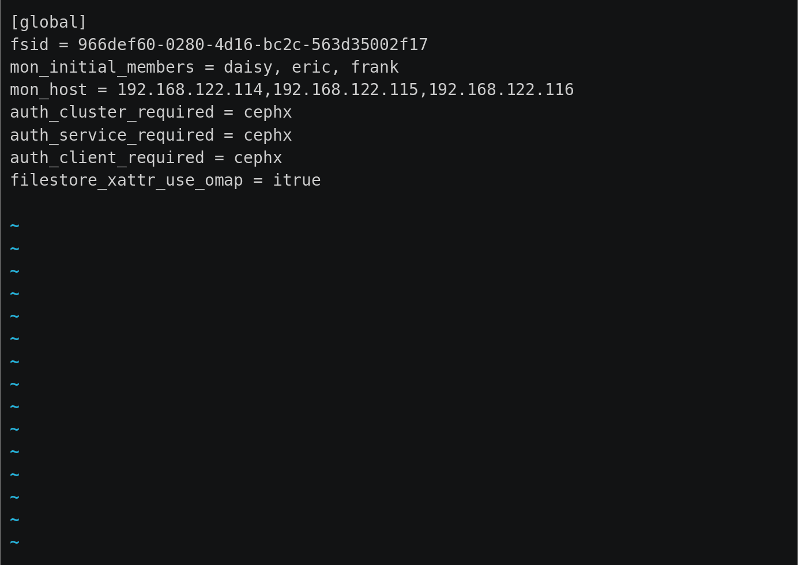

Last week, I traveled to the [Franche-Comté](http://en.wikipedia.org/wiki/Franche-Comté) region of eastern France on behalf of SUSE, to introduce a group of Ceph novices to our favorite distributed storage system and to SUSE's distributed storage product, [SUSE Enterprise Storage 2.1](https://www.suse.com/products/suse-enterprise-storage/).

[PSA Peugeot Citroën,](http://en.wikipedia.org/wiki/PSA_Peugeot_Citroën) usually simply called PSA, is one of Europe's best-known automobile manufacturers and one of France's largest employers, with over 180,000 full-time employees. One of its largest information technology facilities is the _Centre Informatique Groupe PSA_ in [Bessoncourt,](https://fr.wikipedia.org/wiki/Bessoncourt) about 40km from the Franco-Swiss-German border near Basel/Bâle. This facility is "home" to a group of engineers that my SUSE contact, [Christophe Le Dorze](https://www.linkedin.com/in/christophe-le-dorze-a548431a) (whom I had the pleasure of introducing to Ceph a couple of years ago), described as extremely sharp and pleasant to work with — and right he is.

## New to Ceph, not a problem

Whenever I run a class, what I do immediately after introducing myself is a quick poll of my attendees. This helps me find out who they are, what they do in their organization, and what exposure they've previously had to the technology we're covering in the course. Almost all were completely new to Ceph, with just two having had some prior experience. _Pas de souci:_ this didn't stop anyone from making excellent progress throughout the course.

Over the course of the first three days, each of my attendees built their own SUSE Enterprise Storage 2.1 cluster (based on Ceph 0.94 "Hammer") using our [hastexo Academy](//academy.hastexo.com) platform for course content and interactive labs — which went just as swimmingly as our courses based on other Ceph platforms, once we had [ironed out a few kinks](https://www.hastexo.com/blogs/florian/2016/03/14/we-built-a-sles12sp1-openstack-image/) in SLES12SP1 guest images. We covered basics of RADOS, Ceph Mons and OSDs, RBD, radosgw, and CephFS, and quickly progressed to benchmarking, performance tuning, and advanced topics such as erasure-coded pools, tiers, and overlay pools. On days 4 and 5, we also had a chance to cover OpenStack integration, ranging from RBD integration with Glance, Cinder and Nova to managing Swift endpoints via Keystone-integrated radosgw.

## Solid tech, solid product

As I mentioned halfway through the course, introducing Ceph to people for whom the technology is entirely new is always a great pleasure -- the technology is just so beautifully engineered and makes intiutive sense, almost no matter where you look. Sure, it does have its kinks, but for the most part it's truly logical and fun to work with.

<blockquote class="twitter-tweet">
Teaching people <a href="https://twitter.com/hashtag/Ceph?src=hash">#Ceph</a> again this week. Doesn't get old. It's just a big bag of awesome. To <a href="https://twitter.com/liewegas">@liewegas</a> and everyone else: thank you.
— Florian Haas (@xahteiwi) <a href="https://twitter.com/xahteiwi/status/710216168519249920">March 16, 2016</a></blockquote>

SUSE's Ceph product, SUSE Enterprise Storage 2.1, is also a solidly packaged, proverbial quality work of German engineering (although, of course, SUSE's Ceph team happens to be spread out over Germany, the Netherlands, the United States, and Australia). It has recently added Crowbar-based bare-metal deployment support and some excellent iSCSI gateway functionality. For the latter, you should [check out this SUSE whitepaper.](https://www.suse.com/docrep/documents/kgu61iyowz/suse_enterprise_storage_2_and_iscsi.pdf)

## Interested? Give it a whirl!

If _you_ want to give SES2.1 a try (you really should), we've made that easy for you too: [here](https://github.com/hastexo/orchestration/blob/master/heat/ceph/sles/sles12sp1-ses2.1.yaml) is an OpenStack Heat template that you can deploy to any OpenStack public our private cloud (OpenStack Juno or later).

As seen below, using the template is super simple: deploy the stack with `heat stack-create` or the _Orchestration_ component in the OpenStack dashboard, set your SLES12SP1 and SES2.1 eval keys (which you can fetch from [here](https://www.suse.com/products/server/download/) and [here,](https://www.suse.com/products/suse-enterprise-storage/) respectively), wait for the stack to spin up, log in, and then `ceph-deploy` away!

And of course, if you'd like to take a full Ceph Fundamentals course on-line, self-paced, with fully interactive labs on a real multi-node system, you should [check out our HX212 class](https://www.hastexo.com/blogs/florian/2016/02/08/hx212-is-live/), available anytime.

* * *

Yours truly and part of the team at PSA. Photo credit: Loïc Devulder.

Source: Hastexo ([Five Days of Ceph at PSA Peugeot Citroën](https://www.hastexo.com/blogs/florian/2016/03/23/ceph-at-psa/))
