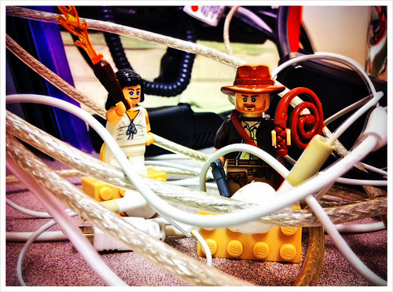

This is the fourth in a series of posts about how DreamHost builds its Cloud products. Written by Luke Odom straight from the data center operations.

So far in this series, we have looked at what processors to use in our machines and what drives we should use. The next thing we are going to look at is how to connect all the machines and switches together.

Image Source: [Flickr](https://www.flickr.com/photos/billsophoto/5597422810/in/photolist-hBpyoD-buvXYL-bHqKkp-buvY1j-9wCfMQ-8P31PA)

We want to make sure we both have enough bandwidth and that it is fully redundant. [Ceph](http://ceph.com/) recovery is the cluster’s most network-intensive activity. From experience, we knew that we would use 2-4 Gbps during Ceph recovery. To put that into perspective, the average American home has an Internet connectivity speed of 12.6 Mbps. During Ceph recovery, we are using about 4000 Mbps. This means that [Category 5e ethernet cable](https://en.wikipedia.org/wiki/Category_5_cable), which is what most consumers are using for networking, isn’t practical. We needed to use a cable capable of 10Gbps. Here, we have 3 options:

**1.** The first is to use a form of fiber optics. There are different wavelengths and connectors with fiber optics, but they all work the same way. They work by sending light over a long and exceedingly thin strand of glass. The advantage of fiber is that it has very low latency and takes very little power to operate. The switches are also widely available as they use transceivers plugged into SFP+ ports which are very common. The [compatibility page of Cumulus](https://cumulusnetworks.com/support/linux-hardware-compatibility-list/),  the software we run on our switches, highlights that every 10G switch but one is using 10G-SFP+ ports so we have many options available if we go with fiber. The big disadvantage to using fiber is its cost. You need dedicated SFP+ cards, as motherboards don’t usually have that built in, and you also need both transceivers and fiber, both of which are very expensive. Fiber is also more delicate than copper-based wires, which introduces a layer of complexity in  running it or working near it. Extreme care is required to avoid breakages.

**2.** Another similar option is [Twinaxial cable](https://en.wikipedia.org/wiki/Twinaxial_cabling), more commonly referred to as TwinAx. TwinAx uses an SPF+ port as well, but instead of a transceiver and a strand of fiber, you have a transceiver built into a copper cable. You still have the expense of the extra card, but a TwinAx cable is a third of the price of a strand of fiber and transceiver. It is also the same speed and can be used on the same gear. TwinAx is very similar to [Coaxial cable](https://en.wikipedia.org/wiki/Coaxial_cable), or “Coax.” Coax is used with cable internet and cable TV to transmit signals to consumers’ homes. The difference is that TwinAx has two copper cables instead of one. TwinAx is what we used for the original [DreamCompute](https://www.dreamhost.com/cloud/computing/) cluster as it is a great low-cost alternative to fiber! The downside to TwinAx is latency. TwinAx uses pulses of electricity instead of light to send signals. As electrons travel slower than the speed of light, it takes them three times longer to travel down the same length of cable.

**3.** The third option we considered was [10G-baseT](https://en.wikipedia.org/wiki/10_Gigabit_Ethernet). For the last decade, almost every server we have purchased has had 1G-baseT ports integrated into the motherboard. Most consumer laptops and desktops that have a wired network port today are also 1G-baseT. 1G-baseT and 10GbaseT both use four pairs of very thin twisted copper wire and an rj-45 connector (which looks like a large phone jack), though the cabling standards for 10G are slightly different to handle the higher speeds. 10G-baseT was standardized 10 years ago, but until recently implementations have been very rare and expensive. That started changing last year with the Intel x540 chipset. This allowed inexpensive onboard 10G-baseT, and manufacturers quickly began adding it as an option. Cumulus also started supporting a 10G-baseT switch. Using on-board 10G-baseT and category 6 ethernet is a tenth of the cost of using fiber and significantly cheaper than TwinAx. The downside to 10G-baseT is latency. At the lengths of cable we use, it takes about 0.000001 seconds longer for a signal to get from the computer to the switch. This seems inconsequential, but some applications, such as Ceph, are very latency sensitive. Even slight latency can make a noticeable impact, and requires testing.

We decided to use 10G-baseT. Weighed against the minor latency difference demonstrated in our testing, the ease of install and substantially lower price made our choice clear. We also decided to get motherboards with four 10Gbase-T ports. For the initial deployment, we set up 20 Gbps capacity between each machine and the switch. We didn’t want to use more than half the capacity at any given time. This would ensure that we wouldn’t be saturating one port if another port went down. Based on our testing, we didn’t expect to use more than 10 Gbps. As a failsafe, we got the extra two ports to make any necessary upgrades quick and simple if we needed it. Now that we are in production, we haven’t had any spikes of greater than 10Gbps from any individual machine. Still, it is nice to have the ability to add extra capacity if we need it.

_Stay tuned for our next post in the series, where we answer the question: To converge, or not to converge? Til next time!_ 

The post [How DreamHost Builds Its Cloud: Architecting the Network](https://www.dreamhost.com/blog/2016/10/08/dreamhost-builds-cloud-architecting-network/) appeared first on [DreamHost.blog](https://www.dreamhost.com/blog).

Source: dreamhost ([How DreamHost Builds Its Cloud: Architecting the Network](https://www.dreamhost.com/blog/2016/10/08/dreamhost-builds-cloud-architecting-network/))
