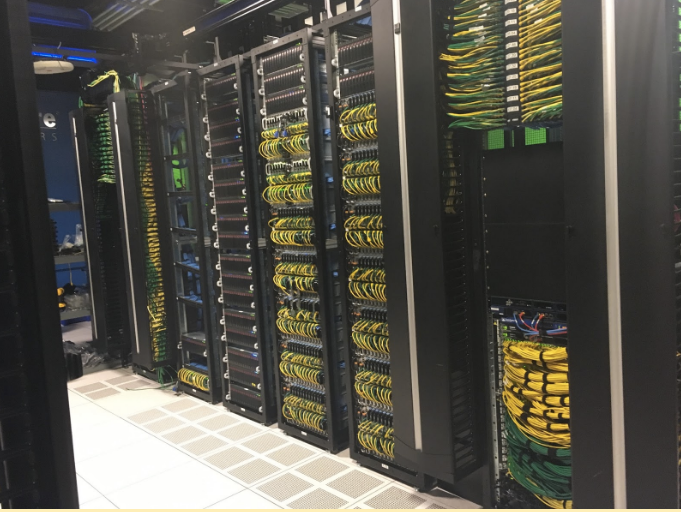
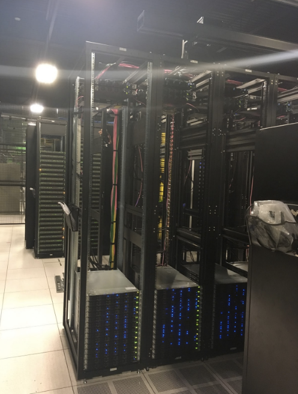
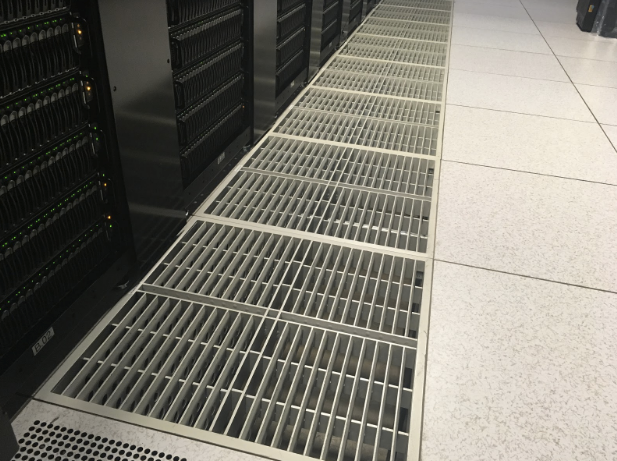

_This is post No. 6 in a series of posts about how DreamHost builds its Cloud products. Written by Luke Odom straight from the data center operations._ 

How many racks to use for our next-gen OpenStack cluster? We use standard 9 foot 58u racks: tall enough and with enough power going to them, that neither rack space nor available power are limiting factors.

The density of our racks is limited only by our switches: with 48 ports to redundantly cable every hypervisor, we can get 48 switches per rack. With two leaf switches and a spine switch that only leaves us with 9u, so adding an additional set of switches and machines isn’t feasible. As we are storing Ceph data in triplicate, it also makes sense to have at least 3 racks to make it easy to have at least 3 availability zones for Ceph. This also locks us into the number of racks we chose. Adding another availability zone for Ceph can cause a significant slowdown in IO, and having a new rack with different availability zones in it is difficult to manage.

If we put our new cluster in too few racks, we would fill up those racks too quickly and have to stand up a new cluster too soon, which is expensive. We also want to minimize the need to manage multiple clusters. If we spread it across too many, we are are wasting the resources needed to buy switches, PDUs, and racks and pay for the space to house them.

One of the major factors in our decision was that we wanted to expand DreamCompute to multiple locations, so we decided to keep the new cluster relatively small and spread it across 4 racks with the goal of spreading growth over multiple locations instead. Spreading across 4 racks gives us room to deploy eight cockpit machines and 184 converged hypervisor/Ceph machines.

This is the new DreamCompute! The holes you see in the floor allow cool air to come up and cool the servers. You have to start deployments at the bottom, as the size of the holes is determined by how many servers are currently deployed and you need to make sure that the cold air can reach the servers. What you see in the above pictures are 25% perforated tiles. As we deploy more hypervisors, those tiles will be replaced with new tiles that have larger holes.

This is a picture of fully deployed rack of VPS and DreamPress. These are using 90% directional perf tiles, which is what we will be using once we have this DreamCompute cluster fully deployed.

#### Location

We’ve designed the infrastructure for this awesome new DreamCompute cluster, but where should we put it? DreamHost currently has 4 data centers locations. The two in the Los Angeles area are being scaled down and the ones in Ashburn, Virginia and Portland, Oregon are currently being scaled up. Both Ashburn and Portland have ample space and bandwidth to handle the new DreamCompute cluster, so both are good options. We wanted the customers of our beta DreamCompute cluster to be able to transition to our production cluster as seamlessly as possible. For this reason, we chose to put our production cluster in Ashburn, directly beside the beta cluster.

That’s it! We’ve picked the processor, RAM, network and drives to go in each machine, got them networked, and have them racked! A brand new DreamCompute OpenStack+Ceph cluster ready to spin up your VMs and do whatever you want. Go have fun!

The post [How DreamHost Builds Its Cloud: Deciding on the physical layout](https://www.dreamhost.com/blog/2016/10/27/dreamhost-builds-cloud-deciding-physical-layout/) appeared first on [DreamHost.blog](https://www.dreamhost.com/blog).

Source: dreamhost ([How DreamHost Builds Its Cloud: Deciding on the physical layout](https://www.dreamhost.com/blog/2016/10/27/dreamhost-builds-cloud-deciding-physical-layout/))
