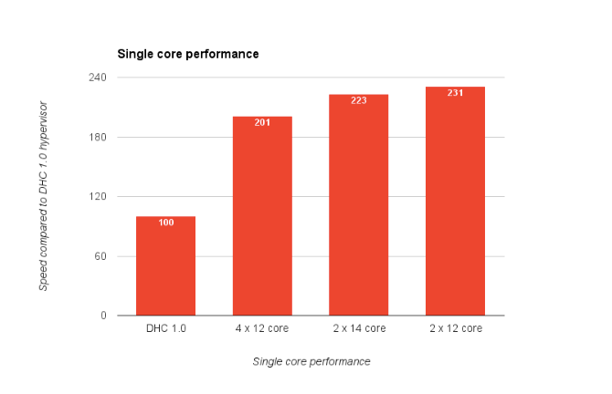
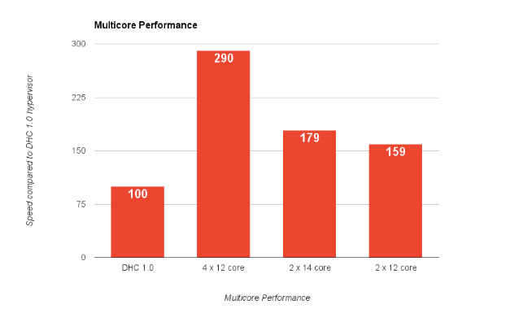

_This is No. 5 in a series of posts about how DreamHost builds its Cloud products. Written by Luke Odom straight from the data center operations._ 

With the first [DreamCompute](https://www.dreamhost.com/cloud/computing/) cluster, we used specialized hardware for both the [Ceph](http://ceph.com/) storage nodes and the hypervisors. The Ceph storage nodes had little RAM, low frequency and low core processors, but lots of drives. The hypervisors had lots of CPU cores, lots of RAM, but only boot drives. As we wanted to have low density Ceph nodes, the RAM and CPU requirements were minimal, so we decided to also test out a converged solution where the Ceph nodes and hypervisors shared the same hardware.

Source: [Flickr](https://www.flickr.com/photos/exothermic/2108916970)

Let’s look at what options are available for specialized compute hardware. DreamHost has a hardware testing department that uses a combination of in-house and remote access to systems to test their performance. The team discusses results and decides which hardware will be the best. Of the hundreds of CPU benchmarking tools, we currently use a combination of sysbench, mysqlslap, and a few various phoronix tests. We’ve chosen these as they best mirror the actual environment that these machines will be running in. We then run these tests in both a single thread configuration and a multi-core configuration to give us an idea of both individual process performance and overall system performance.

To make hardware decisions easier, we average and condense all these benchmarks into a single metric for both single and multi core and, where possible, baseline this metric against existing hardware in production. We also look at the cost/performance ratio and the performance/watt ratio to come up with valid options. For the specialized hypervisor hardware we narrowed down the options to three Intel processors: the E5-2670v3, the E5-2683v3, and the E7-4830v3. These all have a similar single core speed, cost/performance ratio and performance/watt ratio. The big difference is density.

The single core performance is at least twice as fast as our beta cluster (DHC 1.0, in the chart) for all three of these processors and is similar for the three processors we are comparing.

Even though the old hypervisors had 64 physical cores each, they still can’t match the overall system performance of the new Intel based machines. The chart shows also what a difference multiple cores make in systems performance. The machine with four 12-core processors can do almost double the work as a system with only two 12-core processors. The decision to use specialized hardware is influenced by density. The more processing power you have in a single machine, the fewer machines you have to maintain and the more customers you can put on each machine. However, it opens up a bigger point of failure should something go wrong.

Having had a lot more experience with Ceph, a specialized Ceph machine is much easier to figure out. Ceph works fastest when you have fewer drives on each host. We have found the optimal amount to be 10-12 drives. The specialized hardware would have 10 960GB Ceph SSDs, a single E5-2620v3, 32GB RAM, and mirrored 512 GB SSD boot drives.

The alternative to a specialized solution is a converged one, where the hypervisors and Ceph OSDs are hosted on the same hardware. To get our estimated ratio correct (and allocate some of the cores and RAM to Ceph) we would need a machine with dual 8-core processors, 128 GB RAM, two 960 GB boot drives, and eight 960GB Ceph drives. The single core performance of the processor is pretty much the same as the other Intel processors of that generation that we are testing but each individual machine can’t do quite as much work. However, even with far fewer cores, it still beats the hypervisors from the old cluster.

The big advantage of a converted solution is a reduced amount of hardware needed. Fewer machines means fewer points of failure, less cabling, and a lower cost. The big risks of a converged solution is resource contention between the virtual machines and Ceph or problems caused by either the hypervisor or the Ceph drives affecting the entire machine. There is also the risk that this is an untested technique that could reveal problems—on a software or hardware level—once we go into production.

In the end, we decided that the ease of management and increased density was worth the risk and decided to go with a converged solution.

_Get more insights into how we built our cloud in the next post, coming soon!_ 

The post [How DreamHost Builds Its Cloud: To Converge or Not to Converge?](https://www.dreamhost.com/blog/2016/10/20/dreamhost-builds-cloud-converge-not-converge/) appeared first on [DreamHost.blog](https://www.dreamhost.com/blog).

Source: dreamhost ([How DreamHost Builds Its Cloud: To Converge or Not to Converge?](https://www.dreamhost.com/blog/2016/10/20/dreamhost-builds-cloud-converge-not-converge/))
