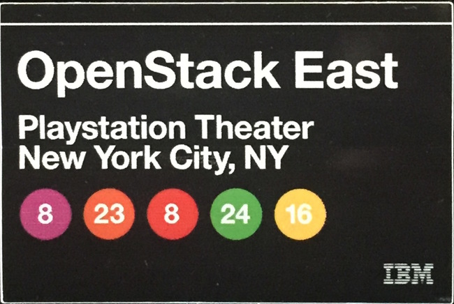

_OpenStack Days NYC, Operators Midcycle and Red Hat Ceph Storage 2.0_

Today, while I was enjoying the keynotes of old friends at OpenStack Days New York City, the Ceph team at Red Hat was hard at work releasing RHCS 2.0 — the most significant update to Red Hat Ceph Storage since we acquired Inktank in 2014.

#   Geographic distribution

Ceph is inherently highly available — you could lose a disk, a host, even a rack of storage with the certainty that your data is safely replicated in at least two other places. Ceph’s synchronous nature is a further guarantee: write operations do not return until all three copies have been committed to disk. Like all engineering decisions, this comes with a tradeoff: Ceph is sensitive to network latency as a result of its conservative design. This makes a _stretch cluster_ configuration, where multiple racks of hardware belonging to the same logical cluster are located at geographically separate sites something that is undesirable on performance grounds: beyond short light speed distances the increase in latency reduces the cluster’s overall performance.

The right way to build a disaster recovery architecture in Ceph is to operate multiple independent clusters at separate sites, with replication occurring asynchronously between multiple clusters, not synchronously within a geographically dispersed single _stretched_ cluster.

Enter RHCS 2.0: RGW’s new _Global Clusters_ feature (also commonly known as _RGW active-active_) replicates data asynchronously between multiple Ceph clusters, ensuring data is stored at all sites that are configured to receive copies — functionality of interest not only to the narrow disaster recovery use case but also to propagate data to multiple sites ahead of its processing or for distribution. The mental picture is simple: immediate consistency _locally_, with remote _eventual_ consistency as RGW asynchronously replicates your applications’ data bucket to another cluster.

A more complex mechanism enables point-in-time consistent replicas for the RADOS block interface, where simple eventual consistency would not suffice to guarantee volume integrity. The new _RBD Mirror_ daemon replays an image’s dedicated journal of operations at the remote site, assuring that the secondary replica of an RBD volume is in a consistent, ready to use state were the primary site to suddenly disappear. In a site-wide outage, all the volumes backing your running virtual machines are ready to resume from where work halted at the primary site, before the asteroid hit it, so to speak. The delay between the primary and the replica is a function of network performance, but the disk image is guaranteed to be fully self-consistent. For more detail, refer to our OpenStack Summit talk on how to [Save the Galaxy with OpenStack and Ceph](https://f2.svbtle.com/saving-the-galaxy-openstack-dr-with-ceph).

#   The Future of Management

We are embracing Ansible as our management platform of choice — starting with this release, RHCS installs via [Ceph-ansible](https://github.com/ceph/ceph-ansible) — and we have more ambitious plans yet in store for for our Ansible integration, so stay tuned. Additionally, [Red Hat Storage Console](https://www.redhat.com/en/about/videos/red-hat-storage-console-2) 2, an amazingly easy to use new management tool is being introduced as our opinionated, graphical management console that streamlines and simplifies the install and management of a new Ceph cluster. The combination of the two tools gives us the best of both worlds: advanced administrators with a flair for hands-on cluster configuration get the full DevOps experience with Ansible, while traditional storage admins who prefer not to manage their storage systems from a Linux shell get a guided, opinionated experience that is mindful of their time commitments. And Storage Console uses Ceph-ansible and the Calamari API under the covers, so if you decide to transition between management strategies, that is also an option.

Ceph-ansible’s awesomeness was quickly confirmed by Ben England in Red Hat’s famous Performance & Scale team:

##   “We were able to deploy 1.8 PB of storage in under one hour using Ceph-ansible, provisioning 1040 OSDs on 29 nodes”

#   Faster and awesome: the tech previews

[Bluestore](http://www.sebastien-han.fr/blog/2016/03/21/ceph-a-new-store-is-coming/) is a new Ceph backend that more than doubles performance by eliminating the double-write penalty of today’s FileStore. While still under heavy development and not suitable for production use, we are placing it already in tech preview as a way to help users assess what the performance state of the art will look like next year, and plan their future deployments accordingly.

The second tech preview is an NFS gateway that allows users to mount an RGW bucket as a remote NFS directory. This will be extremely convenient for mass import or export of files into or from a Ceph cluster, but is not meant to provide full POSIX semantics — that is the job of the third tech preview: CephFS.

CephFS, the POSIX-compliant file system that uses a Ceph storage cluster to store its data and can be used with the OpenStack Manila service has entered tech preview (yay!) on its way to full support. With both RHCS 2.0 and OpenStack Platform 9 out we now have a full Manila stack including the Manila file share service, the CephFS driver and CephFS itself all in tech preview for those of you who want to try this out end-to-end.

This is a continuation of our commitment to complete and tightly integrated storage for OpenStack environments. CephFS was blessed by upstream as _stable_ in the Jewel release, but we prefer Sage’s description of CephFS as now finally being _“fully awesome!”_

#   But wait, there’s even more

We have added LDAP and Active Directory integration to RGW, so users can be imported from your corporate identity vault without needing to be instantiated locally — handy for those internal web applications hosted in S3 storage so popular today. And while we are talking authentication, we upgraded auth support to the latest standards: Keystone v3 for OpenStack clusters, and AWS V4 on the object side. Security was enhanced as well: Ceph no longer runs as `root`, but rather as an unprivileged user, and the security posture is further hardened by the default setup now running under SELinux in enforcing mode. RBD now supports renaming of snapshots, and images can be tagged with metadata. We have have enhanced Amazon S3 and OpenStack Swift compatibility, including support for object versioning, bulk deletes, and more.

We are throwing in a free set of steak knives for the first 99 callers! :-) More seriously, this is a landmark release in our path to making Ceph the Linux of Storage, and we hope you try it, test it, and trust it with your data — we have.

Source: Federico Lucifredi ([Jewels of Distributed Storage](http://f2.svbtle.com/the-jewel-of-distributed-storage))
