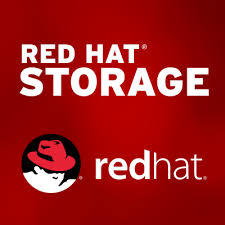
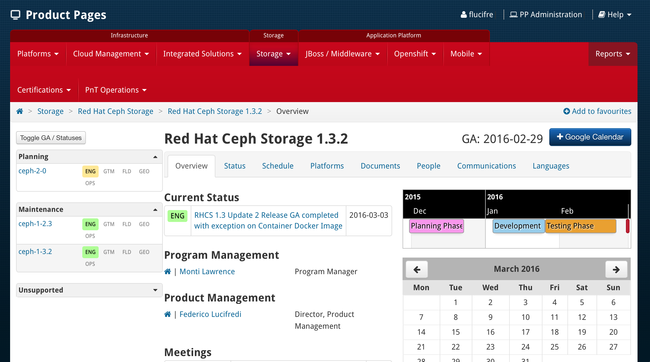

It’s a fantastic thing that we made the release date, because otherwise we would have to wait for four more years — I had this quirky desire to release one of my products on February the 29th, and this year we finally made it happen! ;-)

Today we are pleased to launch the latest and greatest release of [Red Hat Ceph Storage](https://access.redhat.com/documentation/en/red-hat-ceph-storage/), upping the minor release number to [1.3.2](https://access.redhat.com/documentation/en/red-hat-ceph-storage/version-1.3.2/release-notes/).



This is first and foremost a maintenance release including a number of bug fixes, but there are some features as well. First of all, we are rebasing on upstream Hammer 0.94.5 from the current .3, as always tracking the state of the art in Ceph’s LTS release development. Adding the extensive testing and bug fixing that gives Red Hat products their reputation for quality has been accomplished in efficient 8-week test and integration cycles during our last two point releases, giving customers a remarkably current product which also meets stringent enterprise-readiness criteria.

# Performance Tune Up

On the performance front, we are tuning TCMalloc’s thread cache to default to 128MB instead of the old 32MB, as [joint research by SanDisk, Intel and Red Hat](http://ceph.com/planet/the-ceph-and-tcmalloc-performance-story/) has shown considerable promise. Red Hat’s Storage Solution Architectures team stepped in to field-test the findings with key New York financials in the past quarter, and remarkable performance improvement are the result. Transactional workload testing showed up to 350% improvement (4K-16K random IO). These of course are the best results, I have my Marketeer hat on today — you need to evaluate the [full report](http://ceph.com/wp-content/uploads/2016/02/Ceph_Hackathon_Memory_Allocator_Testing.pdf) to better judge the extent of the improvement in your use case. This is definitely _not_ a 300% improvement across the board, but It is nonetheless a nice step forward on the road to Jewel’s new Bluestore backend.

| A Technical Note |
| --- |
| _TCMalloc had a longstanding issue where the environment setting for thread cache size was not honored. On RHEL, this was resolved by the upgrade to TCMalloc 2.4 delivered in RHEL 7.2, while Ubuntu has recently patched TCMalloc 2.1 downstream to the same end. If you experiment with thread cache tuning on your cluster, make sure you have a version of TCMalloc that will honor the setting first! please also note that RHCS 1.3.2 optimizes the thread cache configuration as part of its default setup and no manual tuning is necessary._ |

# Security

We are now including a full SELinux policy for OSD, MON, RGW, and Calamari — all running daemons in the Ceph system can now be secured with SELinux. SELinux adds mandatory access controls to UNIX’ traditional discretionary access controls, providing the highest level of security against exploits, including against as-of-yet undiscovered attacks. We are not turning on SELinux by default as this is a point release and that does not seem appropriate, but Ceph customers can now easily incorporate their storage in a software-defined datacenter based on SELinux when security is of top concern.

On the operational efficiency front, we are continuing to expand the number of documented configurations that support a Ceph cluster with updates without requiring a direct Internet connection. In 1.3.1 we added [Satellite 6](https://access.redhat.com/articles/1750863) support to our legacy Inktank tooling, and in this release we are delivering support for [Satellite 5](https://access.redhat.com/articles/2139421) and [Apt-Cacher-NG](https://access.redhat.com/articles/2148241).



# Docker

Containers are all the rage these days, and efforts are underway to deliver containerized versions of all Red Hat storage products. Ceph is leading the way with a Tech Preview of 1.3.2 as a Docker image, to be followed in a few days by a fully supported Gluster image from our sister team. The RHCS image cleverly encapsulates both MON and OSD code, and you select which daemon to instantiate passing a single parameter to _docker run_ as detailed by Sébastien Han in his [blog](https://opensource.com/business/15/7/running-ceph-inside-docker) illustrating the design. As the image becomes available on the Red Hat registry, you will be able to try this yourselves — here is an example to get you started:

```
docker pull registry.access.redhat.com/rhceph/rhceph-1.3-rhel7
docker run -d --net=host -v /etc/ceph:/etc/ceph  -v 
        /var/lib/ceph/:/var/lib/ceph/ -e MON_IP=172.17.72.41 -e 
        CEPH_PUBLIC_NETWORK=172.17.72.0/24 rhceph-1.3-rhel7 mon
docker run -d --net=host -v /dev/:/dev/ --pid=host 
       --privileged=true -v /etc/ceph:/etc/ceph   
       -v /var/lib/ceph/:/var/lib/ceph/  
       -e OSD_DEVICE=/dev/sdb rhceph-1.3-rhel7 osd
```

Clearly, this needs orchestration (Kubernetes, anyone?), but while we work on that, we have a knowledge base article walking through how to build a containerized cluster manually from our image [here](https://access.redhat.com/articles/2184551).

# We’re Always Ready to Support You

We will continue to support RHCS 1.2, our previous major release, until May 31, 2016 — exceeding our original release-time committment to support Firefly for 18 months until November 2015 . As you may already know, we also extended the support lifecycle of RHCS to a full three years with the 1.3 release, as is documented by our [Lifecycle](https://access.redhat.com/articles/1372203) policy. As always, if you need technical assistance, our Global Support team is one click away using the Red Hat [customer portal](https://access.redhat.com).

Comments? Discuss on [Hacker News](https://news.ycombinator.com/item?id=11199907).

Source: Federico Lucifredi ([Leap Ahead](http://f2.svbtle.com/ceph-1-3-2-a-leap-ahead))
