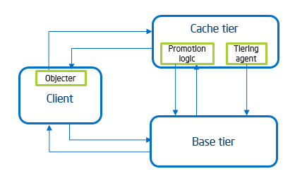
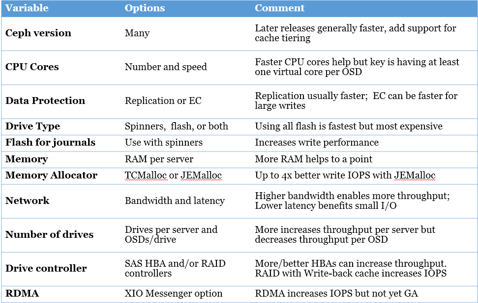

In my **[first blog on Ceph](http://www.mellanox.com/blog/2015/06/ceph-is-a-hot-storage-solution-but-why)** I explained what it is and why it’s hot; in my **[second blog on Ceph](http://www.mellanox.com/blog/2015/08/a-good-network-connects-ceph-to-faster-performance/)** I showed how faster networking can enable faster Ceph performance (especially throughput).  But many customers are asking how to make Ceph even faster. And recent testing by Red Hat and Mellanox, along with key partners like **[Supermicro](http://www.supermicro.com/solutions/storage_ceph.cfm),** QCT (**[Quanta](http://www.qct.io/Solution/Software-Defined-Infrastructure/Storage-Virtualization/QCT-and-Red-Hat-Ceph-Storage-p365c225c226c230)** Cloud technology), and Intel have provided more insight into increasing Ceph performance, especially around IOPS-sensitive workloads.

Figure 1: Everyone wants Ceph to go FASTER

**Different Data in Ceph Imposes Different Workloads**

Ceph can be used for block or object storage and different workloads. Usually, block workloads consist of smaller, random I/O, where data is managed in blocks ranging from 1KB to 64KB in size. Object storage workloads usually offer large, sequential I/O with data chunks ranging from 16KB to 4MB in size (and individual objects can be many gigabytes in size). The stereotypical small, random block workload is a database such as MySQL or active virtual machine images. Common object data include archived log files, photos, or videos. However in special cases, block I/O can be large and sequential (like copying a large part of a database) and object I/O can be small and random (like analyzing many small text files).

The different workloads put different requirements on the Ceph system. Large sequential I/O (usually objects) tends to stress the storage and network bandwidth for both reads and writes. Small random I/O (usually blocks) tends to stress the CPU and memory of the OSD server as well as the storage and network latency. Reads usually require fewer CPU cycles and are more likely to stress storage and network bandwidth, while writes are more likely to stress the CPUs as they calculate data placement. Erasure Coding writes require more CPU power but less network and storage bandwidth.

**CPU Power**

Ceph is fairly hungry for CPU power, but the key observation is that an OSD server should have one core per OSD. If you have two sockets with 12 cores each and put one OSD on each drive, you can support 24 drives, or 48 drives with hyper-threading (allowing one virtual core per OSD). This is already reflected in the Ceph setup guidelines. CPU power is probably more important for small random writes (IOPS) than for large sequential ones (throughput), and more CPU power may be needed to support writes when using erasure coding (EC). But since EC is only used for object storage, it’s unlikely to be used for Ceph as database storage. Generally, having enough cores to cover all the OSDs in the server is more important than the speed of the cores.

**Drive Type and OSD Allocation**

Flash is faster than spinning disk, but also much more expensive, so customers tend to choose all-flash for maximum performance or all spinners for maximum capacity and lowest cost per TB. For most object storage the right choice is spinning disk with one SSD per server for the journal. Note that using a SSD for journaling tends to accelerate writes but not reads. Newer versions of Ceph support cache tiering (first introduced in _Firefly_, improved in _Hammer_) which allows the most frequently used data on each node to live on flash while the less frequently used data lives on spinning disk.

Figure 2: Cache tiering makes more efficient use of flash and spinning disks

**Memory Allocation**

A recent discovery (based on work by SanDisk, Intel, Red Hat and others) showed the type of Linux memory allocator plays a big part in IOPS performance. The commonly used TCMalloc can consume too much CPU when not enough thread cache is available (and it makes it difficult to increase the thread cache). By going to JEMalloc or newer versions of TCMalloc IOPS performance increased up to 4.2x. You can read more about this in this **[Ceph blog](https://ceph.com/planet/the-ceph-and-tcmalloc-performance-story/)**.

Figure 3: Good Linux Cache Juggling Can Increase Ceph IOPS

**Faster Network**

As mentioned in my **[second blog](http://www.mellanox.com/blog/2015/08/a-good-network-connects-ceph-to-faster-performance/)**, OSD servers with 20 HDDs or 2-3 SSDs can exceed the bandwidth of single 10GbE link for read throughput.  This has been demonstrated in Ceph testing by Supermicro, QCT, Samsung, Scalable Informatics, Mellanox, and Cisco—each of them used one Mellanox 40GbE NIC (or 4x10GbE NICs in the Cisco test) per server to provide enough bandwidth. So if you want a performance-optimized Ceph cluster with >20 spinners or >2 SSDs, consider upgrading to a 25GbE or 40GbE. One 25GbE port should handle the full read bandwidth a Ceph server with 40+ HDDs or 5-12 SSDs (depending on SSD type). A 40GbE link can handle the Ceph throughput of over 60+ HDDs or 8-16 SSDs per server.

For IOPS, latency is more important than bandwidth. Testing by Red Hat and Supermicro (and also by Intel) showed that Ceph can support many IOPS using 10GbE, but if you have enough IOPS per server (as Intel did), you can still exceed 10GbE capabilities and need to either upgrade the network or spread the IOPS across more servers.  We’ve also seen that Mellanox 25GbE and 40GbE networks have lower latency than most 10GbE networks, which can improve IOPS performance even when Ceph bandwidth per server is <10Gb/s.

Figure 4: QCT Ceph testing shows one 40GbE network results in lower Ceph latency than 2 10GbE networks.

Previously the only upgrade after 10GbE was 40GbE, but now 25 and 50GbE options are also available. 25GbE runs over two wires/fibers (one pair), costs only slightly more than 10GbE, and typically can re-use existing fiber optic cabling. 40GbE costs a little more than 25GbE and runs over 8 wires (four pairs) but has been around longer.  Today we see 25GbE growing extremely rapidly in Cloud and Web 2.0 data centers while 40GbE is a more comfortable choice in enterprise data centers.

**Number of Drives and OSDs**

Using more drives per OSD node increases throughput per node, but decreases throughput per OSD (per drive). For customers interested in the best price/capacity and most customers looking to optimize price/throughput, more drives per node is the way to go. But this is limited by server physical capacity, drive controllers, network throughput, and CPU cores.

With hard drives and slower SSDs, there should be one OSD per drive. With really fast SSDs like the new generation NVMe drives, one OSD might not fully utilize the SSD and you might need to create two OSDs per SSD for best performance.

**Drive Controllers and RAID Controller Cache**

When using SAS drives (spinners or SSDs) the server needs SAS controllers (SAS HBAs). The best performance is achieved when you have one HBA for every 6-8 SAS drives, but it’s cheaper to use a SAS expander to let one HBA control 24 (or more) drives. Testing in 2015 showed that for the highest throughput workloads, using SAS expanders and too many drives per HBA can slow performance. So use more HBAs and fewer expanders to achieve maximum throughput, or use SAS expanders to minimize cost when full drive throughput is not needed.

More recent testing with Red Hat, Supermicro, and Seagate also showed that a good RAID controller with onboard write-back cache can accelerate IOPS-oriented write performance. While Ceph doesn’t use RAID (since it supports both simple replication and EC), the right RAID controller cache can still improve write performance via the onboard cache.

Figure 5: Variables that affect Ceph performance

**The Cost of Faster Performance is Not Free but It Is Affordable**

Higher performance rarely comes for free but it doesn’t have to be expensive. It’s easy to upgrade the CPU, RAM, drives, network, drive and controllers at a modest cost, as long as you don’t insist on the very fastest available x86 CPUs or making all the drives SSDs. On the other hand, Ceph tuning, upgrading the Ceph version, or changing the memory allocation is free other than a modest time investment. Adding an SSD to each node for journaling, adding another SAS controller, or upgrading the network card from 10GbE to 25GbE only costs $300 per server (prices will vary depending on model, quantity, and purchasing channel), which comes out to a few pennies per GB when amortized across many drives in a server. Assuming 48 \* 4TB drives per server, that’s $6.25 per drive, $1.50 per raw terabyte, or less than 0.2 cents per raw GB.

Figure 6: Faster Ceph performance is not free, but it’s often very affordable

**Watch This Space – More Guidance to Come**

This guidance is based on both completed and in-progress testing work by Red Hat with various partners. More Ceph performance testing is ongoing as I write this blog. I expect to see more detailed results and new reference architecture papers from Mellanox, Supermicro, and flash vendors also working on Ceph.  In addition, Mellanox continues to work with Red Hat on productizing Ceph RDMA support and integrating erasure coding offloads. RDMA should increase IOPS performance from 44% to 200% for some small block workloads on all-flash storage. EC offloads will allow the more efficient erasure coding storage to be used without the current performance penalty.

For Ceph performance optimization, RDMA, and EC offloads, I hope to see more than one new paper published and/or demos shown before or at **[Red Hat Summit 2016](https://www.redhat.com/en/summit)** (June 28-July 1 in San Francisco).

**So watch this space closely!**

Figure 7: Keep watching this blog closely for more Ceph news!

**RESOURCES**

- Performance and Sizing Guide: **[Red Hat Ceph on QCT Servers](http://www.redhat.com/en/resources/performance-and-sizing-guide-red-hat-ceph-storage-qct-servers)**
- Red Hat & **[Supermicro/Red Hat Ceph Reference Architecture](http://www.redhat.com/en/resources/red-hat-ceph-storage-clusters-supermicro-storage-servers)** (for capacity and throughput-optimized configurations)
- QCT software-defined storage **[solution for Red Hat Ceph](http://www.qct.io/Solution/Software-Defined-Infrastructure/Storage-Virtualization/QCT-and-Red-Hat-Ceph-Storage-p365c225c226c230)** Storage
- Supermicro **[Ceph Solutions](http://www.supermicro.com/solutions/storage_ceph.cfm)**
- Red Hat **[Ceph datasheet](http://www.redhat.com/en/resources/red-hat-ceph-storage)** and the **[Red Hat Storage Blog](http://redhatstorage.redhat.com/blog/)**
- Ceph online **[docs on Cache Tiering](http://docs.ceph.com/docs/master/rados/operations/cache-tiering/)**
- Ceph blog on **[JEMalloc vs. TCMalloc](https://ceph.com/planet/the-ceph-and-tcmalloc-performance-story/)** and YouTube **[Red Hat webinar on Ceph Performance Tuning](https://www.youtube.com/watch?v=oxixZPSTzDQ&feature=youtu.be)**
- Mellanox [E**thernet switch systems**](http://www.mellanox.com/page/ethernet_switch_overview), ideal for Ceph networking at 10/25/40/56/100 GbE
- Mellanox **[Ethernet Adapters](http://www.mellanox.com/page/ethernet_cards_overview)** at 10/25/40/56/100 GbE

Source: mellanox ([Making Ceph Faster: Lessons From Performance Testing](http://www.mellanox.com/blog/2016/02/making-ceph-faster-lessons-from-performance-testing/))
