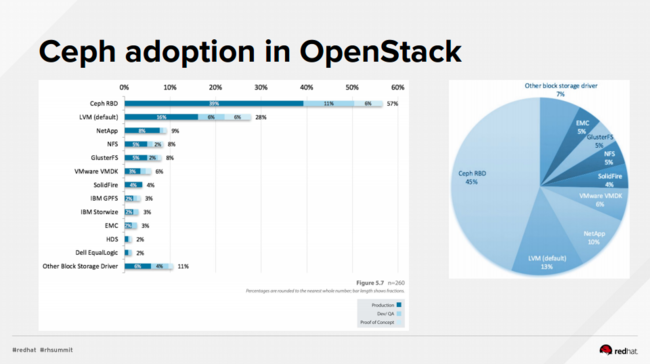
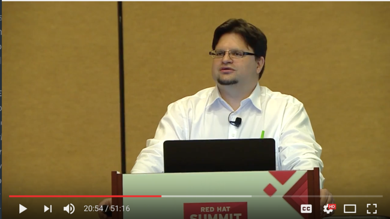

_The Three musketeers_ (as our marketing colleagues have started to call us now) were at the [Red Hat Summit](https://www.redhat.com/en/summit) last week to walk the assembled crowd of CIOs through all the reasons why Ceph is the most successful storage technology in the OpenStack market segment.

Ceph is the most widely deployed storage technology used with OpenStack, most often because it’s an open source, massively scalable, unified software-defined storage solution. Its popularity is also due to its unique and optimized technical integration with the OpenStack services and its pure-software approach to scaling. In other words, they just go together [like peanut butter and jelly](https://rh2016.smarteventscloud.com/connect/sessionDetail.ww?SESSION_ID=42740).

In this intro-level session, Sean and I introduced the audience to OpenStack and Ceph, and Sébastien tied the two together mapping the deep integration between the two. There are still many that need to hear about the rise of Software-defined Storage for the first time, and we are doing our part to spread the word.

**UPDATE** The Summit organization has now posted the live recording of our session in the Red Hat YouTube channel.

Our slides are [available as a PDF](http://people.redhat.com/%7Eflucifre/talks/Red%20Hat%20Summit%202016%20-%20Peanut%20Butter%20and%20Jelly.pdf) and can be viewed inline below.

Source: Federico Lucifredi ([OpenStack and Ceph: like Peanut Butter & Jelly](http://f2.svbtle.com/openstack-and-ceph-like-peanut-butter-jelly))
