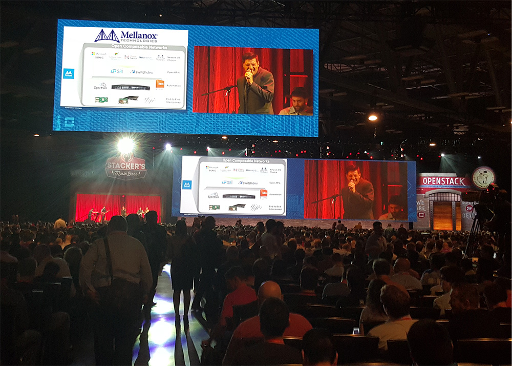
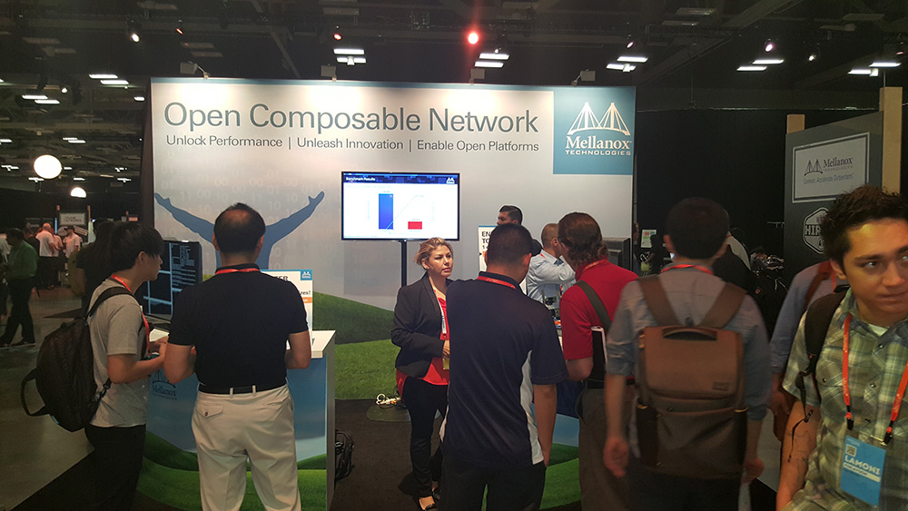
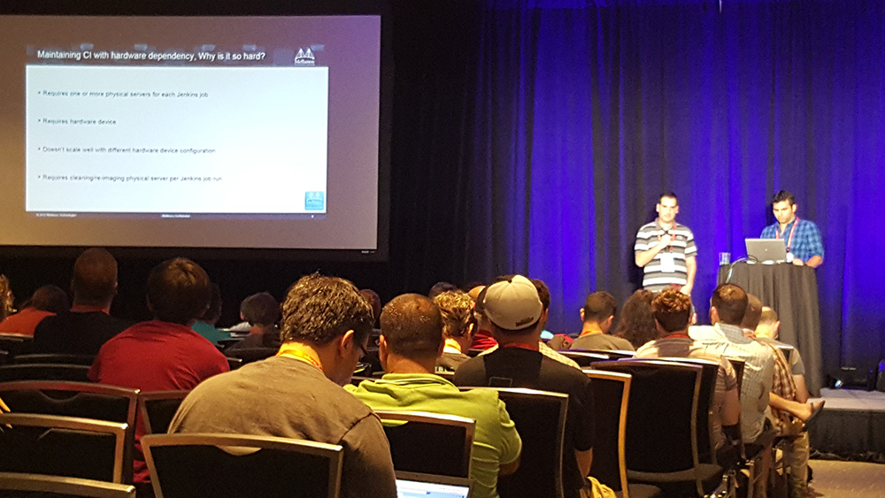
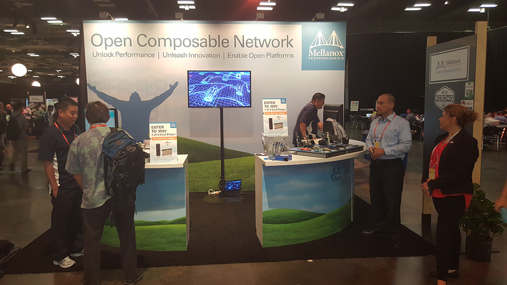

[The OpenStack Summit](https://www.openstack.org/summit/austin-2016/) is a five-day conference for developers, users, and administrators of OpenStack cloud software. Held every six months, the conference schedule rotates based on the OpenStack software release cycle.  This week, the summit is being held in Austin, Texas at the Austin Convention Center.

The summit started yesterday and we had two successful sessions:

**Open Composable Networks: Leverage LEGO Design to Transform Cloud Networking** by **_Kevin Deierling, Mellanox VP Marketing_**

Kevin talked about a new way of cloud networking that stemmed from the hyper-scale cloud web services giants, but is being made available widely by Mellanox and our cloud ecosystem partners. He shared real world deployments of our OpenStack customers such as Cambridge, Enter and NCI and described the LEGO parts they have used such as: Mellanox NEO, our End-to-End 25/50/100G Ethernet and InfiniBand intelligent interconnect, etc…

Lightning Talks by **_Moshe Levi_**, **_SW Cloud Manager_** about **Using Device Emulator to Enhance CI**

Moshe talked about Mellanox SimX and explained how to reduce the number of physical servers and eliminate the physical device dependency in CI.

We invite you to visit Mellanox’s booth (D20) and see the 25/50/100G Cloud Solution based on Spectrum, ConnectX-4 and Mellanox NEO for Network Automation. Make sure to stop by and talk with us!  Here are some photos from yesterday’s sessions along with the Mellanox booth.

Source: mellanox ([OpenStack Summit Austin 2016](http://www.mellanox.com/blog/2016/04/openstack-summit-austin-2016/))
