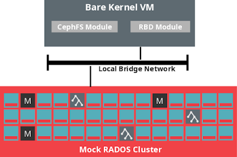

### Introduction

Ceph's _vstart.sh_ utility is very useful for deploying and testing a mock cluster directly from the Ceph source repository. It can:  

- Generate a cluster configuration file and authentication keys
- Provision and deploy a number of OSDs

- Backed by local disk, or memory using the _\--memstore_ parameter

- Deploy an arbitrary number of monitor, MDS or rados-gateway nodes

All services are deployed as the running user. I.e. root access is not needed.  
  
Once deployed, the mock cluster can be used with any of the existing Ceph client utilities, or exercised with the unit tests in the Ceph _src/test_ directory.  
  
When developing or testing Linux kernel changes for CephFS or RBD, it's useful to also be able to use these kernel clients against a _vstart.sh_ deployed Ceph cluster.  
  

<table align="center" cellpadding="0" cellspacing="0" class="tr-caption-container" style="margin-left: auto;margin-right: auto;text-align: center"><tbody><tr><td style="text-align: center"></td></tr><tr><td class="tr-caption" style="text-align: center">Test Environment Overview - image based on content by Sage Weil</td></tr></tbody></table>

  
The instructions below walk through configuration and deployment of all components needed to test Linux kernel RBD and CephFS modules against a mock Ceph cluster. The procedure was performed on [openSUSE](http://opensuse.org/) Leap 42.1, but should also be applicable for other Linux distributions.  
  

### Network Setup

First off, configure a bridge interface to connect the Ceph cluster with a kernel client VM network:  
  

\> sudo /sbin/brctl addbr br0  
\> sudo ip addr add 192.168.155.1/24 dev br0  
\> sudo ip link set dev br0 up  

  
_br0_ will **not** be bridged with any physical adapters, just the kernel VM via a TAP interface which is configured with:  
  

\> sudo /sbin/tunctl -u $(whoami) -t tap0  
\> sudo /sbin/brctl addif br0 tap0  
\> sudo ip link set tap0 up  

  
For more information on the bridge setup, see:  
[http://blog.elastocloud.org/2015/07/qemukvm-bridged-network-with-tap.html](http://blog.elastocloud.org/2015/07/qemukvm-bridged-network-with-tap.html)  
  

### Ceph Cluster Deployment

The Ceph cluster can now be deployed, with all nodes accepting traffic on the bridge network:  
  

\> cd $ceph\_source\_dir  
<build Ceph>  
\> cd src  
\> OSD=3 MON=1 RGW=0 MDS=1 ./vstart.sh -i 192.168.155.1 -n --memstore  

  
_$ceph\_source\_dir_ should be replaced with the actual path. Be sure to specify the same IP address with _\-i_ as was assigned to the _br0_ interface.  
  
More information about _vstart.sh_ usage can be found at:  
 [http://docs.ceph.com/docs/hammer/dev/dev\_cluster\_deployement/](http://docs.ceph.com/docs/hammer/dev/dev_cluster_deployement/)  
  

### Kernel VM Deployment

Build a kernel:  

\> cd $kernel\_source\_dir  
\> make menuconfig 

_$kernel\_source\_dir_ should be replaced with the actual path. Ensure _CONFIG\_BLK\_DEV\_RBD=m_, _CONFIG\_CEPH\_FS=y_, _CONFIG\_CEPH\_LIB=y_, _CONFIG\_E1000=y_ and _CONFIG\_IP\_PNP=y_ are set in the kernel config. A sample can be found [here](https://raw.githubusercontent.com/ddiss/ceph_vstart_with_kernel/master/.config).  

\> make  
\> INSTALL\_MOD\_PATH=./mods make modules\_install

Create a link to the modules directory _./mods_, so that Dracut can find them:  

\> sudo ln -s $PWD/mods/lib/modules/$(make kernelrelease)   
                /lib/modules/$(make kernelrelease)  

  
Generate an initramfs with Dracut. This image will be used as the test VM.  

\> export CEPH\_SRC=$ceph\_source\_dir/src  
\> dracut --no-compress  --kver "$(cat include/config/kernel.release)"   
        --install "tail blockdev ps rmdir resize dd vim grep find df sha256sum   
                   strace mkfs.xfs /lib64/libkeyutils.so.1"   
        --include "$CEPH\_SRC/mount.ceph" "/sbin/mount.ceph"   
        --include "$CEPH\_SRC/ceph.conf" "/etc/ceph/ceph.conf"   
        --add-drivers "rbd"   
        --no-hostonly --no-hostonly-cmdline   
        --modules "bash base network ifcfg"   
        --force myinitrd  

  
Boot the kernel and initramfs directly using QEMU/KVM:  

\> qemu-kvm -smp cpus=2 -m 512   
        -kernel arch/x86/boot/bzImage -initrd myinitrd   
        -device e1000,netdev=network1,mac=b8:ac:6f:31:45:70   
        -netdev tap,id=network1,script=no,downscript=no,ifname=tap0   
        -append "ip=192.168.155.2:::255.255.255.0:myhostname   
                rd.shell=1 console=ttyS0 rd.lvm=0 rd.luks=0"   
        -nographic  

  
This should bring up a Dracut debug shell in the VM, with a network configuration matching the values parsed in via the _ip=_ kernel parameter.  
  

dracut:/# ip a  
...  
2: eth0: ... mtu 1500 qdisc pfifo\_fast state UP group default qlen 1000  
    link/ether b8:ac:6f:31:45:70 brd ff:ff:ff:ff:ff:ff  
    inet 192.168.155.2/24 brd 192.168.155.255 scope global eth0  

  
For more information on kernel setup, see:  
[http://blog.elastocloud.org/2015/06/rapid-linux-kernel-devtest-with-qemu.html](http://blog.elastocloud.org/2015/06/rapid-linux-kernel-devtest-with-qemu.html)  
  

### RBD Image Provisioning

An RBD volume can be provisioned using the regular Ceph utilities in the Ceph source directory:  
  

\> cd $ceph\_source\_dir/src  
\> ./rados lspools  
rbd  
...  

  
By default, an _rbd_ pool is created by _vstart.sh_, which can be used for RBD images:  

\> ./rbd create --image-format 1 --size 1024 1g\_vstart\_img  
\> ./rbd ls -l  
NAME           SIZE PARENT FMT PROT LOCK  
1g\_vstart\_img 1024M          1  

  
**Note:** "_\--image-format 1_" is specified to ensure that the kernel supports all features of the provisioned RBD image.  
  

### Kernel RBD Usage

From the Dracut shell, the newly provisioned _1g\_vstart\_img_ image can be mapped locally using the _sysfs_ filesystem:  

dracut:/# modprobe rbd  
\[    9.031056\] rbd: loaded  
dracut:/# echo -n "192.168.155.1:6789 name=admin,secret=AQBPiuhd9389dh28djASE32Ceiojc234AF345w== rbd 1g\_vstart\_img -" > /sys/bus/rbd/add  
\[  347.743272\] libceph: mon0 192.168.155.1:6789 session established  
\[  347.744284\] libceph: client4121 fsid 234b432f-a895-43d2-23fd-9127a1837b32  
\[  347.749516\] rbd: rbd0: added with size 0x40000000  

  
**Note:** The monitor address and _admin_ credentials can be retrieved from the _ceph.conf_ and _keyring_ files respectively, located in the Ceph source directory.  
  
The _/dev/rbd0_ mapped image can now be used like any other block device:  

dracut:/# mkfs.xfs /dev/rbd0   
...  
dracut:/# mkdir -p /mnt/rbdfs  
dracut:/# mount /dev/rbd0 /mnt/rbdfs  
\[  415.841757\] XFS (rbd0): Mounting V4 Filesystem  
\[  415.917595\] XFS (rbd0): Ending clean mount  
dracut:/# df -h /mnt/rbdfs  
Filesystem      Size  Used Avail Use% Mounted on  
/dev/rbd0      1014M   33M  982M   4% /mnt/rbdfs  
  

  

### Kernel CephFS Usage

_vstart.sh_ already goes to the effort of deploying a filesystem:  

\> cd $ceph\_source\_dir/src  
\> ./ceph fs ls  
\> name: cephfs\_a, metadata pool: cephfs\_metadata\_a, data pools: \[cephfs\_data\_a \]  
  

All that's left is to mount it from the kernel VM using the _mount.ceph_ binary that was copied into the initramfs:  

dracut:/# mkdir -p /mnt/mycephfs  
dracut:/# mount.ceph 192.168.155.1:6789:/ /mnt/mycephfs   
                -o name=admin,secret=AQBPiuhd9389dh28djASE32Ceiojc234AF345w==  
\[  723.103153\] libceph: mon0 192.168.155.1:6789 session established  
\[  723.184978\] libceph: client4122 fsid 234b432f-a895-43d2-23fd-9127a1837b32  
  
dracut:/# df -h /mnt/mycephfs/  
Filesystem            Size  Used Avail Use% Mounted on  
192.168.155.1:6789:/  3.0G  4.0M  3.0G   1% /mnt/mycephfs  
  

  
**Note:** The monitor address and _admin_ credentials can be retrieved from the ceph.conf and keyring files respectively, located in the Ceph source directory.  
  

### Cleanup

Unmount CephFS:  

dracut:/# umount /mnt/mycephfs  
  

Unmount the RBD image:  

dracut:/# umount /dev/rbd0  
\[ 1592.592510\] XFS (rbd0): Unmounting Filesystem  
  

Unmap the RBD image (_0_ is derived from _/dev/rbdX_):  

dracut:/# echo -n 0 > /sys/bus/rbd/remove  
  

Power-off the VM:  

dracut:/# echo 1 > /proc/sys/kernel/sysrq && echo o > /proc/sysrq-trigger  
\[ 1766.387417\] sysrq: SysRq : Power Off  
dracut:/# \[ 1766.811686\] ACPI: Preparing to enter system sleep state S5  
\[ 1766.812217\] reboot: Power down  
  

Shutdown the Ceph cluster:  

\> cd $ceph\_source\_dir/src  
\> ./stop.sh  
  

### Conclusion

A mock Ceph cluster can be deployed from source in a matter of seconds using the _vstart.sh_ utility.  
Likewise, a kernel can be booted directly from source alongside a throwaway VM and connected to the mock Ceph cluster in a couple of minutes with Dracut and QEMU/KVM.  
  
This environment is ideal for rapid development and integration testing of Ceph user-space and kernel components, including RBD and CephFS.

Source: David Disseldorp ([Rapid Ceph Kernel Module Testing with vstart.sh](http://blog.elastocloud.org/2016/05/rapid-ceph-kernel-module-testing-with.html))
