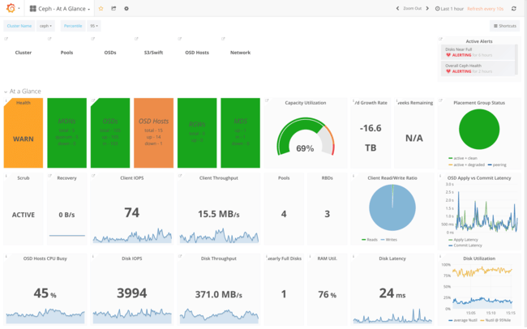
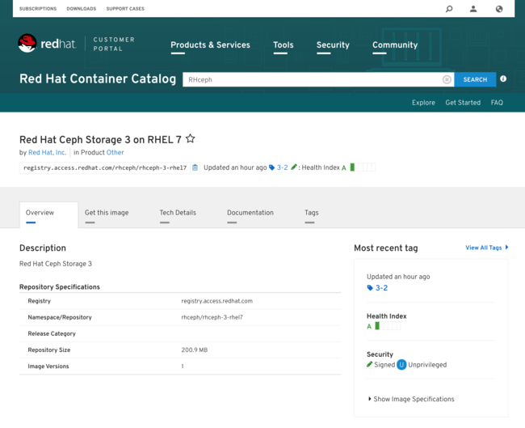
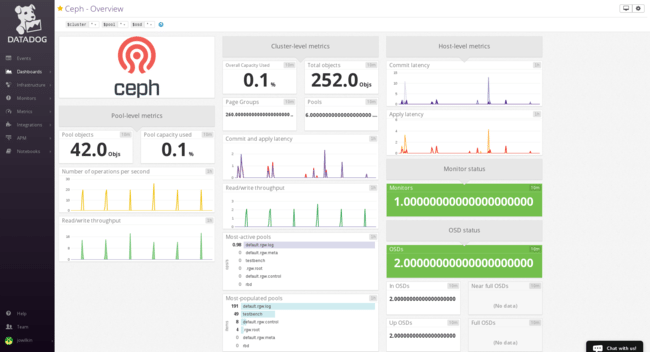

_The third one is a charm._

RHCS 3 is our annual major release of Red Hat Ceph Storage and it brings great new features to customers in the areas of containers, usability and raw technology horsepower. It includes support for CephFS, giving us a complete all-in-one storage solution in Ceph spanning block, object and file alike. It introduces iSCSI support to provide storage to platforms like VMWare ESX and Windows Server that currently lack native Ceph drivers. _And_ we are also introducing support for client-side caching with dm-cache.

On the usability front we are introducing new automation to manage the cluster with less user intervention (dynamic bucket sharding), a troubleshooting tool to analyze and flag invalid cluster configurations (Ceph Medic), and a new and rather impressive monitoring dashboard ([Ceph Metrics](https://github.com/ceph/cephmetrics)) that brings unparalleled insight into the state of the cluster.

Last but definitely not least, Containerized Storage Daemons drive a massive improvement in TCO through better hardware utilization.

#  Containers, Containers, Never Enough Containers!

We graduated to fully supporting our Ceph distribution running containerized in Docker application containers earlier in June with the [2.3 release](https://access.redhat.com/containers/?tab=overview#/registry.access.redhat.com/rhceph/rhceph-2-rhel7), after more than a year of [open testing of tech preview images](https://access.redhat.com/containers/#/registry.access.redhat.com/rhceph/rhceph-1.3-rhel7).

RHCS 3 raises the bar by introducing colocated, Containerized Storage Daemons (CSDs) as a supported configuration. CSDs drive a massive TCO improvement through better hardware utilization: the baseline object store cluster we recommend to new users spans 10 OSD storage nodes, 3 MON controllers, and 3 RGW S3 gateways. By allowing colocation, the smaller MON and RGW nodes can now run colocated on the OSDs’ hardware, eliminating not only the capital expense of those servers, but also the ongoing operational cost of managing those servers. Pricing using a most popular hardware vendor, we are looking at a 24% hardware cost reduction or, in alternative, adding 30% more raw storage for the same initial hardware invoice.

##  “All nodes are storage nodes now!”

We are accomplishing this improvement by colocating any of the Ceph scale-out daemons on the storage servers, one per host. Containers insure that RAM and CPU allocations are in place to protect both the OSD and the co-located daemon from resource starvation during rebalancing or recovery load spikes. We can currently colocate all the scale-out daemons except the new iSCSI gateway, but we expect that in the short-term MON, MGR, RGW and the newly-supported MDS will take the lion share of these configurations.

As my marketing manager is found of saying, _all nodes are storage nodes now!_ Just as importantly, we can field a containerized deployment using the very same [ceph-ansible](https://github.com/ceph/ceph-ansible) playbooks our customers are familiar with and have come to love. Users can conveniently learn how to operate with containerized storage while still relying on the same tools—and we continue to support RPM-based deployments, so if you would rather see others cross the chasm first, that is totally okay as well, you can continue operating with RPMs and Ansible as you are accustomed to ;-)

#  The Ceph File System: now fully supportedawesome

The Ceph File System, CephFS for friends, is the Ceph interface providing the abstraction of a fully POSIX-compliant filesystem backed by the storage of a RADOS object storage cluster. CephFS achieved reliability and stability already last year, but with this new version the MDS directory metadata service is fully scale-out, eliminating our last remaining concern to its production use. In Sage’s own words, it is now _fully awesome!_

##  “CephFS is now _fully_ awesome!” —Sage Weil

With this new version, CephFS is now fully supported by Red Hat. For details about CephFS, see the [Ceph File System Guide for Red Hat Ceph Storage 3](https://access.redhat.com/documentation/en-us/red_hat_ceph_storage/3/html/ceph_file_system_guide/). While I am on the subject, I would like to give a shout-out to the unsung heroes in our awesome storage documentation team: they steadily continues to introduce high-quality guides with every release, and our customers are surely taking notice.

# iSCSI and NFS: compatibility trifecta

Earlier this year we introduced the first version of our NFS gateway, allowing a user to mount an S3 bucket as if it was an NFS folder, for quick bulk import and export of data from the cluster, as literally every device out there speaks NFS natively. In this release, we are enhancing the NFS gateway with support for NFS v.3 alongside the existing NFS v.4 support.

The remaining leg of our legacy compatibility plan is iSCSI. While iSCSI is not ideally suited to a scale-out system like Ceph, the use of multipathing for failover makes the fit smoother than one would expect, as no explicit HA is needed to manage failover.

With RHCS 3.0 we are bringing to GA the iSCSI gateway service that we have been previewing during the past year. While we continue to favor the LibRBD interface as it is more featureful and delivers better performance, iSCSI makes perfect sense as a fall-back to connect VMWare and Windows servers to Ceph storage, and generally anywhere a native Ceph block driver is not yet available. With this initial release, we are supporting VMWare ESX 6.5, Windows Server 2016 and RHV 4.x over an iSCSI interface, and you will see us adding more platforms to the list of supported clients next year as we increase the reach of our automated testing infrastructure.

# ¡Arriba, arriba! ¡Ándale, ándale!

Red Hat’s famous Performance & Scale team has revisited client-side caching tuning with the new codebase, and blessed an optimized configuration for dm-cache that can now be easily configured with Ceph-volume, the new up-and-coming tool that is slated by the Community to eventually give the aging ceph-disk a well-deserved retirement.

Making things faster is important, but equally important is insight into performance metrics. The new dashboard is well deserving of a blog on its own, but it plainly brings a quantum leap in performance monitoring to any Ceph environment, starting with the cluster as a whole and drilling into individual metrics or individual nodes as needed to track down any performance issue. Select users have been patiently testing our early builds with Luminous this summer, and their consistently positive feedback makes very confident you will love the results.

Linux monitoring has many flavors, and while we supply tools as part of the product, customers often want to integrate their existing infrastructure, whether it is [Nagios](https://access.redhat.com/documentation/en-us/red_hat_ceph_storage/3/html/monitoring_ceph_for_red_hat_enterprise_linux_with_nagios/nagios-introduction) alerting in very binary tones that something seems to be wrong, or another tool. For this reason, we joined forces with our partners at [Datadog](https://www.datadoghq.com/) to introduce a joint configuration for [SAAS monitoring of Ceph](https://access.redhat.com/documentation/en-us/red_hat_ceph_storage/3/html/monitoring_ceph_with_datadog/datadog-introduction) using Datadog’s impressive tools.

# Stats

More than 30 features are landing in this release alongside our rebasing of the enterprise product to the Luminous codebase. These map to almost [500 bugs](https://bugzilla.redhat.com/buglist.cgi?bug_status=NEW&bug_status=ASSIGNED&bug_status=POST&bug_status=MODIFIED&bug_status=ON_DEV&bug_status=ON_QA&bug_status=VERIFIED&bug_status=RELEASE_PENDING&bug_status=CLOSED&classification=Red%20Hat&list_id=8188905&product=Red%20Hat%20Ceph%20Storage&query_format=advanced&target_release=3.0) in our downstream tracking system, and hundreds more upstream in the [Luminous](http://ceph.com/releases/v12-2-0-luminous-released/) [12.2.1](http://ceph.com/releases/v12-2-1-luminous-released/) release we started from. I like to briefly call out attention to about 20 of them that our very dedicated global support team prioritized for us as the most impactful way to further smooth out the experience of new users and continue our march towards making Ceph evermore enterprise-ready and easy to use. This is our biggest release yet, and its timely delivery three months after the upstream freeze is an impressive achievement for our Development and Quality Assurance engineering teams.

As always, those of you with an insatiable thirst for detail should read the [release notes](https://access.redhat.com/documentation/en-us/red_hat_ceph_storage/3.0/html/release_notes/) next—and feel free to ping me on [Twitter](https://twitter.com/0xF2) if you have any questions!

# The third one is a charm

Better economics through improved hardware utilization, great value add for customers in the form of new access modes in file, iSCSI, and NFS compatibility, joined by improved usability and across-the-board technological advancement are the themes we tried to hit with this release. I think we delivered… but we aren’t done yet. There is more stuff coming your way next year! In the meantime, happy holidays from our team to yours.

Source: Federico Lucifredi ([A Luminous Release](http://f2.svbtle.com/a-luminous-release))
