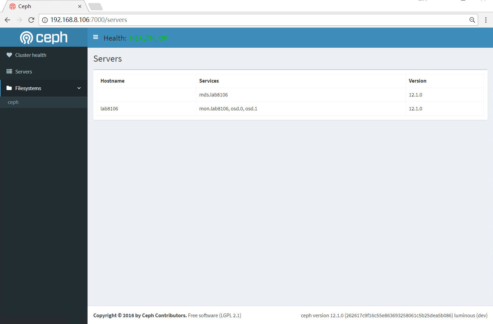

  
  

## 前言

ceph luminous版本新增加了很多有意思的功能，这个也是一个长期支持版本，所以这些新功能的特性还是很值得期待的，从底层的存储改造，消息方式的改变，以及一些之前未实现的功能的完成，都让ceph变得更强，这里面有很多核心模块来自中国的开发者，在这里准备用一系列的文章对这些新功能进行一个简单的介绍，也是自己的一个学习的过程

## 相关配置

### 配置ceph国内源

修改 /etc/yum.repos.d/ceph.repo文件  

<table><tbody><tr><td class="code"><pre>[ceph] name=ceph baseurl=http://mirrors.163.com/ceph/rpm-luminous/el7/x86_64/ gpgcheck=0 [ceph-noarch] name=cephnoarch baseurl=http://mirrors.163.com/ceph/rpm-luminous/el7/noarch/ gpgcheck=0 </pre></td></tr></tbody></table>

添加完更新下缓存  

<table><tbody><tr><td class="code"><pre>yum makecache </pre></td></tr></tbody></table>

前一段时间163源上的ceph没有了，可能是误操作的，现在的163源已经恢复，上面添加的是最新的luminous版本源，本篇实践的功能是在这个版本才加入的

### 安装ceph相关软件包

<table><tbody><tr><td class="code"><pre>[root@lab8106 ~]# yum install ceph-deploy ceph </pre></td></tr></tbody></table>

检查版本  

<table><tbody><tr><td class="code"><pre>[root@lab8106 ~]# ceph -v ceph version 12.1.0 (262617c9f16c55e863693258061c5b25dea5b086) luminous (dev) </pre></td></tr></tbody></table>

### 搭建一个集群

这个就不描述配置集群的步骤，这个网上很多资料，也是很基础的操作  
这里提几个luminous重要的变化

- 默认的消息处理从simple变成了async了（ms\_type = async+posix）
- 默认的后端存储从filestore变成了bluestore了
- ceph-s的命令的输出发生了改变(显示如下)

<table><tbody><tr><td class="code"><pre>[root@lab8106 ceph]# ceph -s   cluster:     id:     49ee8a7f-fb7c-4239-a4b7-acf0bc37430d     health: HEALTH_OK     services:     mon: 1 daemons, quorum lab8106     mgr: lab8106(active)     osd: 2 osds: 2 up, 2 in     data:     pools:   1 pools, 64 pgs     objects: 0 objects, 0 bytes     usage:   2110 MB used, 556 GB / 558 GB avail     pgs:     64 active+clean </pre></td></tr></tbody></table>

### 开启监控模块

在/etc/ceph/ceph.conf中添加  

<table><tbody><tr><td class="code"><pre>[mgr] mgr modules = dashboard </pre></td></tr></tbody></table>

设置dashboard的ip和端口  

<table><tbody><tr><td class="code"><pre>ceph config-key put mgr/dashboard/server_addr 192.168.8.106 ceph config-key put mgr/dashboard/server_port 7000 </pre></td></tr></tbody></table>

这个从代码上看应该是可以支持配置文件方式的设置，目前还没看到具体的文档，先按这个设置即可，默认的端口是7000

重启mgr服务  

<table><tbody><tr><td class="code"><pre>[root@lab8106 ceph]# systemctl restart ceph-mgr@lab8106 </pre></td></tr></tbody></table>

检查端口  

<table><tbody><tr><td class="code"><pre>[root@lab8106 ceph]# netstat -tunlp|grep 7000 tcp        0      0 192.168.8.106:7000      0.0.0.0:*               LISTEN      31485/ceph-mgr </pre></td></tr></tbody></table>

### 访问界面

  
这个是首页的信息

  
如果配置了cephfs文件系统后，会有这个文件系统相关的监控

  
这个界面是显示的主机的信息的

## 总结

从部署方便性来说，这个部署还是非常的方便的，而且走的是ceph原生接口，ceph通过增加一个mgr模块，可以把一些管理的功能独立出来，从而让mon自己做最重要的一些事情

目前的监控功能还比较少，主要是监控功能，未来应该会慢慢增加更多的功能，从产品角度来看，一个原生的UI监控使得ceph整个模块更加的完整了

有的时候也许 simple is the best

## 参考资料

/usr/lib64/ceph/mgr/dashboard/README.rst

## 变更记录

| Why | Who | When |
| --- | --- | --- |
| 创建 | 武汉-运维-磨渣 | 2017-06-26 |

Source: zphj1987@gmail ([ceph luminous 新功能之内置dashboard](http://www.zphj1987.com/2017/06/25/ceph-luminous-new-dashboard/))
